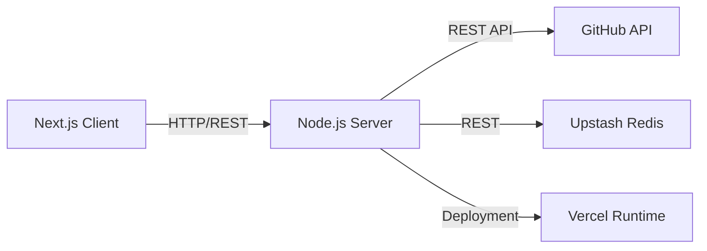
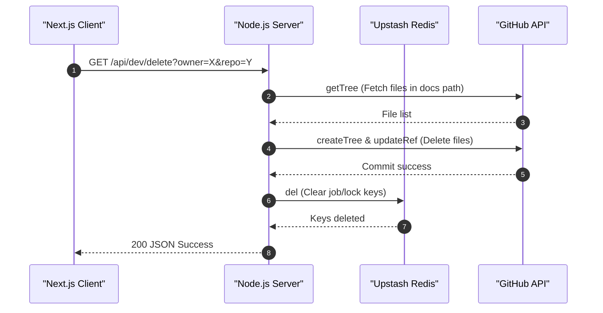

# System Architecture

GitDex is engineered as a full-stack monorepo consisting of a Next.js frontend and a Node.js backend. The system is designed to transform GitHub repositories into interactive documentation by leveraging a server-side pipeline that interacts with the GitHub API and an Upstash Redis instance for state and job management.

## High-Level System Overview

The architecture follows a decoupled client-server model where the Next.js client handles the user interface and routing, while the Node.js server manages the business logic, external API integrations, and indexing orchestration.



## Component Analysis

### Next.js Client
The client serves as the presentation layer. It utilizes the Next.js App Router and is integrated with `fumadocs-ui` to provide a structured documentation experience.

- **Core Providers**: Implements `ThemeProvider` for system-aware styling and `RootProvider` for documentation orchestration.
- **UI Integration**: Uses `sonner` for toast notifications and custom font variables (`MozillaHeadline`, `MozillaText`) for consistent branding.
- **Client-Side Routing**: Manages the layout and metadata for the AI-powered documentation interface.

### Node.js Server
The backend is an Express-based application designed for high-performance asynchronous tasks.

- **Middleware Layer**: 
    - **CORS**: Restricts access to specific `CLIENT_URLS` defined in environment variables.
    - **Request Logging**: Tracks request duration and status codes for observability.
    - **Raw Body Capture**: Specifically captures the raw request body to support signature verification for external triggers (e.g., QStash).

```typescript
// Raw body capture for signature verification
app.use(express.json({
    verify: (req: any, res, buf) => {
        req.rawBody = buf.toString();
    }
}));
```

- **API Layer**: Provides endpoints for job management (`/api`), system health (`/health`), and development utilities.

## Data & State Management

The system relies on external services to maintain state and perform repository operations, as the server is deployed in a serverless environment.

### Upstash Redis
Redis is used as the primary coordination layer for the indexing pipeline, handling:
- **Job Tracking**: Monitoring the status of repository indexing.
- **Locking**: Preventing concurrent indexing operations on the same repository using `lock:*` keys.
- **Cooldowns**: Managing `last_indexed:*` timestamps to prevent redundant processing.

### GitHub Integration
The server utilizes `@octokit/rest` to perform deep integrations with GitHub, including:
- **Tree Analysis**: Retrieving file structures via `git.getTree`.
- **Content Modification**: Creating commits and updating references to store generated documentation in a dedicated docs repository.

## Request Flow

The following sequence diagram illustrates the interaction between components during a repository management request (such as a developer-triggered deletion).



## API Endpoint Summary

| Endpoint | Method | Description | Access Level |
| :--- | :--- | :--- | :--- |
| `/api/*` | Various | Job routing and indexing control | Public/Client |
| `/api/dev/clear` | `GET` | Wipes all `job:*`, `lock:*`, and `system:*` keys from Redis | Development Only |
| `/api/dev/delete` | `GET` | Deletes documentation files from GitHub and clears Redis state | Development Only |
| `/health` | `GET` | Simple health check for deployment monitoring | Public |

## Deployment Configuration

The server is optimized for Vercel using a `vercel.json` configuration that maps all incoming requests to the main entry point and disables caching for API responses to ensure data freshness.

```json
{
  "version": 2,
  "builds": [
    { "src": "index.ts", "use": "@vercel/node" }
  ],
  "routes": [
    {
      "src": "/(.*)",
      "dest": "index.ts",
      "headers": { "Cache-Control": "no-store, must-revalidate" }
    }
  ]
}