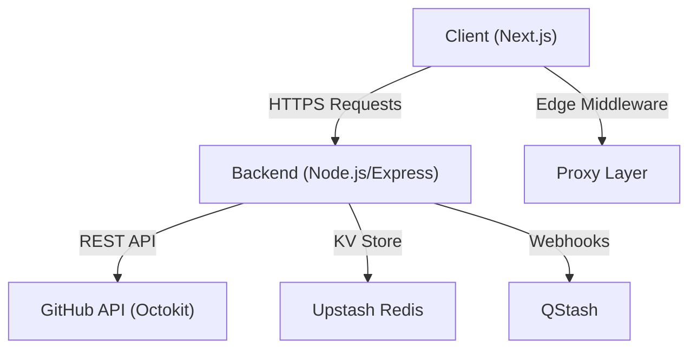
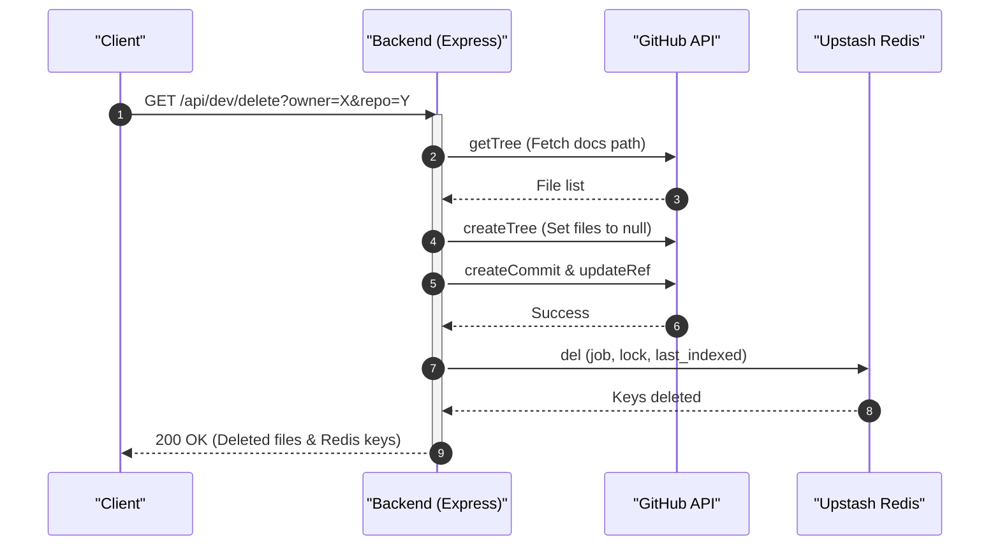

# System Architecture

GitDex employs a decoupled full-stack architecture consisting of a Next.js frontend, a Node.js backend deployed on Vercel, and integrations with external services for data persistence and repository management.

## High-Level Architectural Overview

The system is designed to bridge the gap between GitHub repositories and AI-driven documentation. The architecture follows a request-response pattern where the frontend orchestrates user interactions and the backend manages the heavy lifting of repository analysis and external API coordination.



## Component Breakdown

### Frontend Layer
The frontend is built with Next.js and utilizes a proxy mechanism to handle request headers before they reach the application logic.

- **Request Proxying**: The system uses a proxy configuration to inject specific headers, such as `x-pathname`, into the request [client/proxy.ts:8-11]().
- **Routing Constraints**: The proxy excludes internal Next.js assets, API routes, and static files from its matching logic to ensure optimal performance [client/proxy.ts:14-16]().

### Backend Layer
The backend is a Node.js application using the Express framework, designed for serverless deployment.

- **Server Core**: The server is initialized with Express and configured to handle CORS based on a comma-separated list of allowed client URLs [server/index.ts:14-18]().
- **Deployment Configuration**: The backend is deployed via Vercel using the `@vercel/node` builder, with all incoming routes directed to the `index.ts` entry point [server/vercel.json:5-13]().
- **Request Processing**: To support QStash signature verification, the server captures the raw request body before it is parsed as JSON [server/index.ts:21-25]().

### External Service Integration
GitDex relies on third-party services to maintain state and interact with source code.

- **Upstash Redis**: Used for job tracking, locking mechanisms, and cooldown management [server/index.ts:5, 37-55](). It prevents concurrent processing of the same repository and stores indexing state.
- **GitHub API**: Utilizes the `@octokit/rest` library to interact with the GitHub platform [server/index.ts:64](). This is primarily used to read repository trees and commit changes to the documentation repository [server/index.ts:71-115]().

## Data Flow and Interactions

### Repository Documentation Deletion Flow
The backend provides administrative capabilities to wipe indexed data for specific repositories. This process involves a coordinated effort between Redis and the GitHub API.



## API Interface

The backend exposes several endpoints for health monitoring and development management.

| Endpoint | Method | Purpose | Source Reference |
| :--- | :--- | :--- | :--- |
| `/health` | `GET` | Basic service availability check | [server/index.ts:131-133]() |
| `/api` | `ALL` | Job management routes (via `jobsRoutes`) | [server/index.ts:27]() |
| `/api/dev/clear` | `GET` | Wipes all `job:*`, `lock:*`, and `system:*` keys from Redis | [server/index.ts:34-58]() |
| `/api/dev/delete` | `GET` | Deletes GitHub documentation files and clears Redis state | [server/index.ts:59-128]() |

## Configuration Summary

The system's behavior is driven by environment variables and deployment manifests:

```typescript
// Example of the backend's core configuration pattern
const PORT = process.env.PORT || 3001;
const clientUrls = (process.env.CLIENT_URLS || 'http://localhost:3000')
    .split(',')
    .map(url => url.trim());
```
[server/index.ts:10-14]()