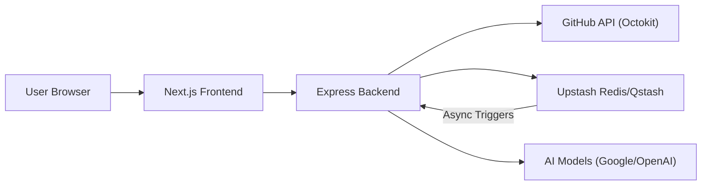
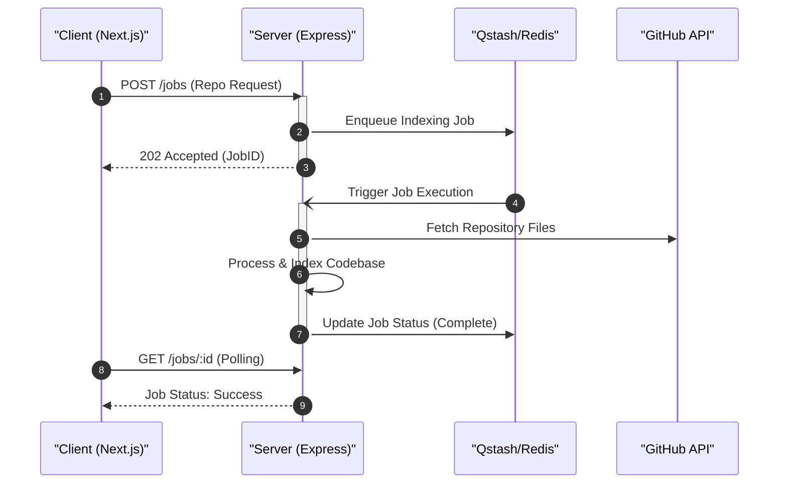

# System Architecture

GitDex employs a decoupled full-stack architecture designed to handle computationally expensive repository indexing and AI-driven codebase analysis. The system is split into a high-performance Next.js frontend for user interaction and a Node.js (Bun-powered) backend for heavy lifting, job orchestration, and AI integration.

## Full-Stack Design

The project is structured as a monorepo consisting of a `client` and a `server`. This separation ensures that the user interface remains responsive while the backend manages long-running asynchronous tasks such as cloning repositories and generating embeddings.

### Architectural Components

| Component | Technology Stack | Primary Responsibility |
| :--- | :--- | :--- |
| **Frontend** | Next.js, React 19, Zustand | UI Rendering, Chat Interface, State Management |
| **Backend** | Node.js (Bun), Express | API Orchestration, Indexing Logic, Job Scheduling |
| **Queue/Cache** | Upstash Redis & Qstash | Asynchronous Job Queuing and Transient State |
| **AI Integration** | Vercel AI SDK, Google GenAI | LLM Orchestration and Code Analysis |
| **Data Source** | Octokit (GitHub API) | Repository Data Extraction |

### System Interaction Diagram


```mermaid
graph LR
    User["User Browser"] --> Client["Next.js Frontend"]
    Client --> Server["Express Backend"]
    Server --> GitHub["GitHub API (Octokit)"]
    Server --> Redis["Upstash Redis/Qstash"]
    Server --> LLM["AI Models (Google/OpenAI)"]
    Redis -- "Async Triggers" --> Server
```

## Data Flow and API Communication

Communication between the client and server is primarily handled via RESTful API calls. Because repository indexing is time-consuming, GitDex utilizes an asynchronous job pattern rather than maintaining long-lived HTTP connections for processing.

### Communication Sequence

The following sequence illustrates the flow from the moment a user requests a repository analysis to the final AI chat interaction.


```mermaid
sequenceDiagram
    autonumber
    participant C as "Client (Next.js)"
    participant S as "Server (Express)"
    participant Q as "Qstash/Redis"
    participant G as "GitHub API"

    C ->> S: POST /jobs (Repo Request)
    activate S
    S ->> Q: Enqueue Indexing Job
    S -->> C: 202 Accepted (JobID)
    deactivate S
    
    Q -) S: Trigger Job Execution
    activate S
    S ->> G: Fetch Repository Files
    S ->> S: Process & Index Codebase
    S ->> Q: Update Job Status (Complete)
    deactivate S
    
    C ->> S: GET /jobs/:id (Polling)
    S -->> C: Job Status: Success
```

### Core API Endpoints

Based on the server implementation, the backend exposes routes for job management to decouple the request from the processing.

| Method | Endpoint | Description | Payload/Params |
| :--- | :--- | :--- | :--- |
| `POST` | `/jobs` | Initiates the indexing pipeline for a repo | `{ "repo": "owner/name" }` |
| `GET` | `/jobs/:id` | Checks the status of a specific indexing job | `id` (Job UUID) |
| `POST` | `/chat` | Interfaces with the AI Chat Controller | `{ "messages": [...] }` |

## Technical Implementation Details

### Server Entry Point
The server uses Express for routing and integrates Upstash Redis for state persistence. The use of Bun as the runtime provides faster startup and execution for the indexing pipeline.

```typescript
// server/index.ts snippet
import express from "express";
import { Redis } from '@upstash/redis';
import jobsRoutes from "./src/routes/jobsRoutes.js";

const app = express();
app.use(cors());
app.use("/jobs", jobsRoutes);
```

### Client State Management
The frontend leverages `zustand` for lightweight state management and the Vercel AI SDK for streaming responses from the backend to the UI.

```json
// Key Client Dependencies
{
  "ai": "^6.0.208",
  "zustand": "^5.0.14",
  "@assistant-ui/react": "^0.11.58",
  "next": "^16.2.9"
}
```

## Invariants & Failure Modes

### Distributed State Consistency
Since the backend utilizes Upstash Redis and Qstash, the system is designed to be stateless. If the Express server restarts, the job state is preserved in Redis, and Qstash ensures that pending indexing tasks are retried.

### Failure Handling
- **GitHub Rate Limiting:** The server uses `@octokit/rest` to interact with GitHub. Excessive requests during indexing can trigger rate limits; the system relies on the job queue to retry failed fetches.
- **LLM Token Limits:** The integration of `js-tiktoken` on the server side allows the system to calculate token counts before sending requests to the AI, preventing "context window exceeded" errors.
- **Client-Server Sync:** The frontend implements polling or guard mechanisms to ensure the UI does not allow AI chat interactions until the corresponding repository index job is marked as `complete` in the backend.

### Performance Trade-offs
- **Polling vs WebSockets:** The architecture chooses API polling for job status over WebSockets to simplify deployment on serverless environments (like Vercel) where persistent socket connections are restricted.
- **Bun Runtime:** Bun is used specifically for the server to optimize the filesystem-heavy operations involved in repository analysis.