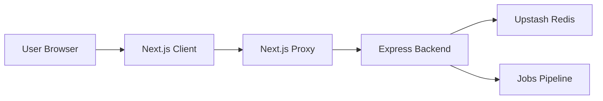
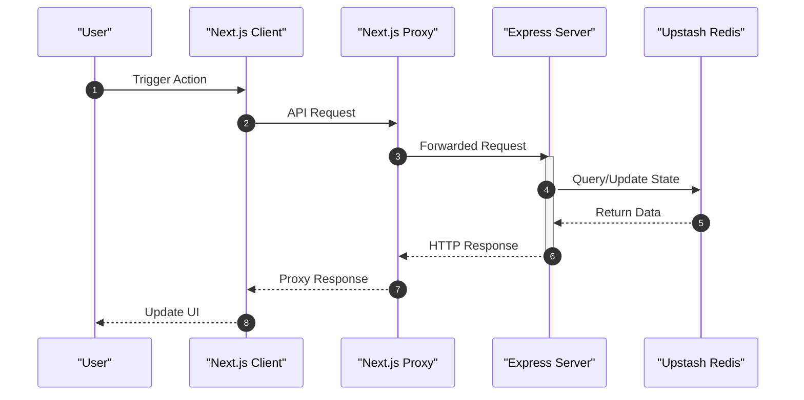

# System Architecture

GitDex is engineered as a full-stack monorepo, separating the user-facing interface from the heavy-lifting processing logic. The architecture leverages a Next.js frontend for a seamless user experience and a Node.js Express backend to handle asynchronous jobs and data persistence.

## Architectural Overview

The system is divided into two primary domains: the **Client** and the **Server**. To ensure security and avoid Cross-Origin Resource Sharing (CORS) complexities in production, the client utilizes a proxy layer to communicate with the backend.

### High-Level Component Interaction


```mermaid
graph LR
    User["User Browser"] --> Client["Next.js Client"]
    Client --> Proxy["Next.js Proxy"]
    Proxy --> Server["Express Backend"]
    Server --> Redis["Upstash Redis"]
    Server --> Jobs["Jobs Pipeline"]
```

## Client-Side Architecture

The frontend is built using Next.js, employing a modern component-based architecture. It integrates several specialized providers to handle theme, documentation layout, and notifications.

### Core UI Integration
As seen in `client/src/app/layout.tsx`, the application wraps its root layout in multiple provider layers:
- **`ThemeProvider`**: Manages application-wide light/dark mode via `next-themes`.
- **`RootProvider`**: Provided by `fumadocs-ui` to handle documentation-centric UI structures.
- **`Toaster`**: A `sonner` component used for non-blocking system notifications.

### The Proxy Layer
To mediate requests between the browser and the backend, GitDex implements a proxy mechanism in `client/proxy.ts`. This layer intercepts `NextRequest` objects and forwards them to the backend server, returning a `NextResponse`.

```typescript
// client/proxy.ts
export function proxy(request: NextRequest)
```

## Backend Architecture

The backend is a specialized Node.js service designed for scalability and asynchronous task management.

### Server Core
The server is powered by Express and configured for environment-based execution using `dotenv`. It utilizes `cors` to manage request permissions and integrates with an external data store.

### Infrastructure Components
| Component | Technology | Purpose |
| :--- | :--- | :--- |
| **Web Framework** | `express` | Handles API routing and HTTP requests. |
| **State/Queue** | `@upstash/redis` | Manages distributed state and potentially job queuing. |
| **Routing** | `jobsRoutes` | Dedicated routing logic for processing repository jobs. |

### Request Lifecycle

The following sequence diagram illustrates the path of a request from the user interface to the backend data layer.


```mermaid
sequenceDiagram
    autonumber
    participant U as "User"
    participant C as "Next.js Client"
    participant P as "Next.js Proxy"
    participant S as "Express Server"
    participant R as "Upstash Redis"

    U ->> C: Trigger Action
    C ->> P: API Request
    P ->> S: Forwarded Request
    activate S
    S ->> R: Query/Update State
    R -->> S: Return Data
    S -->> P: HTTP Response
    deactivate S
    P -->> C: Proxy Response
    C -->> U: Update UI
```

## Integration Summary

The interaction between the client and server is decoupled through the proxy, while the server maintains a lean core by delegating specific business logic to the `jobsRoutes`. 

```typescript
// server/index.ts
import express from "express";
import { Redis } from '@upstash/redis';
import jobsRoutes from "./src/routes/jobsRoutes.js";
```

This structure allows the frontend to remain focused on presentation and user interaction, while the backend manages the resource-intensive tasks of repository analysis and job scheduling.