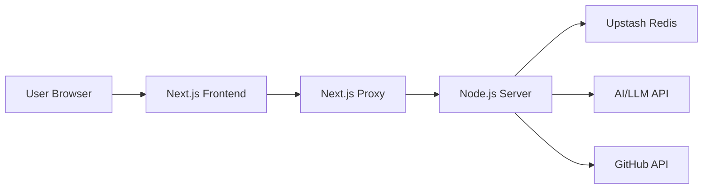

# System Architecture

The GitDex architecture is designed as a decoupled full-stack application, separating the presentation layer and the heavy-compute orchestration layer. This separation allows the frontend to remain highly responsive and deployable to edge environments (via Next.js) while the backend handles resource-intensive tasks like repository indexing, AI orchestration, and state persistence via Redis.

At its core, GitDex operates as a bridge between raw GitHub repository data and Large Language Models (LLMs), utilizing a job-based processing system to handle the asynchronous nature of code analysis.

### High-Level Architectural Components

The system is divided into three primary tiers: the Client Application, the API Proxy, and the Backend Server.

| Component | Technology | Role | Key Responsibility |
| :--- | :--- | :--- | :--- |
| **Frontend** | Next.js / React | Presentation | UI rendering, state synchronization, and user interaction. |
| **API Proxy** | Next.js Route Handlers | Gateway | Forwarding client requests to the Node.js backend to manage CORS and security. |
| **Backend** | Node.js / Express | Orchestration | Repository processing, Redis state management, and AI integration. |
| **State Store** | Upstash Redis | Persistence | Tracking indexing job progress and caching metadata. |

### Request Flow and Component Interaction

Because the frontend and backend are decoupled, GitDex employs a proxy pattern. Rather than the browser communicating directly with the Node.js server, requests are routed through Next.js server-side handlers. This ensures a unified API surface and simplifies deployment configurations.


```mermaid
graph LR
    User["User Browser"] --> NextJS["Next.js Frontend"]
    NextJS --> Proxy["Next.js Proxy"]
    Proxy --> Express["Node.js Server"]
    Express --> Redis["Upstash Redis"]
    Express --> AI["AI/LLM API"]
    Express --> GH["GitHub API"]
```

### The Backend Orchestrator

The backend is built with Express and serves as the "brain" of the operation. It doesn't just serve data; it manages complex lifecycles for repository indexing. By integrating `@upstash/redis`, the server can track the status of long-running jobs without blocking the main execution thread.

The entry point initializes the middleware stack and mounts specific route handlers for job management:

```typescript
// server/index.ts
import express from "express";
import cors from "cors";
import { Redis } from '@upstash/redis';
import jobsRoutes from "./src/routes/jobsRoutes.js";

const app = express();
app.use(cors());
app.use(express.json());

// Mounting job-specific routes for indexing and analysis
app.use("/api/jobs", jobsRoutes);
```

This structure indicates a **Job-Queue Pattern**. When a user requests a repository analysis, the server doesn't process it synchronously. Instead, it likely creates a job entry in Redis, returns a job ID to the client, and processes the repository in the background.

### The Proxy Layer

To bridge the gap between the Next.js client and the Express server, GitDex implements a proxy mechanism. This is critical for maintaining a seamless developer experience and avoiding complex CORS configurations across different deployment domains.

```typescript
// client/proxy.ts
import { NextResponse } from 'next/server';
import type { NextRequest } from 'next/server';

export function proxy(request: NextRequest) {
  // Logic to forward the request to the Node.js backend
  // ensures the client only interacts with its own domain.
}
```

By utilizing `NextResponse` and `NextRequest`, the proxy can intercept requests from the frontend, append necessary authentication headers or environment variables, and forward them to the `server/index.ts` instance.

### Frontend Integration & Layout

The frontend uses the Next.js App Router to provide a modern, reactive interface. The root layout integrates `fumadocs-ui` for documentation and `next-themes` for visual consistency, ensuring that the AI assistant's output is rendered in a professional, readable format.

The layout acts as the global provider wrapper, ensuring that state and theme contexts are available to all child components, including the AI chat interface and the repository visualization tools.

```typescript
// client/src/app/layout.tsx
export default function RootLayout({ children }: { children: React.ReactNode }) {
  return (
    <html lang="en" suppressHydrationWarning>
      <body>
        <ThemeProvider>
          <RootProvider>
            {children}
            <Toaster />
          </RootProvider>
        </ThemeProvider>
      </body>
    </html>
  );
}
```

This architectural choice ensures that while the backend is performing heavy lifting—such as parsing thousands of lines of code—the frontend remains fluid, providing real-time updates on job progress via the proxy and Redis.