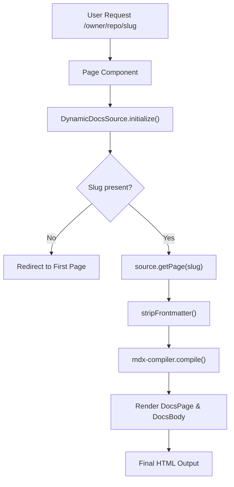

# System Architecture

GitDex leverages the Next.js App Router to create a highly dynamic, multi-tenant documentation engine. The architecture is designed to transform GitHub repository structures into a navigable documentation site on the fly, without requiring a build-step for every repository.

## Routing Structure

The application employs a nested dynamic routing strategy to handle an arbitrary number of GitHub owners and repositories.

```text
app/
├── layout.tsx                      # Root Layout: Global providers & themes
└── [owner]/                        # Dynamic: GitHub username or organization
    └── [repo]/                     # Dynamic: Repository name
        ├── layout.tsx              # Repo Layout: AI Assistant & Repo context
        └── [[...slug]]/            # Optional Catch-all: File path/slugs
            └── page.tsx            # Dynamic Page: MDX Compilation & Rendering
```

### Dynamic Segment Breakdown

1.  **`[owner]` & `[repo]`**: These segments isolate the context of the documentation. Any request to `/facebook/react` tells the system to initialize a data source specifically for the React repository owned by Facebook.
2.  **`[[...slug]]`**: An optional catch-all route. This allows GitDex to handle both the repository root (where `slug` is empty) and deeply nested file paths (e.g., `/docs/api/hooks` becomes `['docs', 'api', 'hooks']`).

## Request Flow & Rendering Pipeline

Because documentation is fetched and compiled dynamically from GitHub, the system uses `force-dynamic` rendering to ensure content is always up-to-date.



### The Compilation Lifecycle

The rendering process follows a strict pipeline to ensure raw GitHub MDX is safely transformed into React components:

1.  **Initialization**: The `DynamicDocsSource` fetches the repository structure and identifies the requested page.
2.  **Sanitization**: The `stripFrontmatter` function recursively removes all leading YAML frontmatter blocks. This prevents the JSX parser from crashing when encountering raw metadata generated by AI or manually entered in GitHub.
3.  **TOC Generation**: `getTableOfContents` scans the cleaned MDX to build the navigation sidebar.
4.  **Compilation**: The `compiler.compile` method transforms the MDX string into a renderable React component (`MdxContent`).
5.  **Injection**: The compiled content is wrapped in `DocsBody` and injected with custom MDX components via `getMDXComponents`.

## Layout Hierarchy

### Root Layout
The top-level `layout.tsx` manages the global application state:
- **`ThemeProvider`**: Handles light/dark/system mode.
- **`RootProvider`**: The Fumadocs provider that manages the global documentation state.
- **`Toaster`**: Global notification system.

### Repository Layout
The `[owner]/[repo]/layout.tsx` acts as the context wrapper for a specific project:
- **`AssistantModal`**: Injects the AI assistant into every page of the specific repository, passing the `owner` and `repo` as context for RAG (Retrieval-Augmented Generation) queries.
- **Loading State**: Provides a centralized loading spinner (`Loader2`) while the repository context is being resolved.

## Performance Strategy

To maintain a responsive experience despite dynamic fetching:
- **`revalidate = 0`**: Disables static caching to ensure AI-generated documentation updates are reflected immediately.
- **Dynamic Source**: The `DynamicDocsSource` class abstracts the fetching logic, allowing for potential caching layers to be implemented without altering the page logic.
- **Selective Hydration**: Using `fumadocs-ui` components ensures that only necessary parts of the documentation page are re-rendered during navigation.