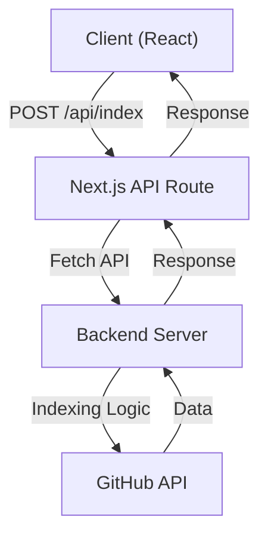
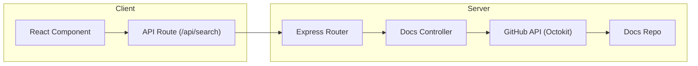
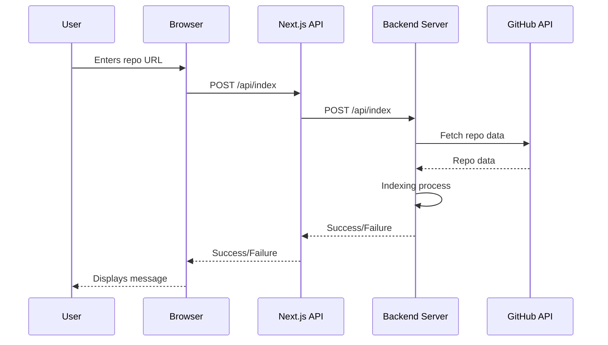

# API Endpoints

This document provides a detailed overview of the API endpoints available in GitDex, outlining their functionalities, request structures, and response formats.  This information is crucial for developers looking to integrate GitDex's capabilities into their own applications or services.

## Indexing Endpoint

The `/api/index` endpoint is responsible for initiating the indexing process for a given GitHub repository. It receives the repository URL as input and triggers a background process to extract and store the relevant documentation.

### Request

*   **Method:** `POST`
*   **URL:** `/api/api/index` (client) forwards to `${process.env.NEXT_PUBLIC_API_URL}/api/index` (server)
*   **Headers:** `Content-Type: application/json`
*   **Body:**

```json
{
  "repoUrl": "https://github.com/owner/repo"
}
```

### Response

*   **Success (200 OK):**

```json
{
  "message": "Indexing started successfully" // Example success message
}
```

*   **Error (400 Bad Request):**

```json
{
  "error": "Repo URL is required"
}
```

*   **Error (500 Internal Server Error):**

```json
{
  "error": "Internal server error"
}
```

This endpoint handles the initial request from the client, validates the input, and then forwards the request to the backend server.

```typescript
// client/src/app/api/index/route.ts
import { NextResponse } from 'next/server';

export async function POST(request: Request) {
  try {
    const body = await request.json();
    const { repoUrl } = body;
    
    if (!repoUrl) {
      return NextResponse.json({ error: 'Repo URL is required' }, { status: 400 });
    }
    
    // Forward the request to your backend
    const response = await fetch(`${process.env.NEXT_PUBLIC_API_URL}/api/index`, {
      method: 'POST',
      headers: {
        'Content-Type': 'application/json',
      },
      body: JSON.stringify({ repoUrl }),
    });
    
    const data = await response.json();
    
    if (!response.ok) {
      return NextResponse.json(data, { status: response.status });
    }
    
    return NextResponse.json(data);
  } catch (error) {
    console.error('Error in API route:', error);
    return NextResponse.json({ error: 'Internal server error' }, { status: 500 });
  }
}
```

[View on GitHub](https://github.com/shinymack/gitdex/blob/main/client/src/app/api/index/route.ts)

## Search Endpoint

The `/api/search` endpoint provides a search functionality that allows users to find repositories based on a query string.  It uses the GitHub API to search for repositories matching the provided query.

### Request

*   **Method:** `GET`
*   **URL:** `/api/search?q={query}`
*   **Query Parameters:**
    *   `q`: The search query string.

### Response

*   **Success (200 OK):**

```json
{
  "items": [
    {
      "id": 12345,
      "name": "repo-name",
      "full_name": "owner/repo-name",
      "description": "A short description",
      "url": "https://github.com/owner/repo-name"
    },
    // ... more results
  ]
}
```

*   **Success (200 OK) - No Results:**

```json
{
  "items": []
}
```

This endpoint utilizes the Octokit library to interact with the GitHub API.  It retrieves a larger page of results and then filters them to improve partial-name matching.

```typescript
// client/src/app/api/search/route.ts
import { Octokit } from '@octokit/rest';
import { NextResponse } from 'next/server';

export async function GET(req: Request) {
  const url = new URL(req.url);
  const q = (url.searchParams.get('q') || '').trim();

  if (!q) {
    return NextResponse.json({ items: [] });
  }

  try {
    const octokit = new Octokit({ auth: process.env.GITHUB_TOKEN });

    // Fetch a larger page from GitHub, then do a lightweight filter to improve
    // partial-name matches (helps when typing only part of a repo name).
    const res = await octokit.request('GET /search/repositories', {
      q: `${q} in:name,description`,
      per_page: 50,
    });

    const qLower = q.toLowerCase();
    const items = (res.data.items || [])
      .filter((repo: any) => {
        if (!repo) return false;
        const name = (repo.name || '').toLowerCase();
        const full = (repo.full_name || '').toLowerCase();
        const desc = (repo.description || '').toLowerCase();
        return full.includes(qLower) || name.includes(qLower) || desc.includes(qLower);
      })
      .slice(0, 7);

    return NextResponse.json({ items });
  } catch (err) {
    console.error('Octokit search error:', err);
    return NextResponse.json({ items: [] }, { status: 200 });
  }
}
```

[View on GitHub](https://github.com/shinymack/gitdex/blob/main/client/src/app/api/search/route.ts)

## Documentation Metadata Endpoint

The `/api/docs/:owner/:repo/meta.json` endpoint retrieves the metadata associated with the documentation for a specific repository. This metadata is stored in a `meta.json` file within the documentation repository.

### Request

*   **Method:** `GET`
*   **URL:** `/api/docs/:owner/:repo/meta.json`
*   **Path Parameters:**
    *   `owner`: The owner of the repository.
    *   `repo`: The name of the repository.

### Response

*   **Success (200 OK):**

```json
{
  "name": "Repository Name",
  "description": "A description of the repository.",
  "version": "1.0.0"
  // ... other metadata
}
```

*   **Success (200 OK) - Empty Metadata:**

```json
{}
```

*   **Error (404 Not Found):**

```json
{
  "error": "Doc not found"
}
```

This endpoint fetches the `meta.json` file from the designated documentation repository using Octokit. If the file is not found, it returns a 404 error.

```javascript
// server/controllers/docsController.js
import { Octokit } from '@octokit/rest';

const octokit = new Octokit({ auth: process.env.GITHUB_TOKEN });

// GET /api/docs/:owner/:repo/meta.json
export const getDocController = async (req, res) => {
  const { owner, repo } = req.params;
  try {
    // The documentation storage repo (e.g. shinymacktest/gitdex-docs)
  const docsRepoOwner = process.env.DOCS_REPO_OWNER || process.env.GITHUB_USERNAME;
  const docsRepo = process.env.DOCS_REPO_NAME || 'gitdex-docs';

    const { data: metaData } = await octokit.rest.repos.getContent({
      owner: docsRepoOwner,
      repo: docsRepo,
      path: `docs/${owner}/${repo}/meta.json`,
      // request raw so we can parse content directly
      mediaType: { format: 'raw' },
    });

    // If we got here, the meta.json exists
    try {
      // metaData will be raw content string when mediaType.format='raw'
      const parsed = typeof metaData === 'string' ? JSON.parse(metaData) : metaData;
      return res.json(parsed);
    } catch (e) {
      // If parsing fails, still return success but empty meta
      return res.json({});
    }
  } catch (error) {
    // If file not found, return 404 so callers can treat as not-indexed
    return res.status(404).json({ error: 'Doc not found' });
  }
};
```

[View on GitHub](https://github.com/shinymack/gitdex/blob/main/server/controllers/docsController.js)

## Documentation Files Endpoint

The `/api/docs/:owner/:repo/files` endpoint retrieves both the metadata and all the documentation files associated with a specific repository.

### Request

*   **Method:** `GET`
*   **URL:** `/api/docs/:owner/:repo/files`
*   **Path Parameters:**
    *   `owner`: The owner of the repository.
    *   `repo`: The name of the repository.

### Response

*   **Success (200 OK):**

```json
{
  "meta": {
    "name": "Repository Name",
    "description": "A description of the repository.",
    "version": "1.0.0"
  },
  "files": [
    {
      "path": "file1.md",
      "content": "# Title of File 1"
    },
    {
      "path": "file2.md",
      "content": "# Title of File 2"
    }
  ]
}
```

This endpoint fetches the `meta.json` file and then retrieves all files within the `docs/{owner}/{repo}` directory in the documentation repository. It uses Octokit to interact with the GitHub API and retrieve the file contents.

```javascript
// server/controllers/docsController.js
// GET /api/docs/:owner/:repo/files -> return meta + all files under docs/{owner}/{repo}
export const getDocsFiles = async (req, res) => {
  const { owner, repo } = req.params;
  try {
    const docsRepoOwner = process.env.DOCS_REPO_OWNER || process.env.GITHUB_USERNAME;
    const docsRepo = process.env.DOCS_REPO_NAME || 'gitdex-docs';

    // fetch meta.json
    const { data: metaData } = await octokit.rest.repos.getContent({
      owner: docsRepoOwner,
      repo: docsRepo,
      path: `docs/${owner}/${repo}/meta.json`,
    });

    // fetch tree and filter for this docs path
    const { data: treeData } = await octokit.rest.git.getTree({
      owner: docsRepoOwner,
      repo: docsRepo,
      tree_sha: 'main',
      recursive: 'true',
    });

    const docsPath = `docs/${owner}/${repo}/`;
    const docsFiles = treeData.tree.filter(item => item.path.startsWith(docsPath) && item.type === 'blob');

    const files = await Promise.all(
      docsFiles.map(async (file) => {
        const { data } = await octokit.rest.repos.getContent({
          owner: docsRepoOwner,
          repo: docsRepo,
          path: file.path,
        });

        let content = '';
        if ('content' in data && typeof data.content === 'string') {
          content = Buffer.from(data.content, 'base64').toString();
        }
        return { path: file.path.replace(docsPath, ''), content };
      })
    );

    return res.json({ meta: metaData, files });
  } catch (error) {
    console.error('getDocsFiles error', error);
    return res.status(500).json({ error: 'Failed to fetch docs files' });
  }
};
```

[View on GitHub](https://github.com/shinymack/gitdex/blob/main/server/controllers/docsController.js)





## API Routing

The server-side routing for the documentation endpoints is handled by Express.js, as shown below:

```javascript
// server/routes/docsRoutes.js
import express from 'express';
import { getDocController, getDocsFiles } from '../controllers/docsController.js';

const router = express.Router();

// New: GET /api/docs/:owner/:repo/meta.json -> get doc metadata
router.get('/:owner/:repo/meta.json', getDocController);
router.get('/:owner/:repo/files', getDocsFiles);

// Legacy route for single-segment repo (optional)
router.get('/:repo', getDocController);

export default router;
```

[View on GitHub](https://github.com/shinymack/gitdex/blob/main/server/routes/docsRoutes.js)

This code defines the routes for retrieving documentation metadata and files, mapping them to the corresponding controller functions.

## Key Integration Points

*   **GitHub API:** GitDex heavily relies on the GitHub API for searching repositories and retrieving file contents.  Authentication is managed through the `GITHUB_TOKEN` environment variable. Ensure that you are correctly authenticated with GitHub to avoid rate limiting.
*   **Octokit:**  This library simplifies interactions with the GitHub API.  Understanding its features and limitations is crucial for efficient development.
*   **Documentation Storage:**  GitDex assumes that documentation is stored in a dedicated repository, following a specific directory structure (`docs/{owner}/{repo}`).
*   **Error Handling:** Comprehensive error handling is essential to provide informative feedback to users and to prevent unexpected application behavior.

GitDex uses environment variables for configuration.

```bash
# .env
GITHUB_TOKEN=your_github_token
NEXT_PUBLIC_API_URL=http://localhost:3001 # Example, your backend URL
DOCS_REPO_OWNER=your_docs_repo_owner
DOCS_REPO_NAME=your_docs_repo_name
```







