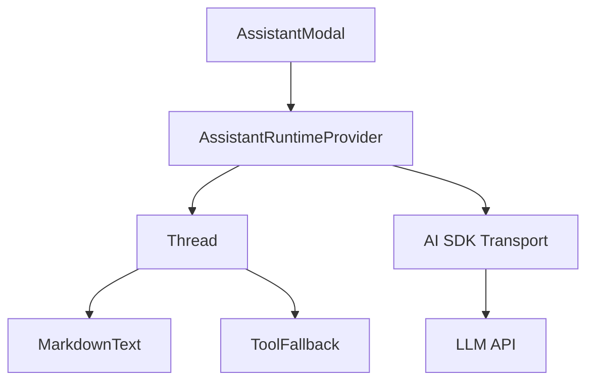

# Assistant User Interface

The Assistant User Interface is the interaction layer of GitDex, facilitating natural language communication between the user and the indexed repository data. It is built upon the `@assistant-ui` framework, which decouples the chat UI from the underlying LLM transport layer, allowing for complex state management of streaming responses, tool calls, and message threading.

## Architectural Role

The Assistant UI acts as the client-side orchestrator for AI interactions. It manages the lifecycle of a chat session, from the initial trigger in the `AssistantModal` to the rendering of structured AI responses via `MarkdownText` and the visualization of background tool executions via `ToolFallback`.



## Component Implementation

### Assistant Modal & Runtime
The `AssistantModal` serves as the root container. It implements a resizable sidebar for desktop views and a full-screen overlay for mobile. It wraps the chat interface in an `AssistantRuntimeProvider` to provide the chat state to all child components.

```tsx title="client/src/components/assistant-ui/assistant-modal.tsx"
export function AssistantModal() {
  const runtime = useChatRuntime({
    transport: new AssistantChatTransport({
      api: "/api/chat", // Endpoint for AI orchestration
    }),
  });

  return (
    <AssistantRuntimeProvider runtime={runtime}>
      <div className={cn("fixed right-0 top-0 h-full", isMobile ? "w-full" : "w-[400px]")}>
        <Thread />
      </div>
    </AssistantRuntimeProvider>
  );
}
```
The modal includes custom mouse event handlers (`startResizing`, `handleMouseMove`) to allow users to dynamically adjust the width of the assistant panel.

### Thread Management
The `Thread` component utilizes primitives from `@assistant-ui/react` to construct the chat experience. It separates the concerns of message display, user input (composer), and session state.

| Component/Primitive | Responsibility |
| :--- | :--- |
| `ThreadPrimitive` | Manages the core message list and scroll behavior. |
| `ComposerPrimitive` | Handles text input and attachment uploads. |
| `BranchPickerPrimitive` | Allows users to navigate different conversation paths. |
| `ThreadWelcome` | Renders the initial state before the first message. |
| `ThreadSuggestions` | Provides pre-defined prompt chips for common repository queries. |

```tsx title="client/src/components/assistant-ui/thread.tsx"
export const Thread: FC = () => {
  return (
    <ThreadPrimitive 
      components={{
        Message: MessagePrimitive,
        Composer: ComposerPrimitive,
        Error: ErrorPrimitive,
      }}
    >
      <ThreadWelcome />
      <ThreadSuggestions />
      <UserActionBar />
    </ThreadPrimitive>
  );
};
```

### Markdown Rendering
The `MarkdownText` component extends standard markdown rendering to support technical documentation requirements, including GitHub Flavored Markdown (GFM), mathematical notation, and architectural diagrams.

**Rendering Pipeline:**
1. **GFM**: Handled by `remark-gfm` for tables and checklists.
2. **Math**: Processed via `remark-math` and rendered using `rehype-katex`.
3. **Diagrams**: Custom integration with a `Mermaid` component to render `mermaid` code blocks.
4. **Code Blocks**: Enhanced with a copy-to-clipboard utility and custom headers.

```tsx title="client/src/components/assistant-ui/markdown-text.tsx"
const MarkdownText = memo(({ children }) => {
  return (
    <MarkdownTextPrimitive
      components={{
        code: (props) => {
          if (useIsMarkdownCodeBlock(props)) {
            return <CodeBlock {...props} />;
          }
          return <code {...props} />;
        },
      }}
      remarkPlugins={[remarkGfm, remarkMath]}
      rehypePlugins={[rehypeKatex]}
    >
      {children}
    </MarkdownTextPrimitive>
  );
});
```

### Tool Fallbacks
When the LLM invokes a tool (e.g., searching the index or reading a file), the system avoids displaying raw JSON tool calls. The `ToolFallback` component intercepts these parts of the message and renders a visual state indicator.

```tsx title="client/src/components/assistant-ui/tool-fallback.tsx"
export const ToolFallback: FC<ToolCallMessagePartComponent> = ({ toolCall }) => {
  const [isExpanded, setIsExpanded] = useState(false);

  return (
    <div className="flex items-center gap-2 p-2 rounded-md bg-muted">
      {toolCall.status === 'loading' ? (
        <Loader2Icon className="animate-spin" />
      ) : toolCall.status === 'error' ? (
        <XCircleIcon className="text-destructive" />
      ) : (
        <CheckIcon className="text-green-500" />
      )}
      <span className="text-xs font-mono">{toolCall.toolName}</span>
      <Button onClick={() => setIsExpanded(!isExpanded)} variant="ghost">
        {isExpanded ? <ChevronUpIcon /> : <ChevronDownIcon />}
      </Button>
    </div>
  );
};
```

## Data Flow: Message Lifecycle

1. **Input**: User submits a prompt via `ComposerPrimitive`.
2. **Transport**: `AssistantChatTransport` sends the payload to `/api/chat`.
3. **Streaming**: The API streams fragments of the response.
4. **Routing**: 
   - If the fragment is `text` $\rightarrow$ `MarkdownText` renders it.
   - If the fragment is a `tool_call` $\rightarrow$ `ToolFallback` renders the loading state.
5. **Resolution**: Once the tool returns data to the LLM and a final text response is generated, `ToolFallback` transitions to a success state and the final answer is appended.