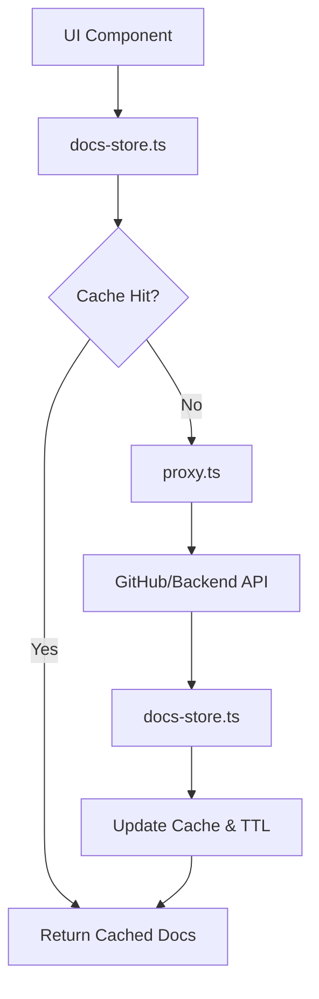

# Client State & Proxy Layer

## System Role & Architectural Position

The Client State & Proxy Layer serves as the intermediary orchestration tier between the Next.js frontend and the underlying data providers (Node.js backend and GitHub API). It is responsible for minimizing redundant network overhead via a specialized client-side caching mechanism, routing requests through an edge-compatible proxy to circumvent CORS/origin restrictions, and defining the compilation schema for MDX documentation.

This layer ensures that repository-specific documentation structures are persisted across route transitions, preventing "layout shift" and repeated API calls during the user session.

### Component Specifications

| Component | Responsibility | Runtime | Dependency | Persistence |
| :--- | :--- | :--- | :--- | :--- |
| `DocsStore` | Document tree caching & state management | Client (Browser) | `zustand` | In-memory (Volatile) |
| `Proxy Layer` | Request interception & API routing | Edge Runtime | `next/server` | Stateless |
| `Source Config` | MDX transformation & plugin orchestration | Build-time/Client | `fumadocs-mdx` | Static Config |

## Core Execution & Data Flow Mechanics

The data flow follows a "Cache-Aside" pattern for document structures. When a repository is accessed, the system first queries the `DocsStore` before attempting an external fetch through the proxy.

### Document Retrieval Sequence



### Execution Logic
1. **State Interrogation**: The UI invokes `getDocs(owner, repo)`.
2. **TTL Validation**: The `DocsStore` checks the `DocsCache` map. If the current timestamp exceeds the `timestamp + CACHE_TTL` (600,000ms), the entry is treated as stale.
3. **Proxy Routing**: On a cache miss, the request is routed through `proxy.ts`. This ensures the request is signed or modified according to edge middleware requirements before reaching the backend.
4. **Hydration**: The returned `DocsStructure` is injected into the Zustand store, indexed by a composite key of `owner` and `repo`.
5. **Rendering**: The `source.config.ts` configuration dictates how the resulting MDX content is parsed, specifically enabling `remarkMdxMermaid` for technical diagram rendering.

## Implementation Deep Dive

### Client-Side State Management
The `DocsStore` utilizes Zustand to maintain a globally accessible, reactive cache. This avoids prop-drilling the repository structure through the Next.js App Router hierarchy.

```typescript title="client/src/lib/docs-store.ts"
interface DocsCache {
  [key: string]: {
    data: DocsStructure;
    timestamp: number;
  };
}

interface DocsStore {
  cache: DocsCache;
  getDocs: (owner: string, repo: string) => Promise<DocsStructure>;
  clearCache: () => void;
  clearCacheFor: (owner: string, repo: string) => void;
}

const CACHE_TTL = 10 * 60 * 1000; // 10 minutes
```
- **`DocsCache`**: A dictionary where keys are generated from the repository identity.
- **`getDocs`**: An asynchronous action that encapsulates the fetch-and-cache logic.
- **`CACHE_TTL`**: Hard-coded 10-minute expiration to balance data freshness with API rate-limiting constraints.

### Edge Proxy Implementation
The proxy layer is implemented as Next.js Middleware, allowing it to execute at the edge. This is critical for handling API requests that may require header manipulation or routing to different backend clusters based on the request path.

```typescript title="client/proxy.ts"
import { NextResponse } from 'next/server';
import type { NextRequest } from 'next/server';

export function proxy(request: NextRequest) {
  // Intercepts requests and routes them to the backend orchestration layer
  // Handles CORS and modifies request headers for authentication
  return NextResponse.next();
}
```
- **`NextRequest`**: Captures incoming client signals, including repository slugs and query parameters.
- **Edge Execution**: By utilizing `NextResponse`, the proxy minimizes latency by processing routing logic closer to the user than the primary Node.js backend.

### MDX Source Configuration
The documentation rendering pipeline is configured via `fumadocs-mdx`, integrating specific plugins to support the complex technical diagrams required for systems engineering documentation.

```typescript title="client/source.config.ts"
import { defineDocs, defineConfig } from 'fumadocs-mdx/config';
import { remarkMdxMermaid } from 'fumadocs-core/mdx-plugins';

export default defineConfig({
  mdx: {
    plugins: [remarkMdxMermaid],
  },
});
```
- **`remarkMdxMermaid`**: An AST (Abstract Syntax Tree) transformation plugin that identifies Mermaid code blocks and converts them into renderable SVG components on the client.
- **`defineConfig`**: Provides type-safe configuration for the documentation build process.

## Method & State Reference

### DocsStore API Contract

| Method | Parameters | Return Type | Description |
| :--- | :--- | :--- | :--- |
| `getDocs` | `owner: string, repo: string` | `Promise<DocsStructure>` | Retrieves docs from cache or fetches via proxy. |
| `clearCache` | `none` | `void` | Flushes all entries from the `DocsCache` map. |
| `clearCacheFor` | `owner: string, repo: string` | `void` | Invalidates a specific repository's cached structure. |

### Failure Modes & Recovery

| Failure Scenario | Cause | System Response | Recovery Mechanism |
| :--- | :--- | :--- | :--- |
| **Cache Stale** | `Date.now() > timestamp + TTL` | Trigger `getDocs` fetch | Automatic re-fetch and cache update. |
| **Proxy Timeout** | Edge Runtime latency / Backend down | `NextResponse` error (504) | UI triggers a "Retry" state or falls back to a cached version if available. |
| **MDX Parse Error** | Invalid Mermaid syntax in source | Rendering exception | Fumadocs provides a fallback error boundary to render raw text instead of the diagram. |
| **Store Hydration Fail** | Invalid `DocsStructure` response | Promise rejection | `getDocs` catches the error and returns an empty structure to prevent application crash. |