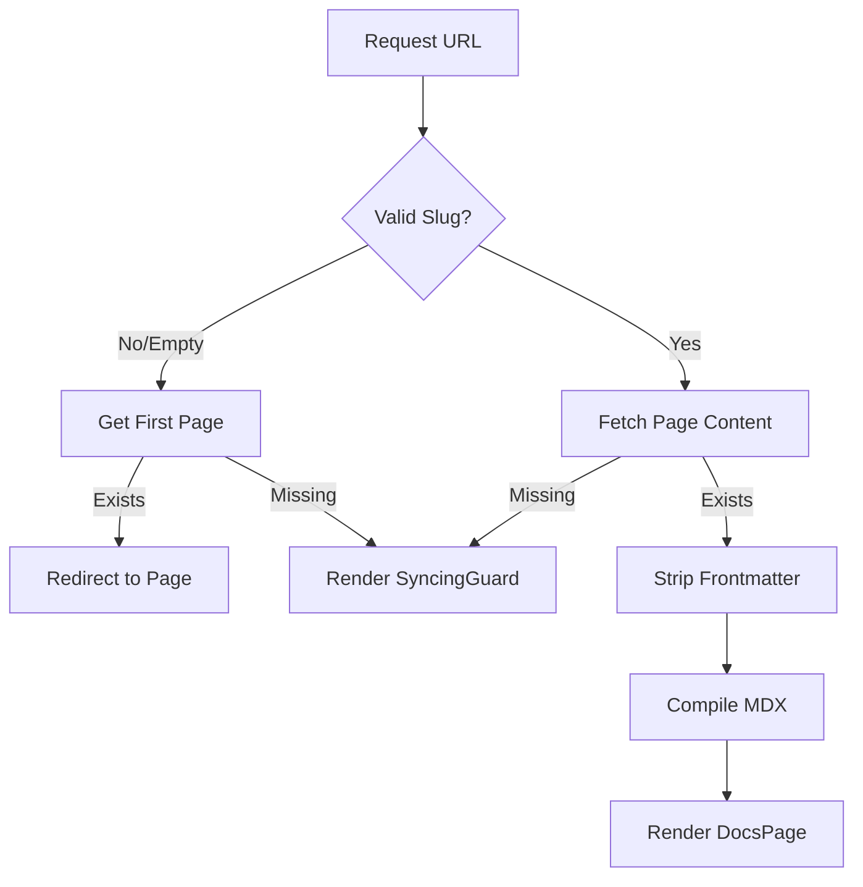

# Dynamic Repository Routing

## System Role & Architectural Position

The Dynamic Repository Routing system implements a multi-tenant documentation engine using Next.js App Router. It maps GitHub repository identifiers (`owner` and `repo`) to a virtualized documentation file system. Instead of static build-time generation, the system employs a "Just-in-Time" (JIT) resolution strategy where repository metadata and AI-generated MDX content are fetched and compiled on-demand.

This layer acts as the primary entry point for the end-user, bridging the gap between the Backend Core Engine's indexed data and the `fumadocs-ui` presentation layer.

### Routing Specifications

| Route Pattern | Purpose | Resolution Strategy | Key Dependency |
| :--- | :--- | :--- | :--- |
| `/[owner]/[repo]` | Repo Root | Redirect to first available page | `DynamicDocsSource` |
| `/[owner]/[repo]/[[...slug]]` | Doc Page | Dynamic MDX compilation | `mdx-compiler` |
| `/[owner]/[repo]/status` | Sync State | Polling-based job monitoring | `/api/status` |
| `/[owner]/[repo]/layout` | Global Repo Wrapper | Shared state (Assistant Modal) | `AssistantModal` |

## Core Execution & Data Flow Mechanics

The routing logic follows a strict resolution pipeline to ensure that users are never presented with empty states while AI indexing is in progress.

### Documentation Resolution Flow



### Execution Pipeline
1. **Parameter Extraction**: Next.js extracts `owner`, `repo`, and `slug` from the URL.
2. **Source Initialization**: `DynamicDocsSource` is instantiated to interface with the backend persistence layer (Redis/Database).
3. **Guard Verification**: If no content exists for the requested slug, the system renders a `SyncingGuard` or redirects to the `/status` page.
4. **Content Sanitization**: Raw MDX content is processed via `stripFrontmatter` to remove redundant YAML blocks that could crash the JSX parser.
5. **JIT Compilation**: The `compiler.compile` method transforms raw MDX strings into executable React components.
6. **Component Injection**: `getMDXComponents` injects repository-specific context (e.g., `defaultBranch`) into the MDX scope.

## Implementation Deep Dive

### Dynamic Page Resolution
The `[[...slug]]` catch-all route handles the mapping of URL paths to specific AI-generated documentation files.

```typescript title="client/src/app/[owner]/[repo]/[[...slug]]/page.tsx"
export const dynamic = 'force-dynamic';
export const revalidate = 0;

export default async function Page({ params }: PageProps) {
  const { owner, repo, slug = [] } = await params;
  
  // 1. Handle root redirect
  if (slug.length === 0) {
    const source = new DynamicDocsSource(owner, repo);
    await source.initialize();
    const firstPage = source.getFirstPage();
    if (firstPage) {
      redirect(`/${owner}/${repo}${firstPage.url}`);
    } else {
      return <SyncingGuard owner={owner} repo={repo} />;
    }
  }

  // 2. Resolve specific page
  const source = new DynamicDocsSource(owner, repo);
  await source.initialize();
  const page = source.getPage(slug);

  if (!page) {
    return <SyncingGuard owner={owner} repo={repo} />;
  }

  // 3. Content Processing
  const mdxContent = stripFrontmatter(page.content);
  const compiled = await compiler.compile({ source: mdxContent });

  return (
    <DocsPage full={page.url === '/'} toc={getTableOfContents(mdxContent)}>
      <DocsBody>
        <MdxContent components={getMDXComponents({ owner, repo, defaultBranch })} />
      </DocsBody>
    </DocsPage>
  );
}
```

**Technical Mechanics:**
- **`force-dynamic`**: Disables static optimization, forcing the server to evaluate the request on every hit. This is critical as documentation content changes asynchronously via the AI pipeline.
- **`stripFrontmatter`**: Employs a `while` loop to aggressively remove leading `---` blocks. This prevents LLM-generated artifacts (like double-frontmatter) from being treated as text and breaking the MDX parser.
- **`DynamicDocsSource`**: Abstracts the logic for retrieving the page tree and specific content nodes from the backend API.

### Indexing Status Polling
The `/status` route manages the user experience during the asynchronous AI generation process, utilizing an exponential backoff polling strategy.

```typescript title="client/src/app/[owner]/[repo]/status/page.tsx"
const runPolling = useCallback(async () => {
  const done = await fetchStatus();
  if (!done) {
    // Exponential backoff: increase delay up to 5000ms
    delayRef.current = Math.min(delayRef.current + 1000, 5000);
    pollTimeoutRef.current = setTimeout(runPolling, delayRef.current);
  }
}, [fetchStatus]);
```

**Key State Transitions:**
- **`loading` $\rightarrow$ `not-indexed`**: No record found in the system; triggers "Start Indexing" button.
- **`not-indexed` $\rightarrow$ `queued`**: Request sent to `/api/index`; job placed in QStash.
- **`queued` $\rightarrow$ `processing`**: Job picked up by the worker; `currentStep` begins updating.
- **`processing` $\rightarrow$ `completed`**: Indexing finished; triggers `router.push` to the documentation root.

## Method & State Reference

### Routing State Machine

| State | Trigger | UI Component | Transition To |
| :--- | :--- | :--- | :--- |
| `queued` | `/api/index` POST | `Hourglass` / Pulse Text | `processing` |
| `processing` | QStash Job Start | `Progress` / `Loader2` | `completed` or `failed` |
| `failed` | Backend Error | `AlertCircle` / Error Msg | `processing` (on retry) |
| `not-indexed` | `indexed: false` | `BookOpen` / Action Button | `queued` |

### Parameter Contracts

#### `DynamicDocsSource` Initialization
| Parameter | Type | Description |
| :--- | :--- | :--- |
| `owner` | `string` | GitHub organization or user handle. |
| `repo` | `string` | Repository name slug. |
| `slug` | `string[]` | Array of path segments mapping to doc files. |

### Error Recovery & Failure Modes

1. **JSX Parser Crash**: Occurs when raw YAML/Frontmatter is passed to the MDX compiler. Resolved by the `stripFrontmatter` regex-like loop.
2. **Race Condition (Indexing vs. Viewing)**: Occurs when a user accesses a page while it is being written. Resolved by the `SyncingGuard` component which intercepts `null` page returns and displays a loading state.
3. **Stale Page Tree**: Resolved by the `ReindexButton` in the `DocsLayout`, which forces a backend re-scan of the repository structure.