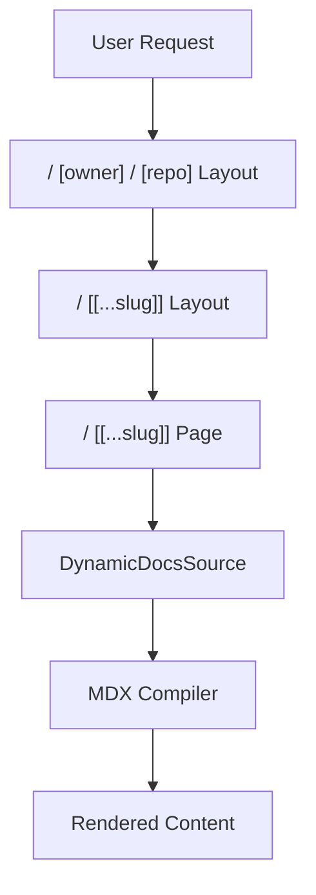

# Dynamic Routing

The Dynamic Routing module is the backbone of GitDex's frontend navigation. It leverages the Next.js App Router to create a flexible, parameter-driven URL structure that allows GitDex to serve AI-powered documentation for any GitHub repository on the fly.

By utilizing dynamic segments and optional catch-all routes, GitDex transforms a standard GitHub repository path (owner/repo) into a fully functional documentation site with a nested page hierarchy.

### Routing Architecture

GitDex employs a nested directory structure within the `app` directory to capture repository identity and file paths. The routing hierarchy is defined as follows:

| Route Segment | Type | Purpose | Example |
| :--- | :--- | :--- | :--- |
| `[owner]` | Dynamic | Identifies the GitHub user or organization. | `shinymack` |
| `[repo]` | Dynamic | Identifies the specific repository. | `gitdex` |
| `[[...slug]]` | Optional Catch-all | Maps to the file path or documentation slug. | `docs/installation` |

This structure ensures that every repository gets its own unique namespace, while the `[[...slug]]` segment allows for an arbitrary depth of nested pages without requiring predefined routes for every file in a repository.

### Component Interaction & Data Flow

The routing process follows a layered approach. When a request hits a repository URL, it passes through two layout levels before reaching the final page component.



1.  **Root Repo Layout (`/[owner]/[repo]/layout.tsx`)**: This is the outermost wrapper for a specific repository. It initializes the repository context and injects global utilities, most notably the `AssistantModal`, ensuring the AI chat is available regardless of which specific file the user is viewing.
2.  **Docs Layout (`/[[...slug]]/layout.tsx`)**: This layer integrates `fumadocs-ui`. It uses the `DynamicDocsSource` to resolve the repository's content structure and provides the `ReindexButton`, allowing users to trigger a fresh index of the repository.
3.  **Content Page (`/[[...slug]]/page.tsx`)**: The leaf node of the route. It extracts the `slug` to determine which specific document to fetch, processes the content via a custom MDX compiler, and renders it using the `DocsBody` component.

### Focused Code Walkthrough

#### Parameter Handling
Both layouts and pages utilize asynchronous `params` to extract the repository identity. This is critical for fetching the correct data from the backend.

```tsx
interface PageProps {
  params: Promise<{
    owner: string;
    repo: string;
    slug?: string[];
  }>;
}
```

The `slug` is typed as `string[]` because of the catch-all `[[...slug]]` syntax, which captures all subsequent URL segments into an array (e.g., `/docs/api/auth` becomes `['docs', 'api', 'auth']`).

#### Content Rendering Pipeline
The page component handles the transformation of raw repository data into rendered MDX. It utilizes a `SyncingGuard` to manage the user experience during active indexing and a custom compiler for GitDex-specific syntax.

```tsx
// Simplified logic from client/src/app/[owner]/[repo]/[[...slug]]/page.tsx
export default async function Page({ params }: PageProps) {
  const { owner, repo, slug } = await params;
  
  // Content is resolved dynamically based on the slug array
  const page = await DynamicDocsSource.getPage(slug);

  if (!page) {
    redirect('/404');
  }

  return (
    <SyncingGuard owner={owner} repo={repo}>
      <DocsPage toc={getTableOfContents(page)}>
        <DocsBody content={compiler(page.content)} />
      </DocsPage>
    </SyncingGuard>
  );
}
```

#### Dynamic Source Integration
The `DynamicDocsSource` is the bridge between the URL parameters and the actual content. In the layout, it is passed to the `DocsLayout` to configure the sidebar and navigation tree:

```tsx
// From client/src/app/[owner]/[repo]/[[...slug]]/layout.tsx
<DocsLayout 
  tree={DynamicDocsSource.tree} 
  {...baseOptions}
>
  {children}
</DocsLayout>
```

### Summary of Routing Logic

*   **Context Preservation**: The `[owner]/[repo]` segments act as the primary keys for all backend API calls.
*   **Flexible Hierarchy**: The `[[...slug]]` segment allows GitDex to mirror the actual file structure of the GitHub repository in the browser's address bar.
*   **Guard-Based Rendering**: The `SyncingGuard` prevents the application from attempting to render documentation that is currently being indexed or is outdated.