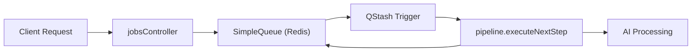
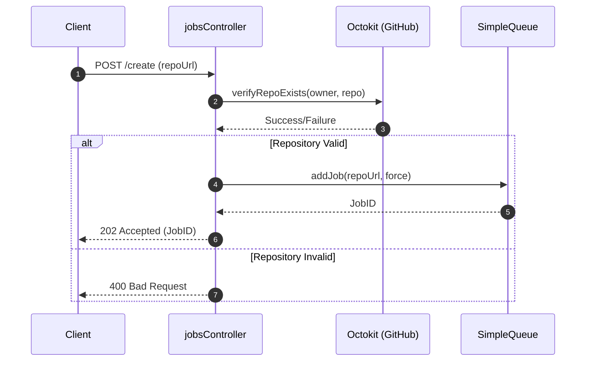

# Job Queue & Scheduling

The Job Queue and Scheduling system in GitDex is designed to handle the resource-intensive process of repository indexing asynchronously. By decoupling the request to index a repository from the actual processing pipeline, the system ensures the main thread remains non-blocking and provides a scalable way to manage long-running AI ingestion tasks.

## System Architecture

The system utilizes a combination of **Redis** (via Upstash) for state persistence and locking, and **QStash** for reliable asynchronous message triggering. This architecture allows the backend to trigger a pipeline step and then "sleep," relying on an external webhook to wake the server up for the next step of execution.



## Job Lifecycle & Data Model

Each repository indexing request is treated as a "Job." The state of these jobs is persisted in Redis to allow for recovery, status tracking, and concurrency control.

### Job State Transitions
Jobs move through the following states:
- `queued`: The job has been created and is waiting for processing.
- `processing`: The job is currently being handled by the pipeline.
- `completed`: Indexing is finished successfully.
- `failed`: An error occurred during processing.

### Job Data Structure
The `JobData` interface defines the schema for every job tracked by the system:

| Field | Type | Description |
| :--- | :--- | :--- |
| `id` | `string` | Unique identifier for the job. |
| `state` | `JobState` | Current status (`queued`, `processing`, `completed`, `failed`). |
| `repoUrl` | `string` | The full URL of the GitHub repository. |
| `owner` | `string` | GitHub organization or user owner. |
| `repo` | `string` | The name of the repository. |
| `createdAt` | `number` | Timestamp of job creation. |
| `updatedAt` | `number` | Timestamp of the last status update. |
| `currentStep` | `number` | The current index of the processing pipeline being executed. |
| `error` | `string \| null` | Error message if the job state is `failed`. |
| `data` | `string \| null` | Additional metadata or processing results. |

## Technical Implementation

### The SimpleQueue Class
The `SimpleQueue` class in `server/src/queue.ts` acts as the orchestrator for job persistence and concurrency. It provides critical utilities to prevent duplicate indexing of the same repository.

**Key Functionalities:**
- **Atomic Locking:** Uses `acquireStepLock` and `releaseStepLock` to ensure that a single repository is not processed by multiple workers simultaneously.
- **Deduplication:** The `getJobId` method generates deterministic IDs based on the owner and repo, allowing the system to check if a job already exists before creating a new one.
- **Self-Healing:** The `healStuckJobs` method identifies jobs that have been in the `processing` state for too long and reverts them to `queued` or `failed` to prevent permanent hangs.

### Job Creation Workflow
When a user submits a repository for indexing, the `jobsController.ts` manages the validation and initiation process.



## API Reference

The following endpoints are exposed via `server/src/routes/jobsRoutes.ts` to manage and monitor the queue.

| Endpoint | Method | Description | Controller Function |
| :--- | :--- | :--- | :--- |
| `/create` | `POST` | Initiates a new indexing job for a given URL. | `createJob` |
| `/status/:id` | `GET` | Retrieves the current state of a specific job by ID. | `getJobStatus` |
| `/status/:owner/:repo` | `GET` | Retrieves job status using GitHub identifiers. | `getStatusByName` |
| `/cron/heal` | `POST` | Triggers the self-healing mechanism for stuck jobs. | `cronHeal` |

## Asynchronous Execution & Scheduling

To avoid blocking the Node.js event loop during heavy AI processing, GitDex uses a webhook-based trigger system:

1. **Trigger:** The `SimpleQueue.triggerNextJob()` method sends a request to **QStash**.
2. **Webhook:** QStash calls the `/execute-next-step` endpoint in `jobsRoutes.ts`.
3. **Verification:** The `verifyQstashSignature` middleware ensures the request is authentic.
4. **Execution:** The `executeNextStep` function in the pipeline processes the current step and, upon completion, calls the queue again to trigger the subsequent step.

### Error Handling
If a step fails, the `failJob` method is called:
```typescript
async failJob(jobId: string, error: string): Promise<string | null> {
    await this.updateJob(jobId, { 
        state: 'failed', 
        error, 
        updatedAt: Date.now() 
    });
    // ... additional cleanup logic
}
```
This updates the Redis state, allowing the frontend to notify the user of the specific failure reason.