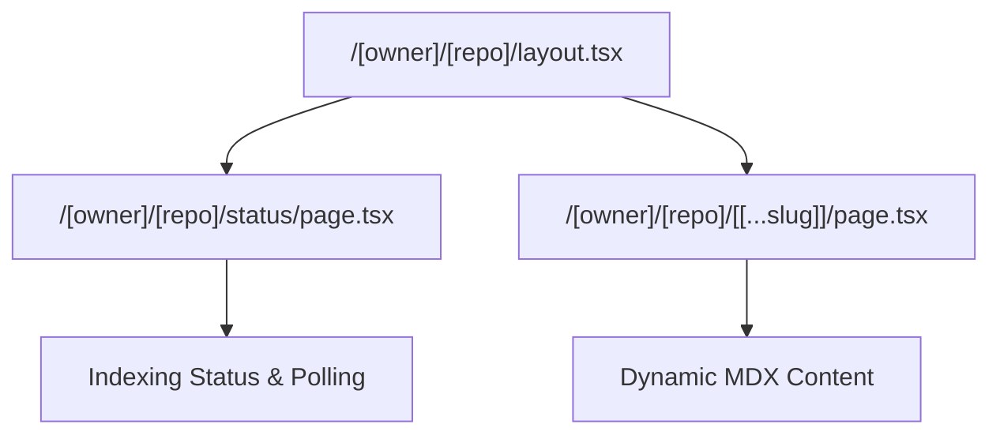
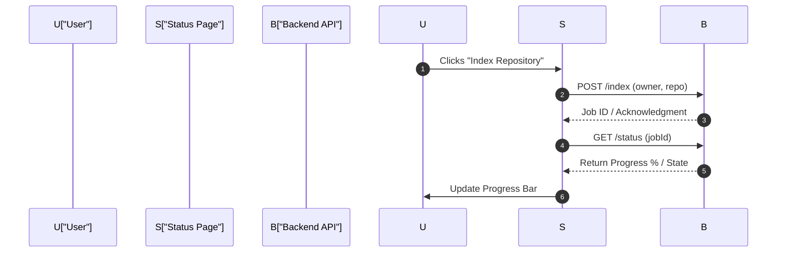

# Routing and Page Structure

GitDex utilizes the Next.js App Router to implement a hierarchical, dynamic routing system. This architecture allows the application to resolve repository-specific contexts (owner and repository name) and navigate through deep-linked documentation paths (slugs) seamlessly.

## Route Architecture

The routing system is centered around a dynamic segment pattern that captures the GitHub repository identity and the specific content being viewed.

### Route Parameters

The following table defines the dynamic parameters used across the repository-specific routes:

| Parameter | Type | Segment | Description | Example |
| :--- | :--- | :--- | :--- | :--- |
| `owner` | `string` | `/[owner]` | The GitHub username or organization name. | `shinymack` |
| `repo` | `string` | `/[repo]` | The name of the target repository. | `gitdex` |
| `slug` | `string[]` | `/[[...slug]]` | Optional catch-all segment for MDX file paths. | `["docs", "setup"]` |

### Routing Hierarchy

The application uses a nested layout pattern to ensure that repository-wide components (like the AI Assistant) persist across different pages within the same repository context.



## Implementation Details

### Repository Layout
The `layout.tsx` file acts as the wrapper for all repository-specific views. It ensures that the `AssistantModal` is available regardless of whether the user is viewing the indexing status or a specific documentation page.

```tsx
interface LayoutProps {
  children: ReactNode;
  params: Promise<{
    owner: string;
    repo: string;
  }>;
}
```

### Dynamic Documentation Pages
The core of the documentation experience resides in the `[[...slug]]` catch-all route. This page integrates with `fumadocs-ui` and a custom dynamic source to render repository content on the fly.

Key technical components include:
- **`DynamicDocsSource`**: Resolves the content based on the provided owner, repo, and slug.
- **`mdx-compiler`**: Processes raw content into renderable components.
- **`SyncingGuard`**: A wrapper component that manages the state synchronization between the client and the indexing server.

```tsx
interface PageProps {
  params: Promise<{
    owner: string;
    repo: string;
    slug?: string[];
  }>;
}
```

### Indexing Status Page
The `/status` route provides a dedicated interface for users to initiate and monitor the repository indexing process. It implements a polling mechanism to track progress via the backend.

**Core Logic Flow:**
1. **`indexRepo`**: Triggers the initial indexing request to the server.
2. **`initPoll`**: Establishes a polling interval to fetch the current status of the indexing job.



## Invariants & Failure Modes

### Handling Missing Content
Since the `[[...slug]]` route is a catch-all, the application must handle cases where the resolved slug does not map to an existing file in the repository. The `DocsPage` and `DynamicDocsSource` are designed to handle these resolution failures, typically resulting in a 404 state or a redirect to the repository root.

### Synchronization State
The use of the `SyncingGuard` prevents users from interacting with documentation that is currently being updated or indexed. This prevents "partial content" views where the AI assistant might be aware of files that the UI hasn't yet rendered.

### Parameter Resolution
Because `params` are provided as a `Promise` in the Next.js App Router (as seen in `PageProps`), the application must `await` these parameters before passing them to the `DynamicDocsSource` or the indexing API to avoid race conditions during server-side rendering (SSR).

### Polling Overhead
The `/status` page utilizes a polling mechanism. To prevent server exhaustion, this is implemented via `useEffect` and `useCallback` to ensure that polling only occurs when the component is mounted and active.