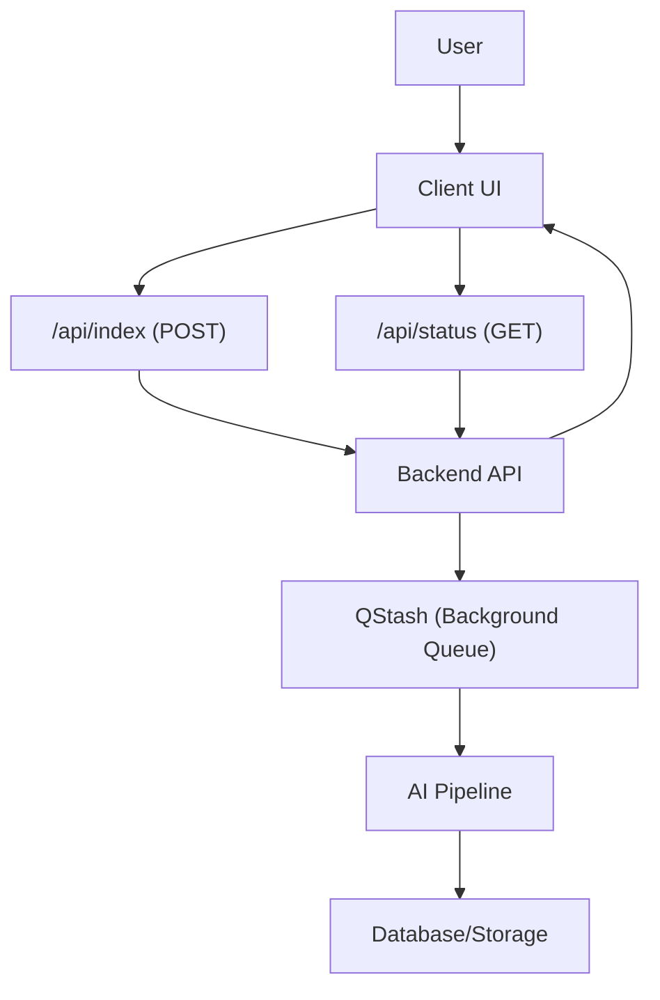

# Repository Status and Indexing

GitDex employs an asynchronous indexing pipeline to transform GitHub repositories into structured documentation. Because AI-driven analysis of large codebases is computationally intensive, the system separates the **triggering** of an index from the **monitoring** of its progress.

## Indexing Lifecycle

When a repository is submitted for indexing, it moves through a series of states. The system uses a polling mechanism to track these transitions in real-time.

### Job States

| State | Description | User Experience |
| :--- | :--- | :--- |
| `loading` | Initial check of the repository status. | "Checking Status..." |
| `not-indexed` | No documentation exists for this repository. | Prompt to "Start Indexing" |
| `queued` | Job is waiting for an available worker. | "Waiting in Queue" |
| `processing` | AI is currently analyzing and generating docs. | Progress bar with step descriptions |
| `failed` | An error occurred during the pipeline. | Error message with "Try Again" option |

### Processing Pipeline
The indexing process is broken down into four primary stages, each representing a milestone in the generation pipeline:

1. **Scanning (20%)**: The system crawls the repository files to understand the project structure.
2. **Planning (40%)**: AI determines the most logical documentation architecture based on the codebase.
3. **Writing (75%)**: The AI generates the actual content for each documentation section.
4. **Uploading (90%)**: The final documentation is persisted to the database and made public.

## System Architecture

The indexing process is handled in the background via **QStash**, ensuring that the web client does not time out during long-running AI operations.

## Triggering and Re-indexing

### Initial Indexing
If a repository has never been indexed, users are directed to the `/status` page where they can trigger the initial process. This initiates a `POST` request to `/api/index` with the repository URL.

### Re-indexing Existing Docs
For repositories already documented, GitDex provides a `ReindexButton` component within the documentation view. 

- **Relative Timestamps**: The button displays when the repository was last indexed (e.g., "2h ago") by fetching the `updatedAt` timestamp from the status API.
- **Cooldown Period**: To prevent API abuse and redundant costs, the system implements a cooldown mechanism. If a re-index is requested too frequently, the API returns a `429 Too Many Requests` response, which is handled in the UI as a "Cooldown Active" toast notification.
- **Seamless Transition**: Upon clicking "Reindex," the user is redirected to the status page to monitor the progress of the background job.

## API Reference

### Check Status
`GET /api/status?owner={owner}&repo={repo}`

Returns the current state of the repository.
- **Success Response**: Returns a JSON object containing `indexed` (boolean) and `job` details (state, currentStep, error, updatedAt).

### Trigger Index
`POST /api/index`

Starts the indexing pipeline.
- **Payload**: `{ "repoUrl": "https://github.com/owner/repo", "force": boolean }`
- **Behavior**: Returns a success message once the job is successfully queued in QStash.