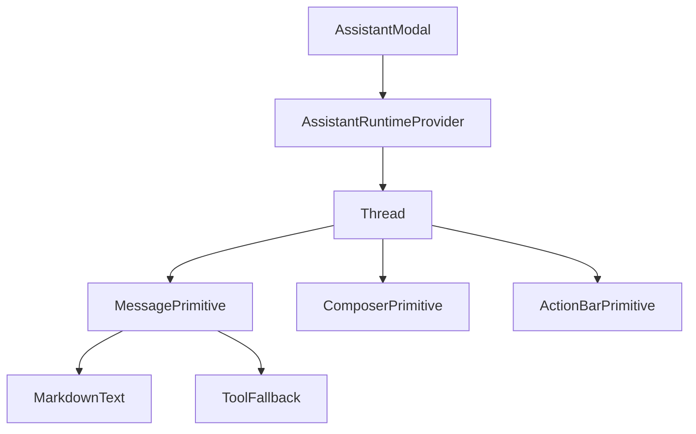
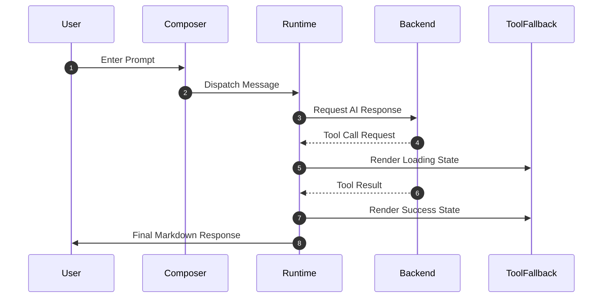

# AI Assistant UI Components

The AI Assistant UI provides a sophisticated, interactive chat interface that allows users to query the indexed repository. It is built upon the `@assistant-ui` framework, integrating streaming AI responses, structured markdown rendering, and specialized handlers for tool calls.

## Component Architecture

The UI is organized hierarchically, moving from the global layout wrapper down to granular content renderers.



## The Chat Runtime

The assistant's state and communication logic are managed by a runtime provider and transport layer. This decoupling allows the UI components to remain agnostic of the specific AI SDK implementation.

### Runtime Integration
The `AssistantModal` initializes the chat environment using:
- `AssistantRuntimeProvider`: Provides the context for the chat state.
- `useChatRuntime`: A hook to interact with the active chat session.
- `AssistantChatTransport`: Handles the actual network communication between the client and the AI backend.

## Core UI Components

### 1. Assistant Modal
The `AssistantModal` acts as the entry point and container. It features a resizable side-panel implementation to ensure the chat does not obstruct the main codebase visualization.

**Resizing Logic:**
The modal implements custom mouse event listeners to track movement and update the panel width dynamically.

```tsx
const handleMouseMove = (mouseMoveEvent: MouseEvent) => {
  const newWidth = mouseMoveEvent.clientX;
  if (newWidth > 300 && newWidth < 800) {
    setPanelWidth(newWidth);
  }
};
```

### 2. Chat Thread
The `Thread` component is the primary orchestration layer for the conversation. It utilizes several primitives to create a seamless chat experience.

| Component/Primitive | Purpose |
| :--- | :--- |
| `ThreadPrimitive` | The main container for the message history. |
| `ComposerPrimitive` | The input area where users type queries and add attachments. |
| `MessagePrimitive` | Individual message bubbles for either the user or the assistant. |
| `ThreadWelcome` | Initial state displayed when no messages exist in the thread. |
| `ThreadSuggestions` | Pre-defined prompt chips to guide user interaction. |

### 3. Markdown Rendering
The `MarkdownText` component extends standard markdown capabilities to support technical documentation and architectural diagrams.

**Rendering Pipeline:**
The component uses a combination of `remark` and `rehype` plugins to process content:
- `remark-gfm`: GitHub Flavored Markdown.
- `remark-math` & `rehype-katex`: Mathematical notation rendering.
- `Mermaid`: Custom integration for rendering Mermaid.js diagrams directly in the chat.

**Code Block Enhancement:**
Custom `CodeHeader` components are used to provide metadata and a one-click copy function for code snippets.

```tsx
const onCopy = () => {
  navigator.clipboard.writeText(code);
  setCopied(true);
  setTimeout(() => setCopied(false), 2000);
};
```

### 4. Tool Fallbacks
When the AI invokes a tool (e.g., searching the codebase or reading a file), the `ToolFallback` component provides visual feedback to the user.

**Tool State Management:**
The component implements `ToolCallMessagePartComponent` to handle three primary states:

| State | Icon | UI Behavior |
| :--- | :--- | :--- |
| **Loading** | `Loader2Icon` | Displays a spinning indicator while the tool executes. |
| **Success** | `CheckIcon` | Confirms tool completion; allows collapsing the output. |
| **Error** | `XCircleIcon` | Alerts the user that the tool call failed. |

## Interaction Flow

The following sequence diagram illustrates the lifecycle of a user request that triggers a tool call.



## Invariants & Failure Modes

### Streaming and Rendering
- **Invariant**: Markdown rendering must be memoized via `unstable_memoizeMarkdownComponents` to prevent expensive re-renders of the entire chat thread during token streaming.
- **Failure Mode**: If a Mermaid diagram contains syntax errors, the `Mermaid` component must handle the error gracefully without crashing the entire message thread.

### Tool Execution
- **Edge Case**: When a tool call is initiated but the connection is severed, the `ToolFallback` may remain in a "Loading" state. The system relies on the `ErrorPrimitive` to catch and display network-level failures.
- **State Handling**: Tool outputs can be large. The `ToolFallback` uses a collapsible UI pattern to prevent long tool outputs from pushing the actual AI response off-screen.

### UI Constraints
- **Boundaries**: The resizable panel is constrained between 300px and 800px to maintain usability across different screen resolutions.
- **Input**: The `Composer` integrates with attachment handlers, ensuring that file references are correctly passed to the runtime as part of the message payload.