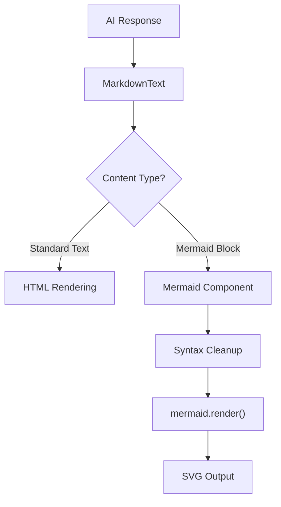

# AI Assistant UI

The AI Assistant UI is the primary interaction layer of GitDex, serving as the human-AI bridge that transforms raw LLM responses into a structured, interactive chat experience. Rather than building a chat interface from scratch, GitDex leverages `@assistant-ui/react` as a foundation, extending it with specialized components for code repository analysis, such as markdown rendering and dynamic Mermaid.js diagrams.

This module is responsible for maintaining the conversational state, handling user input through a rich composer, and rendering complex technical content (code blocks, diagrams, and tool outputs) in a readable format.

### Core Component Architecture

The UI is organized into a hierarchy where high-level primitives manage the state and layout, while specialized leaf components handle the presentation of specific data types.

| Component | Role | Key Responsibility |
| :--- | :--- | :--- |
| `Thread` | Orchestrator | Manages the overall chat layout, including the message list and composer. |
| `MessagePrimitive` | Renderer | Handles the display of individual messages (User vs. Assistant). |
| `MarkdownText` | Formatter | Parses AI responses into formatted HTML/React components. |
| `Mermaid` | Visualizer | Renders text-based Mermaid syntax into SVG diagrams. |
| `ComposerPrimitive`| Input | Manages user queries and attachment uploads. |

### Interaction & Rendering Flow

The flow of a response from the AI to the screen involves a multi-stage rendering pipeline. When the assistant returns a response containing markdown and diagram syntax, the UI must intercept and process these elements before final display.



### The Visualization Pipeline: Mermaid Integration

One of the most powerful features of the AI Assistant UI is its ability to visualize repository structures and logic flows via Mermaid.js. Because LLMs occasionally produce slightly malformed Mermaid syntax, GitDex implements a robust sanitization and rendering pipeline within `client/src/components/mermaid.tsx`.

#### Syntax Sanitization
To ensure reliability, the `Mermaid` component doesn't pass raw AI output directly to the renderer. It employs utility functions to "clean" the content and fix common syntax errors.

```typescript
function fixMermaidSyntax(chart: string): string {
  // Logic to ensure the chart starts with a valid 
  // Mermaid diagram definition (e.g., graph TD, sequenceDiagram)
  // and removes trailing whitespace or invalid characters.
  return cleanContent(chart);
}
```

#### Optimized Rendering
To prevent flickering and redundant CPU usage during React re-renders, the module utilizes a `cachePromise` pattern. This ensures that a diagram is only rendered once for a specific key, and subsequent requests for that same diagram return the cached promise.

```typescript
async function renderMermaid(chart: string, theme: string) {
  const id = `mermaid-${Math.random().toString(36).substr(2, 9)}`;
  const { svg } = await mermaid.render(id, chart);
  return svg;
}
```

### Chat Interface Implementation

The `Thread` component (found in `client/src/components/assistant-ui/thread.tsx`) integrates several UX enhancements to make the AI interaction feel production-ready.

#### 1. Adaptive User Actions
The `UserActionBar` provides context-aware controls for the user. By utilizing `ActionBarPrimitive`, GitDex allows users to interact with AI messages through actions like:
* **Regeneration:** Using `RefreshCwIcon` to trigger a new response.
* **Copying:** Using `CopyIcon` to clip responses to the clipboard.
* **Editing:** Using `PencilIcon` to modify previous prompts.

#### 2. Rich Composer & Attachments
The input area is more than a simple text box. It integrates `ComposerAddAttachment` and `ComposerAttachments`, allowing users to provide specific context (like files or code snippets) to the AI, which is then tracked via `UserMessageAttachments`.

#### 3. Enhanced Viewability
Since technical diagrams can become massive, the `Mermaid` component implements a "Maximize" feature using a Radix-based Dialog.

```tsx
// Snippet from Mermaid component
<div onClick={() => setOpen(true)} className="cursor-pointer">
  <Maximize2 className="h-4 w-4" />
  <MermaidContent chart={chart} />
</div>
```

This allows engineers to toggle between a compact inline view and a full-screen modal (`MermaidDialogContent`) for deep architectural analysis.