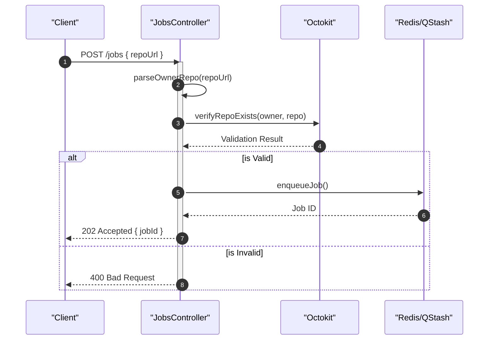
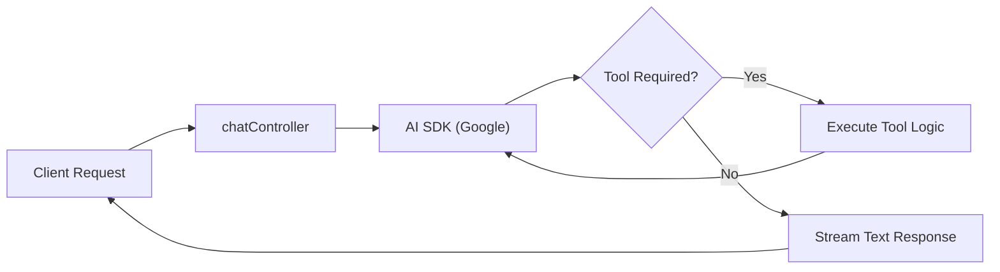

# API Endpoints

The GitDex server provides a RESTful API to manage repository indexing jobs and interface with the AI-powered codebase analyzer. The API is built using Express and integrates with Redis for queue management and the AI SDK for LLM interactions.

## API Overview

The endpoints are divided into two primary categories: **Jobs Management**, which handles the asynchronous ingestion and indexing of repositories, and **AI Chat**, which provides the interface for querying the indexed codebase.

### Endpoint Summary

| Method | Endpoint | Controller Method | Description |
| :--- | :--- | :--- | :--- |
| `POST` | `/jobs` | `createJob` | Initiates a new repository indexing job. |
| `GET` | `/jobs/:id` | `getJobStatus` | Retrieves status for a specific job ID. |
| `GET` | `/jobs/:name` | `getStatusByName` | Retrieves status based on repository name. |
| `POST` | `/jobs/heal` | `cronHeal` | Maintenance endpoint for queue healing. |
| `POST` | `/chat` | `handleChat` | Streams AI responses based on repository context. |
| `POST` | `/pipeline/next` | `executeNextStep` | Internal endpoint to trigger the next pipeline stage. |
| `POST` | `/pipeline/webhook` | `Receiver` | QStash webhook receiver for async tasks. |

---

## Jobs Management API

The Jobs API handles the lifecycle of repository indexing. Because indexing is resource-intensive, the system uses an asynchronous pattern: the API validates the request and queues the job, returning a reference ID to the client.

### Job Creation Logic
When a `POST /jobs` request is received, the `jobsController` performs the following sequence:
1. **URL Parsing**: Extracts the owner and repository name from the provided `repoUrl` using `parseOwnerRepo`.
2. **Verification**: Uses `verifyRepoExists` (via `@octokit/rest`) to ensure the repository is accessible on GitHub.
3. **Queueing**: Adds the job to the Redis-backed queue and schedules the initial processing step via Upstash QStash.

### Job Status Retrieval
Clients can poll the status of an indexing job using either the unique job ID or the repository name. These endpoints query the Redis store to return the current state of the pipeline.

### Sequence: Job Submission Flow


---

## AI Chat API

The `/chat` endpoint serves as the primary interface for the AI Assistant. It leverages the Vercel AI SDK to provide streaming responses and tool-calling capabilities.

### Controller Logic: `handleChat`
The `handleChat` function manages the conversation loop:
- **LLM Integration**: Uses `@ai-sdk/google` to interface with Google's generative models.
- **Contextual Processing**: Utilizes `convertToModelMessages` to maintain conversation history.
- **Tool Calling**: The controller defines specific tools using `zod` schemas, allowing the AI to perform actions (like querying the codebase) during the generation process.
- **Streaming**: Uses `streamText` to push tokens to the client in real-time.

### Chat Execution Flow


---

## Pipeline & Internal Endpoints

To maintain a non-blocking architecture, the system utilizes a pipeline pattern managed by QStash.

### Pipeline Execution
- **`/pipeline/next`**: This endpoint is called by the worker process to trigger the `executeNextStep` logic, moving a repository through the ingestion, processing, and indexing phases.
- **`/pipeline/webhook`**: A specialized endpoint that uses the `Receiver` class from `@upstash/qstash` to verify signatures and process incoming asynchronous messages from the queue.

### Security & Validation
The system implements a `verifyQstashSignature` middleware for pipeline endpoints to ensure that requests originate from the trusted QStash service, preventing unauthorized triggering of the indexing pipeline.

### Implementation Snippet: Job Verification
```typescript
async function verifyRepoExists(owner: string, repo: string): Promise<boolean> {
  try {
    await octokit.repos.get({ owner, repo });
    return true;
  } catch (error) {
    return false;
  }
}