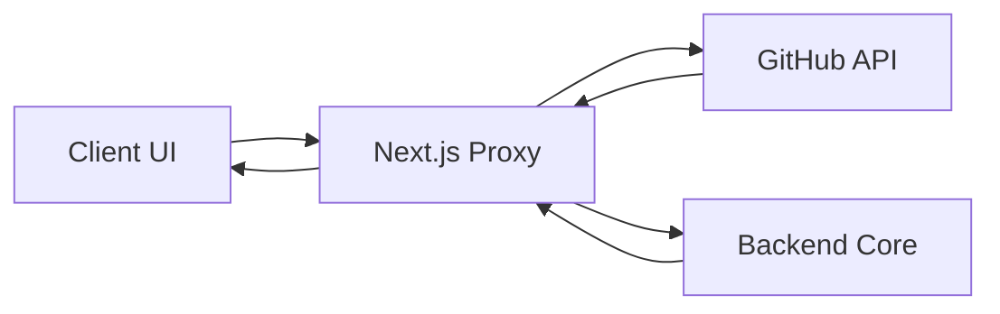

# Client State & Proxy Layer

The Client State & Proxy Layer serves as the Backend-for-Frontend (BFF) and edge orchestration tier. It isolates the client-side application from direct exposure to the Core Backend Engine and external third-party APIs (GitHub), providing a secure interface for request sanitization, header injection, and cross-origin resource sharing (CORS) management.

### System Role & Architectural Position

This layer operates within the Next.js runtime, splitting logic between the **Edge Runtime** (via middleware) and **Serverless Functions** (via API routes). Its primary objective is to encapsulate sensitive credentials (e.g., `GITHUB_TOKEN`) and normalize backend communication through a unified proxy interface.

| Component | Runtime | Primary Responsibility | Key Dependency |
| :--- | :--- | :--- | :--- |
| `proxy.ts` | Edge | Request interception and header propagation | `next/server` |
| `/api/search` | Node.js | GitHub repository discovery and filtering | `@octokit/rest` |
| `/api/index` | Node.js | Indexing job triggering (Backend Proxy) | `NEXT_PUBLIC_API_URL` |
| `/api/status` | Node.js | Indexing state polling (Backend Proxy) | `NEXT_PUBLIC_API_URL` |

---

### Core Execution & Data Flow Mechanics

The layer implements two distinct flow patterns: **Direct Integration** (for external APIs like GitHub) and **Transparent Proxying** (for the GitDex Core Backend). 



#### Request Pipeline Execution:
1. **Edge Interception**: The `proxy.ts` middleware intercepts all non-static requests. It injects the `x-pathname` header into the request object, ensuring downstream handlers maintain context of the original URI.
2. **Route Dispatching**: The Next.js App Router directs the request to specific `/api/*` route handlers.
3. **Credential Injection**: For GitHub search requests, the server-side handler injects the `GITHUB_TOKEN` from the environment, preventing token exposure to the browser.
4. **Backend Forwarding**: For state-related requests (`/index`, `/status`), the layer performs a server-to-server `fetch` to the `NEXT_PUBLIC_API_URL`, acting as a secure gateway.
5. **Response Normalization**: Raw responses from the backend or GitHub are parsed, filtered (in the case of search), and returned as sanitized JSON.

---

### Implementation Deep Dive

#### Edge Middleware & Header Injection
The proxy middleware ensures that the routing context is preserved across the request lifecycle.

```typescript title="client/proxy.ts"
export function proxy(request: NextRequest) {
  const requestHeaders = new Headers(request.headers);
  requestHeaders.set('x-pathname', request.nextUrl.pathname);

  return NextResponse.next({
    request: {
      headers: requestHeaders,
    },
  });
}

export const config = {
  matcher: [
    '/((?!api|_next/static|_next/image|favicon.ico).*)',
  ],
};
```
- **Header Propagation**: The `x-pathname` header is used by the server to determine the intended resource without relying on potentially modified URL parameters.
- **Matcher Constraint**: The `matcher` regex explicitly excludes static assets and API routes to prevent recursive middleware execution and optimize latency.

#### Repository Discovery Logic
The search route implements a two-stage filtering process to improve the accuracy of partial-name matches.

```typescript title="client/src/app/api/search/route.ts"
const res = await octokit.request('GET /search/repositories', {
  q: `${q} in:name,description`,
  per_page: 50,
});

const qLower = q.toLowerCase();
const items = (res.data.items || [])
  .filter((repo: any) => {
    if (!repo) return false;
    const name = (repo.name || '').toLowerCase();
    const full = (repo.full_name || '').toLowerCase();
    const desc = (repo.description || '').toLowerCase();
    return full.includes(qLower) || name.includes(qLower) || desc.includes(qLower);
  })
  .slice(0, 7);
```
- **Over-Fetching Strategy**: The system requests 50 repositories from GitHub's search API to mitigate the rigidity of the GitHub search algorithm.
- **Local Heuristic Filter**: A secondary filter performs case-insensitive substring matches against `full_name`, `name`, and `description`.
- **Result Capping**: The final set is sliced to 7 items to optimize frontend rendering performance and UI layout consistency.

#### Backend Proxy Orchestration
The proxy routes handle the communication with the Core Backend Engine, ensuring that the client never communicates directly with the internal API.

```typescript title="client/src/app/api/index/route.ts"
const response = await fetch(`${process.env.NEXT_PUBLIC_API_URL}/api/index`, {
  method: 'POST',
  headers: { 'Content-Type': 'application/json' },
  body: JSON.stringify({ repoUrl, force: !!force }),
});

const data = await response.json();
if (!response.ok) {
  return NextResponse.json(data, { status: response.status });
}
```
- **Payload Forwarding**: The handler extracts `repoUrl` and `force` flags from the client request and forwards them as a JSON payload.
- **Status Propagation**: The proxy captures the HTTP status code from the backend (e.g., 400 for invalid URLs, 500 for engine failure) and mirrors it back to the client.

---

### Method Reference & Error Recovery

#### API Route Contracts

| Endpoint | Method | Params/Body | Success Response | Error Mode |
| :--- | :--- | :--- | :--- | :--- |
| `/api/search` | `GET` | `q` (query) | `{ items: Repo[] }` | Returns `{ items: [] }` on Octokit failure |
| `/api/index` | `POST` | `{ repoUrl, force }` | `{ status: string }` | 400 if `repoUrl` is missing; mirrors BE error |
| `/api/status` | `GET` | `owner`, `repo` | `{ indexed: boolean }` | 400 if params missing; defaults to `{ indexed: false }` |

#### Error Recovery & Invariants
- **Search Resilience**: The `/api/search` route is wrapped in a global `try-catch` block. In the event of GitHub API rate-limiting or authentication failure, the system returns an empty array (`[]`) rather than a 500 error to prevent UI crashes during repository selection.
- **Status Parsing**: The `/api/status` route implements a defensive JSON parse. If the backend returns a non-JSON response or an empty body, it catches the exception and returns a default state of `{ indexed: false }`.
- **Environment Safety**: The use of `process.env.NEXT_PUBLIC_API_URL` with a fallback to `http://localhost:3001` ensures that the proxy remains functional across different deployment stages (Development, Staging, Production).