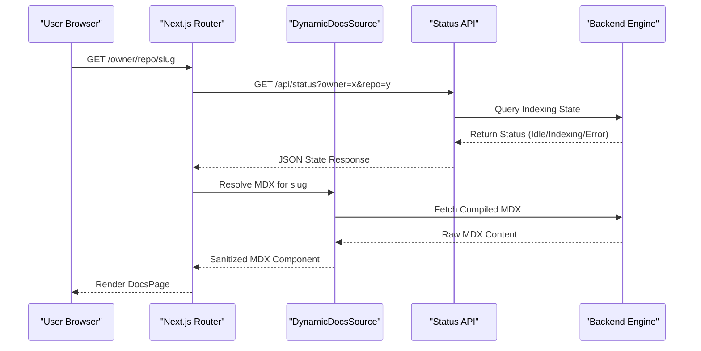

# Dynamic Repository Routing

## System Role & Architectural Position

Dynamic Repository Routing serves as the multi-tenant entry point for GitDex, leveraging Next.js App Router dynamic segments to isolate repository contexts. It transforms URL parameters (`owner`, `repo`) into lookup keys for the backend indexing engine and the `DynamicDocsSource` provider. This layer acts as the bridge between raw repository metadata and the rendered MDX documentation interface.

### Routing Specification & Dependency Matrix

| Component | Route Segment | Responsibility | Primary Dependency |
| :--- | :--- | :--- | :--- |
| `Layout` | `/[owner]/[repo]/layout.tsx` | Context provider, Assistant modal injection | `AssistantModal` |
| `DocsPage` | `/[owner]/[repo]/[[...slug]]/page.tsx` | Dynamic MDX resolution & rendering | `fumadocs-ui`, `DynamicDocsSource` |
| `StatusPage` | `/[owner]/[repo]/status/page.tsx` | Indexing state polling & trigger | `/api/status` |
| `StatusAPI` | `/api/status/route.ts` | Orchestration layer bridge for state | `NextResponse` |

## Core Execution & Data Flow Mechanics

The routing system implements a "Just-In-Time" (JIT) content resolution strategy. Rather than static site generation (SSG), it utilizes dynamic segments to fetch documentation state and content from the backend orchestration layer on request.

### Request Resolution Sequence



### Key Execution Invariants
*   **Parameter Extraction**: Route parameters `owner` and `repo` are treated as immutable keys for the duration of the request lifecycle to ensure cache consistency.
*   **State Guarding**: The `SyncingGuard` component intercepts rendering when the `status` API indicates an active indexing job, preventing the display of stale or partial documentation.
*   **Slug Normalization**: The `[[...slug]]` catch-all segment allows for nested documentation hierarchies, which are mapped to internal file paths within the indexed repository.

## Implementation Deep Dive

### Dynamic MDX Resolution and Sanitization

The system utilizes a custom `DynamicDocsSource` to override the standard `fumadocs` filesystem-based loading. A critical failure point in LLM-generated documentation is the production of malformed or duplicate YAML frontmatter, which crashes the JSX parser. The `stripFrontmatter` utility implements a recursive stripping loop to guarantee clean MDX input.

```typescript title="client/src/app/[owner]/[repo]/[[...slug]]/page.tsx"
function stripFrontmatter(content: string): string {
  const frontmatterRegex = /^---[\s\S]*?---/;
  let stripped = content;
  while (frontmatterRegex.test(stripped)) {
    stripped = stripped.replace(frontmatterRegex, '').trim();
  }
  return stripped;
}
```
**Mechanics**:
1. **Regex Pattern**: `^---[\s\S]*?---` targets blocks starting and ending with triple-dashes at the start of the string.
2. **Recursive Loop**: The `while` loop ensures that if the LLM generates multiple frontmatter blocks (a common hallucination), all are removed.
3. **Parser Safety**: By returning only the body, the `compiler` can process the MDX without encountering unexpected YAML syntax in the JSX stream.

### Asynchronous Status Polling

The `status/page.tsx` implements a client-side polling mechanism to monitor the backend task queue. It utilizes `useCallback` and `useEffect` to manage the polling lifecycle without triggering unnecessary re-renders.

```typescript title="client/src/app/[owner]/[repo]/status/page.tsx"
const initPoll = async () => {
  const res = await fetch(`/api/status?owner=${owner}&repo=${repo}`);
  const data = await res.json();
  
  if (data.status === 'completed') {
    setStatus('completed');
    setPolling(false); // Terminate polling loop
  } else if (data.status === 'error') {
    setStatus('error');
    setPolling(false);
  } else {
    setStatus('indexing');
    // Polling continues via useEffect dependency on polling state
  }
};
```
**Mechanics**:
1. **State Transition**: The polling loop transitions through `idle` $\rightarrow$ `indexing` $\rightarrow$ `completed|error`.
2. **Trigger Mechanism**: The `indexRepo` function sends a POST request to the backend to initialize the `Task Queue Orchestration` pipeline.
3. **Termination Condition**: The loop terminates strictly when a terminal state (`completed` or `error`) is returned from the API.

## Method / State Reference & Error Recovery

### Route Parameter Schema

| Parameter | Type | Source | Description | Constraint |
| :--- | :--- | :--- | :--- | :--- |
| `owner` | `string` | URL Path | GitHub organization or user handle | Alphanumeric/Hyphen |
| `repo` | `string` | URL Path | Repository name | Alphanumeric/Hyphen |
| `slug` | `string[]` | URL Path | Optional path to specific doc page | Max depth 10 |

### API Status Contract (`/api/status`)

**Query Parameters**: `?owner={string}&repo={string}`

**Response Body**:
```json title="api_response_schema.json"
{
  "status": "idle" | "indexing" | "completed" | "error",
  "progress": number, // 0-100
  "error": string | null,
  "lastUpdated": "ISO8601_Timestamp"
}
```

### Error Recovery Matrix

| Failure Mode | Detection | Recovery Action |
| :--- | :--- | :--- |
| **Invalid Repo Params** | 404 from `DynamicDocsSource` | Redirect to `/` or show "Repository Not Found" state. |
| **Malformed MDX** | `compiler` throw / JSX crash | `stripFrontmatter` sanitization $\rightarrow$ Fallback to raw text render. |
| **Polling Timeout** | No response from `/api/status` | Exponential backoff on `initPoll` execution. |
| **Indexing Crash** | `status: "error"` | Display `AlertCircle` component with backend error log. |