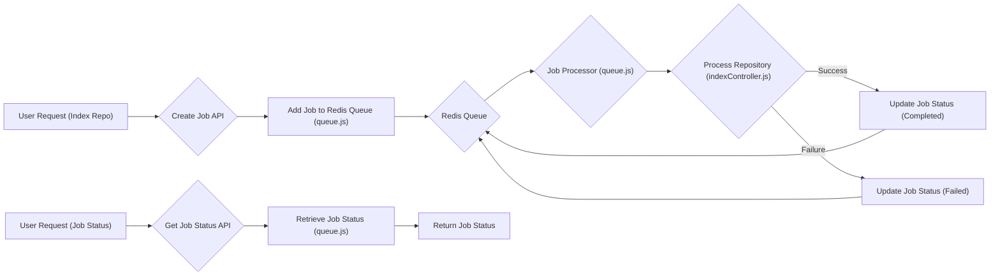
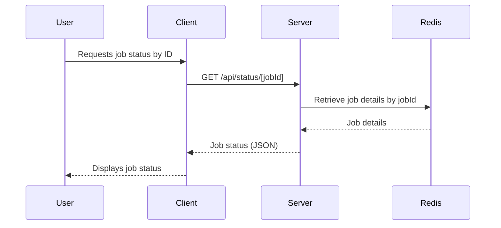

# Job Queue and Processing

This section details the job queue system implemented in GitDex, responsible for managing documentation processing tasks. The system ensures that requests to index repositories are handled efficiently and asynchronously, preventing bottlenecks and providing a responsive user experience. The queue utilizes Redis for job management and persistence.

## Key Features

*   **Asynchronous Processing:** Offloads documentation processing from the main request thread.
*   **Job Persistence:** Uses Redis to store job status and data, ensuring resilience.
*   **Status Tracking:** Provides APIs to monitor the status of individual jobs and overall indexing progress.
*   **Error Handling:** Catches and logs errors during processing, updating job status accordingly.
*   **Repo Name Based Status:** Uses repo name for finding job status.
*   **Stuck Jobs Removal:** Ensures the removal of stuck jobs.

## Components

The job queue system comprises the following key components:

*   **`server/queue.js`:** Implements the job queue using Redis. It provides methods for adding jobs, retrieving job status, and processing the queue.
*   **`server/controllers/jobsController.js`:** Defines API endpoints for creating jobs and retrieving job status.
*   **`client/src/app/api/status/[jobId]/route.ts`:** Next.js route that fetches the status of a specific job by its ID.
*   **`client/src/app/api/status/route.ts`:** Next.js route that fetches indexing status by repo owner and name.

## Code Snippets and Explanations

### 1. Adding a Job to the Queue (`server/queue.js`)

```javascript
// server/queue.js
async addJob(repoUrl) {
  const jobId = `job:${Date.now()}:${Math.random().toString(36).substr(2, 9)}`;
  await redis.hset(jobId, {
    status: "queued",
    repoUrl,
    createdAt: Date.now(),
  });
  await redis.lpush("queue", jobId);
  return jobId;
}
```

This function adds a new job to the Redis queue. It generates a unique `jobId`, sets the initial job status to "queued", stores the repository URL and creation timestamp, and then pushes the `jobId` onto the "queue" list in Redis.

[View on GitHub](https://github.com/shinymack/gitdex/blob/main/server/queue.js)

### 2. Processing Jobs (`server/queue.js`)

```javascript
// server/queue.js
async startProcessing() {
  setInterval(async () => {
    if (this.processing) return;
    this.processing = true;

    try {
      const jobId = await redis.rpop("queue");
      if (!jobId) {
        this.processing = false;
        return;
      }

      await redis.hset(jobId, { status: "processing", startedAt: Date.now() });
      
      const job = await redis.hgetall(jobId);
      const { processRepository } = await import("./controllers/indexController.js");
      
      try {
        const result = await processRepository(job.repoUrl);
        await redis.hset(jobId, {
          status: "completed",
          result: JSON.stringify(result),
          completedAt: Date.now(),
        });
      } catch (error) {
        await redis.hset(jobId, {
          status: "failed",
          error: error.message,
          completedAt: Date.now(),
        });
      }
    } catch (error) {
      console.error("Processing error:", error);
    } finally {
      this.processing = false;
    }
  }, 1000);
}
```

This function continuously polls the Redis queue for new jobs. It retrieves a `jobId` from the "queue" list, updates the job status to "processing", executes the `processRepository` function (responsible for indexing the repository), and then updates the job status to "completed" or "failed" based on the outcome.

[View on GitHub](https://github.com/shinymack/gitdex/blob/main/server/queue.js)

### 3. Getting Job Status (`server/queue.js`)

```javascript
// server/queue.js
async getJobStatus(jobId) {
  const job = await redis.hgetall(jobId);
  if (!job) return null;
  
  return {
    id: jobId,
    status: job.status,
    repoUrl: job.repoUrl,
    result: job.result ? JSON.parse(job.result) : null,
    error: job.error || null,
    createdAt: parseInt(job.createdAt),
  };
}
```

This function retrieves the status of a specific job from Redis using the `jobId`. It fetches all the fields associated with the `jobId` and returns an object containing the job's status, repository URL, result (if completed), error message (if failed), and creation timestamp.

[View on GitHub](https://github.com/shinymack/gitdex/blob/main/server/queue.js)

### 4. Creating a Job via API (`server/controllers/jobsController.js`)

```javascript
// server/controllers/jobsController.js
export const createJob = async (req, res) => {
  try {
    const { repoUrl } = req.body;
    if (!repoUrl) {
      return res.status(400).json({ error: "Repo URL required" });
    }
    
    const jobId = await queue.addJob(repoUrl);
    res.json({ jobId, status: "queued" });
  } catch (error) {
    res.status(500).json({ error: "Failed to create job" });
  }
};
```

This function handles the creation of a new job via an API endpoint. It extracts the `repoUrl` from the request body, validates its presence, adds the job to the queue using `queue.addJob()`, and returns a JSON response containing the `jobId` and initial status.

[View on GitHub](https://github.com/shinymack/gitdex/blob/main/server/controllers/jobsController.js)

### 5. Getting Job Status via API (`client/src/app/api/status/[jobId]/route.ts`)

```typescript
// client/src/app/api/status/[jobId]/route.ts
import { NextResponse } from 'next/server';

export async function GET(
  request: Request,
  { params }: { params: Promise<{ jobId: string }> }
) {
  try {
    const { jobId } = await params;
    
    // Forward the request to your backend
    const response = await fetch(`${process.env.NEXT_PUBLIC_API_URL}/api/status/${jobId}`);
    const data = await response.json();
    
    if (!response.ok) {
      return NextResponse.json(data, { status: response.status });
    }
    
    return NextResponse.json(data);
  } catch (error) {
    console.error('Error in status API route:', error);
    return NextResponse.json({ error: 'Internal server error' }, { status: 500 });
  }
}
```

This Next.js route handles requests to retrieve the status of a job by its ID. It extracts the `jobId` from the route parameters, forwards the request to the backend API, and returns the job status as a JSON response.

[View on GitHub](https://github.com/shinymack/gitdex/blob/main/client/src/app/api/status/[jobId]/route.ts)

### 6. Getting Job Status by Name via API (`server/controllers/jobsController.js`)

```javascript
// server/controllers/jobsController.js
export const getStatusByName = async (req, res) => {
  try {
    const { owner, repo } = req.query;
    if (!owner || !repo) return res.status(400).json({ error: 'Missing owner or repo' });

    // First, check if docs exist in the docs storage repo
  const docsRepoOwner = process.env.DOCS_REPO_OWNER || process.env.GITHUB_USERNAME;
  const docsRepo = process.env.DOCS_REPO_NAME || 'gitdex-docs';
    try {
      // Try to fetch meta.json for this repo (get sha too)
      const { data: metaData } = await octokit.rest.repos.getContent({
        owner: docsRepoOwner,
        repo: docsRepo,
        path: `docs/${owner}/${repo}/meta.json`,
      });

      const metaSha = metaData.sha;

      // If we reached here, docs exist
      return res.json({ indexed: true, path: `/docs/${owner}/${repo}`, metaSha });
    } catch (err) {
      // Not found -> not indexed. Fallthrough to check queue for existing job
    }

    // Check queue for an existing job for this repo (by repoUrl or repo path)
    const job = await queue.findJobByRepo(owner, repo);
    if (job) {
      return res.json({ indexed: false, job });
    }

    // Not indexed and no job currently
    return res.json({ indexed: false });
  } catch (error) {
    console.error('getStatusByName error', error);
    return res.status(500).json({ error: 'Internal server error' });
  }
};
```

This function determines if a repo has already been indexed or if indexing is in progress, based on its owner/repo name. It first attempts to find metadata for the repo in the documentation storage. If the metadata exists, the repo has been indexed and the function returns `indexed: true`. If no metadata is found, it checks the job queue for pending or processing jobs with the same owner and repo name, via findJobByRepo.

[View on GitHub](https://github.com/shinymack/gitdex/blob/main/server/controllers/jobsController.js)

## Queue Processing Flow





## Job Status Retrieval Flow





## Key Integration Points

*   The `createJob` function in `jobsController.js` acts as the entry point for adding new jobs to the queue.
*   The `startProcessing` function in `queue.js` continuously monitors the queue and processes jobs asynchronously.
*   The `getJobStatus` function in `queue.js` provides a mechanism for retrieving the status of individual jobs.
*   Next.js API routes in `client/src/app/api/status/` expose endpoints for accessing job status information from the frontend.

## Best Practices

*   Use environment variables for Redis connection details and other configuration parameters.
*   Implement robust error handling to gracefully handle failures during job processing.
*   Monitor the Redis queue to identify and resolve any performance bottlenecks.
*   Consider implementing a retry mechanism for failed jobs.
*   Implement proper logging to track job progress and identify potential issues.
```