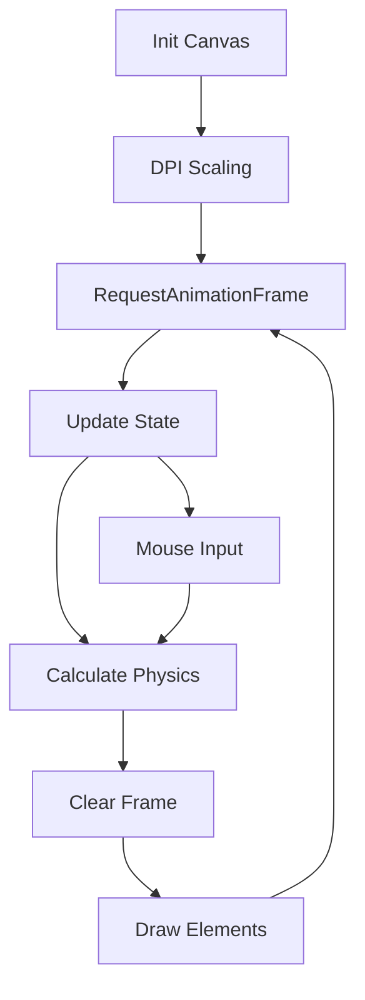

# AI Experience Layer

The AI Experience Layer is the specialized presentation tier of the GitDex frontend, responsible for translating complex AI backend processes—such as repository indexing, token compression, and structural mapping—into high-fidelity, interactive visual representations. It utilizes a hybrid rendering strategy combining React's declarative DOM management with imperative HTML5 Canvas APIs for high-frequency animations.

## System Role & Architectural Position

This layer sits atop the Frontend Infrastructure, consuming theme variables and viewport state to render non-blocking, GPU-accelerated visuals that signal system activity and AI intelligence. It operates primarily in the background (`-z-10`) or as high-level navigational overlays, ensuring that visual density does not interfere with the primary documentation content.

### Component Specifications

| Component | Rendering Mode | Primary Dependency | Performance Target | Critical Invariant |
| :--- | :--- | :--- | :--- | :--- |
| `FlickeringGrid` | Imperative Canvas | `requestAnimationFrame` | 60 FPS | Maintains DPR scaling for retina displays |
| `InteractiveConstellation` | Imperative Canvas | `requestAnimationFrame` | 60 FPS | $O(n^2)$ line complexity capped by `particleCount` |
| `FeatureGrid` | Declarative DOM | Tailwind CSS / Lucide | 120 FPS | CSS transition synchronization via `cubic-bezier` |
| `ModernNav` | Declarative DOM | `next-themes` | Instant | Hydration-safe theme state resolution |

## Core Execution & Data Flow Mechanics

The visual components employ a "Game Loop" pattern to handle real-time interactivity. Instead of relying on React's state reconciliation for every frame, the layer utilizes `useRef` to maintain mutable state (e.g., particle positions, mouse coordinates) and `requestAnimationFrame` to execute render cycles outside the React render loop.

### Canvas Animation Pipeline



### Key Execution Logic
*   **DPI Scaling:** To prevent blurring on High-DPI screens, the canvas internal width/height is multiplied by `window.devicePixelRatio`, while the CSS display size remains constant.
*   **Coordinate Mapping:** Mouse events are normalized relative to the canvas bounding client rectangle (`getBoundingClientRect()`) to ensure precise interaction coordinates regardless of page scroll.
*   **Interpolation:** Opacity and position transitions use linear interpolation (lerp) to smooth the transition between current and target states, preventing visual snapping.

## Implementation Deep Dive

### High-Frequency Visuals: Flickering Grid
The `FlickeringGrid` implements a stochastic flicker algorithm where each cell has a probability (`flickerChance`) of updating its target opacity per frame.

```typescript title="client/src/components/FlickeringGrid.tsx"
// Flicker Logic & Opacity Interpolation
if (Math.random() < flickerChance) {
  cell.targetOpacity = Math.random() * maxOpacity;
}

// Interpolate opacity: current + (target - current) * speed
cell.opacity += (cell.targetOpacity - cell.opacity) * cell.speed;

// Cursor interaction aura calculation
const dx = x - mousePos.current.x;
const dy = y - mousePos.current.y;
const dist = Math.sqrt(dx * dx + dy * dy);
const auraRadius = 160;

let extraOpacity = 0;
if (dist < auraRadius) {
  const factor = 1 - dist / auraRadius;
  extraOpacity = factor * maxOpacity * 1.5;
}
```
**Mechanics:**
1.  **Stochastic Update:** The `Math.random() < flickerChance` check determines if a cell's target state changes, simulating "digital noise."
2.  **Asymptotic Approach:** The opacity update formula ensures a smooth approach to the target value without overshooting.
3.  **Radial Gradient Aura:** The `extraOpacity` is calculated as a linear falloff from the mouse center, creating a light-following effect.

### Particle Physics: Interactive Constellation
The `InteractiveConstellation` component implements a magnetic attraction system where particles are treated as point masses influenced by the cursor.

```typescript title="client/src/components/InteractiveConstellation.tsx"
// Mouse Physics Interaction (Magnetic Attraction)
if (mousePos.current.active) {
  const dx = mousePos.current.x - p.x;
  const dy = mousePos.current.y - p.y;
  const dist = Math.sqrt(dx * dx + dy * dy);
  const maxDist = 180;

  if (dist < maxDist) {
    const force = (maxDist - dist) / maxDist;
    // Pull particles slightly toward mouse cursor
    p.x += (dx / dist) * force * 0.9;
    p.y += (dy / dist) * force * 0.9;
  }
}
```
**Mechanics:**
1.  **Vector Calculation:** Calculates the distance vector `(dx, dy)` between the particle and the cursor.
2.  **Normalized Force:** The `force` variable creates a linear ramp from 1.0 (at cursor) to 0.0 (at `maxDist`), ensuring particles are not jerked violently.
3.  **Parallax Drift:** Background nodes are shifted by `Math.sin(angle) * 8` to simulate 3D depth during the render cycle.

### Simulated System State: Feature Grid
The `FeatureGrid` utilizes a modulo-based state machine to simulate the lifecycle of an AI indexing job.

```typescript title="client/src/components/FeatureGrid.tsx"
// Sync state loop simulation
useEffect(() => {
  const timer = setInterval(() => {
    setSyncState((prev) => (prev + 1) % 4);
  }, 2500);
  return () => clearInterval(timer);
}, []);
```
**Mechanics:**
1.  **State Cycling:** `syncState` transitions from $0 \rightarrow 1 \rightarrow 2 \rightarrow 3 \rightarrow 0$, where each integer maps to a different UI state (e.g., `1` triggers the `animate-spin` class on the `RefreshCw` icon).
2.  **Bento Layout:** Uses a CSS Grid implementation with `md:col-span-2` to create a non-uniform visual hierarchy.

## Method / State Reference & Error Recovery

### Component State Schema

| State/Ref | Type | Scope | Purpose | Update Trigger |
| :--- | :--- | :--- | :--- | :--- |
| `mousePos` | `Ref<{x, y}>` | Global | Tracking cursor coordinates | `mousemove` event |
| `dimensions` | `State<{w, h}>` | Component | Canvas viewport sizing | `resize` event |
| `cells` | `Array<Cell>` | Local | Opacity/Speed per grid node | `requestAnimationFrame` |
| `syncState` | `State<number>` | Component | Feature simulation phase | `setInterval` (2.5s) |

### Failure Modes & Recovery

| Failure Mode | Root Cause | Recovery Mechanism |
| :--- | :--- | :--- |
| **Canvas Blur** | Incorrect DPR scaling | Re-calculation of `canvas.width` on `handleResize` |
| **Frame Drop** | $O(n^2)$ line checks | `particleCount` is clamped via `Math.min(65, ...)` |
| **Theme Mismatch** | CSS variable not yet parsed | `getPrimaryColor()` fallback to `#10b981` (Emerald) |
| **Hydration Error** | Theme-dependent HTML | `mounted` state guard in `ModernNav` to delay rendering |