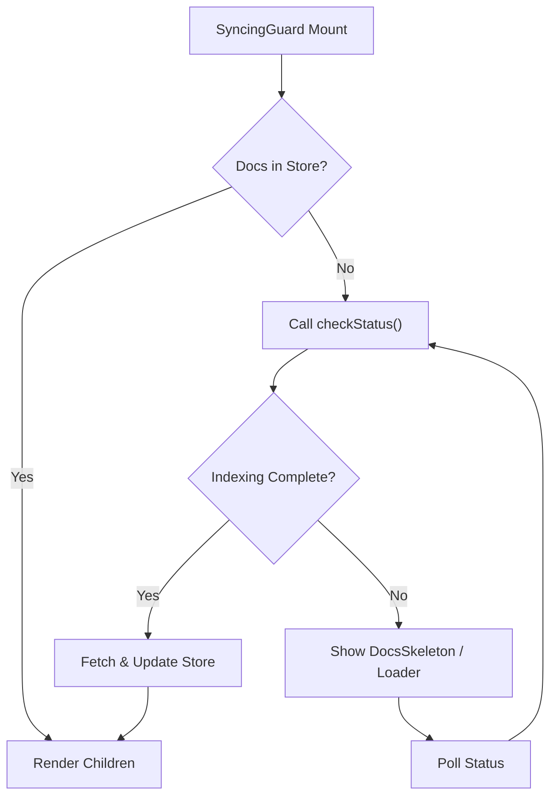
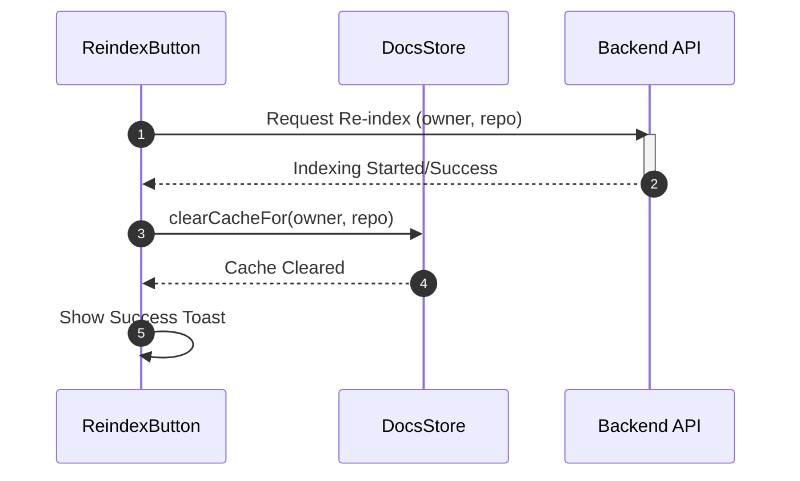

# State and Store Management

The State and Store Management layer in GitDex handles the client-side caching of repository documentation and coordinates the synchronization state between the backend indexing pipeline and the user interface. It ensures that the application remains responsive by minimizing redundant API calls while preventing users from interacting with unindexed repositories.

## Document Store Architecture

GitDex utilizes **Zustand** to implement a lightweight, centralized store for managing repository documentation. This store acts as a caching layer that maps repository identifiers to their processed documentation structures.

### Cache Structure

The store maintains a `DocsCache` object where each entry is keyed by a unique repository identifier (typically a combination of owner and repo name).

| Property | Type | Description |
| :--- | :--- | :--- |
| `data` | `DocsStructure` | The processed repository documentation and AI-analyzed content. |
| `timestamp` | `number` | The Unix timestamp indicating when the data was last fetched/cached. |

### Store Interface

The `DocsStore` provides methods to retrieve and invalidate cache entries, ensuring the UI can force updates when a re-index is triggered.

```typescript
interface DocsStore {
  cache: DocsCache;
  getDocs: (owner: string, repo: string) => Promise<DocsStructure>;
  clearCache: () => void;
  clearCacheFor: (owner: string, repo: string) => void;
}
```

## Syncing and Guard Logic

To prevent the UI from attempting to render empty or incomplete documentation, GitDex employs a `SyncingGuard`. This component acts as a conditional wrapper that intercepts the rendering process based on the repository's current indexing status.

### Synchronization Workflow

The `SyncingGuard` monitors the state of the document store and performs an asynchronous check to determine if the repository is ready for viewing.



## Cache Invalidation and Re-indexing

The `ReindexButton` component allows users to manually trigger the server-side indexing pipeline. This process requires tight integration with the `DocsStore` to ensure that stale data is removed immediately upon a successful update.

### Re-indexing Sequence

The following sequence describes the interaction between the UI, the store, and the backend during a re-index request.



### Trigger Implementation

The re-index logic utilizes `sonner` for notifications and `lucide-react` for visual state feedback (loaders/checks).

```typescript
const handleReindex = async () => {
  setLoading(true);
  try {
    await fetchReindex(owner, repo);
    // Invalidate store to force a fresh fetch on next load
    useDocsStore.getState().clearCacheFor(owner, repo);
    toast.success("Repository re-indexed successfully");
  } catch (error) {
    toast.error("Failed to re-index repository");
  } finally {
    setLoading(false);
  }
};
```

## Invariants & Failure Modes

### State Invariants
- **Cache Consistency**: A repository is only considered "synced" if the `DocsStructure` is successfully retrieved and stored in the `DocsStore` with a valid timestamp.
- **Guard Priority**: The `SyncingGuard` always takes precedence over the documentation viewer to prevent runtime errors caused by accessing `undefined` documentation data.

### Failure Modes & Handling

| Failure Scenario | Detection Mechanism | Mitigation Strategy |
| :--- | :--- | :--- |
| **Indexing Timeout** | `checkStatus` API failure | Display `AlertCircle` icon with a "Try Again" manual refresh button. |
| **Stale Cache** | `timestamp` comparison | `clearCacheFor` is explicitly called during re-indexing to force a hard refresh. |
| **API Rate Limiting** | HTTP 429 Response | Caught in `ReindexButton` and surfaced via `toast.error` to the user. |
| **Partial Indexing** | `DocsStructure` validation | The `SyncingGuard` remains in the loading state until the backend confirms full completion. |