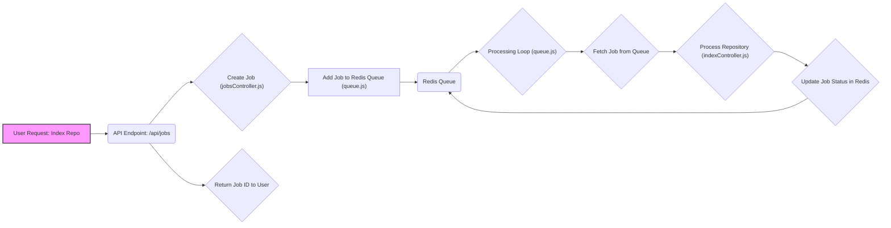

# Job Queue and Processing

This document details the job queue and processing system used in shinymack/gitdex. It outlines how indexing jobs are queued, managed, and processed in the backend, ensuring efficient handling of repository indexing requests.

## Overview

The system utilizes a Redis-based queue to manage indexing jobs.  When a user requests indexing for a repository, a job is added to the queue. A background process continuously monitors the queue, picks up jobs, processes them, and updates the job status.  This architecture allows for asynchronous processing, preventing the web server from being overloaded by long-running indexing tasks.

## Key Components

*   **Redis Queue:**  A Redis list named `"queue"` stores the IDs of queued jobs.
*   **Job Objects:**  Each job is stored as a Redis hash, containing information such as status, repository URL, creation timestamp, and processing results (or error messages).
*   **Job Creation:**  The `createJob` function in `server/controllers/jobsController.js` adds new jobs to the queue.
*   **Job Processing:**  The `startProcessing` function in `server/queue.js` continuously polls the queue and processes jobs.
*   **Status API:**  API endpoints in `client/src/app/api/status/[jobId]/route.ts` and `client/src/app/api/status/route.ts` allow users to check the status of their indexing requests.

## Job Creation

The `createJob` function is responsible for adding new indexing jobs to the queue.

```javascript title="server/controllers/jobsController.js"
import queue from "../queue.js";

export const createJob = async (req, res) => {
  try {
    const { repoUrl } = req.body;
    if (!repoUrl) {
      return res.status(400).json({ error: "Repo URL required" });
    }

    const jobId = await queue.addJob(repoUrl);
    res.json({ jobId, status: "queued" });
  } catch (error) {
    res.status(500).json({ error: "Failed to create job" });
  }
};
```

[View on GitHub](https://github.com/shinymack/gitdex/blob/main/server/controllers/jobsController.js)

This function receives the repository URL from the request body, validates it, and then calls the `addJob` function from `server/queue.js` to add the job to the Redis queue. A unique job ID is generated and returned to the client.

## Adding Jobs to the Queue

The `addJob` function in `server/queue.js` performs the actual queuing operation using Redis.

```javascript title="server/queue.js"
import Redis from "ioredis";

const redis = new Redis(process.env.REDIS_URL , {
  retryDelayOnFailover: 100,
  maxRetriesPerRequest: 3,
  lazyConnect: true,
});

class SimpleQueue {
  async addJob(repoUrl) {
    const jobId = `job:${Date.now()}:${Math.random().toString(36).substr(2, 9)}`;
    await redis.hset(jobId, {
      status: "queued",
      repoUrl,
      createdAt: Date.now(),
    });
    await redis.lpush("queue", jobId);
    return jobId;
  }
}
```

[View on GitHub](https://github.com/shinymack/gitdex/blob/main/server/queue.js)

This function creates a unique `jobId`, stores job details (status, repoUrl, createdAt) in a Redis hash, and then pushes the `jobId` onto the `"queue"` list using `lpush`.

## Job Processing Loop

The `startProcessing` function in `server/queue.js` continuously monitors the queue for new jobs and processes them.

```javascript title="server/queue.js"
class SimpleQueue {
  async startProcessing() {
    setInterval(async () => {
      if (this.processing) return;
      this.processing = true;

      try {
        const jobId = await redis.rpop("queue");
        if (!jobId) {
          this.processing = false;
          return;
        }

        await redis.hset(jobId, { status: "processing", startedAt: Date.now() });

        const job = await redis.hgetall(jobId);
        const { processRepository } = await import("./controllers/indexController.js");

        try {
          const result = await processRepository(job.repoUrl);
          await redis.hset(jobId, {
            status: "completed",
            result: JSON.stringify(result),
            completedAt: Date.now(),
          });
        } catch (error) {
          await redis.hset(jobId, {
            status: "failed",
            error: error.message,
            completedAt: Date.now(),
          });
        }
      } catch (error) {
        console.error("Processing error:", error);
      } finally {
        this.processing = false;
      }
    }, 1000);
  }
}
```

[View on GitHub](https://github.com/shinymack/gitdex/blob/main/server/queue.js)

This function uses `setInterval` to periodically check the queue.  It retrieves a job ID from the queue using `rpop`, updates the job status to "processing", calls `processRepository` (from `server/controllers/indexController.js` – not shown) to perform the actual indexing, and then updates the job status to "completed" or "failed" based on the outcome. The `processRepository` function is dynamically imported to avoid circular dependencies.

## Job Status Retrieval

The `getJobStatus` function in `server/controllers/jobsController.js` allows clients to retrieve the status of a specific job.

```javascript title="server/controllers/jobsController.js"
import queue from "../queue.js";

export const getJobStatus = async (req, res) => {
  try {
    const { jobId } = req.params;
    const job = await queue.getJobStatus(jobId);

    if (!job) {
      return res.status(404).json({ error: "Job not found" });
    }

    res.json(job);
  } catch (error) {
    res.status(500).json({ error: "Failed to get job status" });
  }
};
```

[View on GitHub](https://github.com/shinymack/gitdex/blob/main/server/controllers/jobsController.js)

This function retrieves the `jobId` from the request parameters and calls the `getJobStatus` function from `server/queue.js` to fetch the job details from Redis.

```javascript title="server/queue.js"
class SimpleQueue {
    async getJobStatus(jobId) {
    const job = await redis.hgetall(jobId);
    if (!job) return null;
    
    return {
      id: jobId,
      status: job.status,
      repoUrl: job.repoUrl,
      result: job.result ? JSON.parse(job.result) : null,
      error: job.error || null,
      createdAt: parseInt(job.createdAt),
    };
  }
}
```

[View on GitHub](https://github.com/shinymack/gitdex/blob/main/server/queue.js)

This function uses `redis.hgetall` to retrieve all fields of the job hash.

## API Endpoints for Status

The client-side API routes provide access to job status information.

```typescript title="client/src/app/api/status/[jobId]/route.ts"
import { NextResponse } from 'next/server';

export async function GET(
  request: Request,
  { params }: { params: Promise<{ jobId: string }> }
) {
  try {
    const { jobId } = await params;

    // Forward the request to your backend
    const response = await fetch(`${process.env.NEXT_PUBLIC_API_URL}/api/status/${jobId}`);
    const data = await response.json();

    if (!response.ok) {
      return NextResponse.json(data, { status: response.status });
    }

    return NextResponse.json(data);
  } catch (error) {
    console.error('Error in status API route:', error);
    return NextResponse.json({ error: 'Internal server error' }, { status: 500 });
  }
}
```

[View on GitHub](https://github.com/shinymack/gitdex/blob/main/client/src/app/api/status/%5BjobId%5D/route.ts)

This route forwards the request to the backend server, retrieving the job status using the `jobId`.

## Status Check by Repo Name

A dedicated endpoint retrieves status based on the repository's owner and name.

```javascript title="server/controllers/jobsController.js"
export const getStatusByName = async (req, res) => {
  try {
    const { owner, repo } = req.query;
    if (!owner || !repo) return res.status(400).json({ error: 'Missing owner or repo' });

    const docsRepoOwner = process.env.DOCS_REPO_OWNER || process.env.GITHUB_USERNAME;
    const docsRepo = process.env.DOCS_REPO_NAME || 'gitdex-docs';
    try {
      const { data: metaData } = await octokit.rest.repos.getContent({
        owner: docsRepoOwner,
        repo: docsRepo,
        path: `docs/${owner}/${repo}/meta.json`,
      });

      const metaSha = metaData.sha;

      return res.json({ indexed: true, path: `/docs/${owner}/${repo}`, metaSha });
    } catch (err) {
      // Not found -> not indexed. Fallthrough to check queue for existing job
    }

    const job = await queue.findJobByRepo(owner, repo);
    if (job) {
      return res.json({ indexed: false, job });
    }

    return res.json({ indexed: false });
  } catch (error) {
    console.error('getStatusByName error', error);
    return res.status(500).json({ error: 'Internal server error' });
  }
};
```

[View on GitHub](https://github.com/shinymack/gitdex/blob/main/server/controllers/jobsController.js)

First, it checks if the repository has already been indexed by attempting to fetch the `meta.json` file from the documentation repository. If not found, it checks the Redis queue for any existing jobs associated with the repository using `queue.findJobByRepo(owner, repo)`.

## Queue Operation Flow





## Key Integration Points

*   **Asynchronous Processing:** The queueing system ensures that indexing tasks are performed asynchronously, preventing the main web server from being blocked.
*   **Redis Integration:** Redis is used as the queue and job store, providing persistence and efficient queue management.
*   **API Integration:**  API endpoints provide a clear interface for submitting indexing requests and checking job statuses.
*   **Error Handling:** The system includes error handling to gracefully manage failures during job processing and update the job status accordingly.

## Best Practices

*   **Robust Error Handling:** Implement comprehensive error handling within the `processRepository` function to catch potential indexing errors and update the job status appropriately.
*   **Job Prioritization:** Consider implementing job prioritization to ensure that important repositories are indexed before others.
*   **Scalability:** Monitor the Redis queue and adjust the number of processing workers as needed to maintain optimal performance.
*   **Idempotency:** Make the `processRepository` function idempotent to handle potential job retries gracefully.  This means that running the function multiple times with the same input should produce the same result as running it once.
```