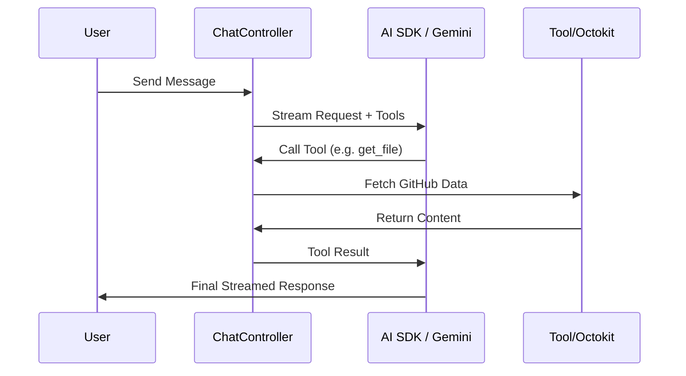

# AI & Chat Intelligence

The AI orchestration layer in GitDex manages the lifecycle of LLM interactions, providing a bridge between user queries, the GitHub API, and the Google Gemini model. It implements a robust execution pipeline that handles rate limiting, automatic retries, and tool-augmented generation (Function Calling) to provide repository-specific context.

## Architectural Role

This module functions as the "brain" of the system, transforming raw user prompts into executable actions. It doesn't just generate text; it orchestrates a loop where the LLM can request external data (via tools) to ground its responses in actual source code.



## LLM Integration & Resilience

The core AI logic is encapsulated in `server/src/ai.ts`. To prevent `429 Too Many Requests` errors from the Gemini API, GitDex implements a synchronous throttling mechanism and a retry wrapper.

### Throttle & Retry Logic

The system uses a module-level throttle based on the `AI_THROTTLE_MS` environment variable to ensure requests are spaced out according to the LLM provider's RPM (Requests Per Minute) limits.

```typescript title="server/src/ai.ts"
export async function generateWithRetry({
  systemPrompt,
  prompt,
  maxRetries = 3
}: GenerateOptions): Promise<string> {
  let attempt = 0;
  while (attempt < maxRetries) {
    try {
      await throttle(); // Sync reservation based on AI_THROTTLE_MS
      const { text } = await generateText({
        model: google('gemini-1.5-pro'),
        system: systemPrompt,
        prompt: prompt,
      });
      return text;
    } catch (e) {
      attempt++;
      if (attempt === maxRetries) throw e;
      await new Promise(res => setTimeout(res, 10000)); // 10s backoff
    }
  }
  throw new Error("Max retries reached");
}
```

The `throttle()` function ensures that the time elapsed since the last request meets the minimum threshold defined in the environment configuration.

## Chat Controller Logic

The `chatController.ts` manages the HTTP request/response lifecycle for the chat interface. It leverages the Vercel AI SDK `streamText` to provide real-time token streaming to the frontend.

### Request Handling

The `handleChat` function extracts context (such as the current repository or file) from the request headers and referer to prime the LLM's system prompt.

| Parameter | Source | Purpose |
| :--- | :--- | :--- |
| `messages` | Body | The conversation history array |
| `Referer` | Header | Used to determine the current repo/file context |
| `AI_MODEL` | Env | Defines the specific Gemini version used |

### Tool Orchestration (Function Calling)

GitDex uses `tool` definitions to allow the LLM to interact with the codebase. This converts the LLM from a static text generator into an agent capable of querying the GitHub API via `Octokit`.

```typescript title="server/src/controllers/chatController.ts"
const tools = {
  getFileContent: tool({
    description: 'Get the content of a specific file in the repository',
    parameters: z.object({
      path: z.string().describe('The path to the file'),
    }),
    execute: async ({ path }) => {
      const { data } = await octokit.repos.getContent({ 
        owner, repo, path 
      });
      // ... decoding logic
      return content;
    },
  }),
  // Additional tools for searching or listing directories
};
```

The `execute` function is called by the AI SDK when the LLM decides it needs more information to answer the prompt. The result is fed back into the model automatically before the final response is streamed to the user.

## Prompt Handling Pipeline

The system processes prompts through the following stages:

1.  **Context Extraction**: `parseReferer()` analyzes the request to identify the `owner` and `repo`.
2.  **Message Normalization**: `convertToModelMessages()` ensures the input history matches the expected LLM schema.
3.  **System Prompting**: A predefined system prompt is injected to define the AI's persona as a GitDex technical expert.
4.  **Streaming Execution**: `streamText` is invoked with the tools configuration, enabling a multi-turn interaction between the LLM and the repository data.

```typescript title="server/src/controllers/chatController.ts"
const result = await streamText({
  model: google('gemini-1.5-pro'),
  system: `You are GitDex, an expert AI... Context: ${repoContext}`,
  messages: convertToModelMessages(messages),
  tools: tools,
  maxSteps: 5, // Allows multiple tool calls in one turn
});

result.pipeDataStreamToResponse(res);
```

The `maxSteps` parameter is critical; it allows the AI to perform a "chain of thought" (e.g., list directory $\rightarrow$ read file A $\rightarrow$ read file B $\rightarrow$ answer query) within a single user request.