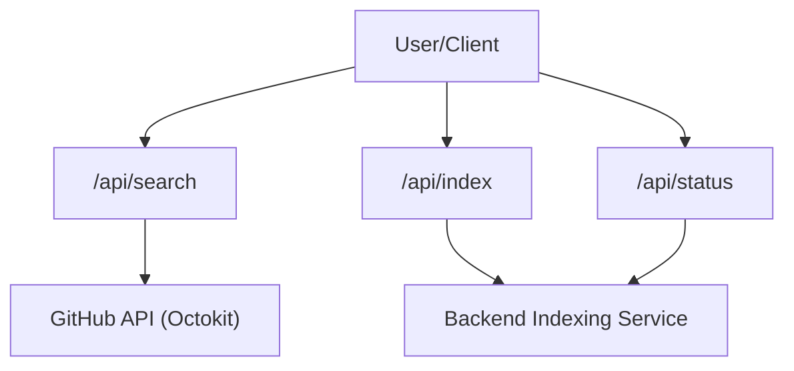

# API Infrastructure

GitDex utilizes Next.js App Router serverless route handlers to manage communication between the client application, the GitHub API, and the internal indexing backend. This architecture ensures that sensitive credentials (like `GITHUB_TOKEN`) remain server-side and provides a clean abstraction layer for the frontend.



## Route Handlers

### Repository Search
`GET /api/search`

This endpoint facilitates the discovery of GitHub repositories. To improve the user experience beyond standard GitHub search behavior, it implements a secondary client-side filter to ensure higher relevance for partial name matches.

**Query Parameters:**
| Parameter | Type | Required | Description |
| :--- | :--- | :--- | :--- |
| `q` | `string` | Yes | The search query string. |

**Logic Flow:**
1. Authenticates via `GITHUB_TOKEN`.
2. Queries the GitHub `/search/repositories` endpoint for the top 50 results matching the name or description.
3. Performs a case-insensitive local filter to refine partial-name matches.
4. Returns a sliced array of the top 7 most relevant results.

**Response:**
- `200 OK`: Returns an object containing an `items` array of repository metadata.

---

### Indexing Trigger
`POST /api/index`

This route acts as a proxy to the backend indexing service. It initiates the process of scraping and indexing a specific repository's content for searchability.

**Request Body:**
```json
{
  "repoUrl": "string", // The full URL of the GitHub repository
  "force": "boolean"   // Optional: If true, forces re-indexing of the repo
}
```

**Behavior:**
- Validates the presence of `repoUrl`.
- Forwards the payload to the service defined in `NEXT_PUBLIC_API_URL`.
- Proxies the backend response status and data back to the client.

**Responses:**
- `200 OK`: Indexing successfully initiated.
- `400 Bad Request`: Missing `repoUrl`.
- `500 Internal Server Error`: Backend service unreachable or crashed.

---

### Indexing Status
`GET /api/status`

Provides the current indexing state of a specific repository to determine if it is ready for searching.

**Query Parameters:**
| Parameter | Type | Required | Description |
| :--- | :--- | :--- | :--- |
| `owner` | `string` | Yes | The GitHub organization or user owner. |
| `repo` | `string` | Yes | The repository name. |

**Logic Flow:**
1. Extracts `owner` and `repo` from the search parameters.
2. Requests status data from the backend indexing service.
3. Parses the response; if the backend returns a non-JSON response or is empty, it defaults to `{ "indexed": false }`.

**Responses:**
- `200 OK`: Returns a JSON object (e.g., `{ "indexed": true }`).
- `400 Bad Request`: Missing `owner` or `repo` parameters.
- `500 Internal Server Error`: Unexpected server failure.