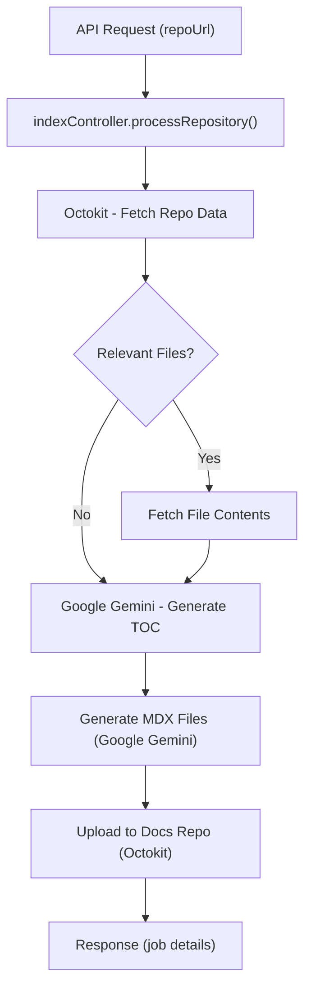

---
title: "Backend Architecture"
description: "In-depth look at the server-side structure, including API endpoints, data models, and processing logic."
sidebar_position: 1
---

# Backend Architecture

This section provides a detailed overview of the backend architecture of GitDex. It covers the server-side structure, including API endpoints, data models, and the logic that drives the application. The backend is primarily built using Node.js with Express, and leverages the Octokit library for interacting with the GitHub API, and Google Gemini AI for generating documentation.

## Core Components

The backend consists of several key components:

*   **`server/index.js`:** This is the main entry point of the application. It sets up the Express server, configures middleware, defines routes, and handles error logging and unhandled exceptions.
*   **`server/routes/indexRoutes.js`:** This file defines the API routes related to indexing and checking the status of indexing jobs. It maps incoming requests to the appropriate controller functions.
*   **`server/controllers/indexController.js`:** This is the core logic that processes a GitHub repository URL and generates documentation. It orchestrates the fetching of repository data, filtering of files, generating the table of contents (TOC), creating MDX documentation files, and uploading these to a dedicated documentation repository.
*   **`server/models/repo.js`:** This file defines the data model for a repository.  While currently simple, it structures the basic information about a repository that the application uses.

## API Endpoints

The backend exposes the following API endpoints:

*   **`POST /api/index`:** This endpoint triggers the documentation generation process for a given GitHub repository. It accepts a `repoUrl` in the request body and returns a job ID that can be used to track the status of the process.  See [`indexRoutes.js`](https://github.com/shinymack/gitdex/blob/main/server/routes/indexRoutes.js).
*   **`GET /api/status/:jobId`:** This endpoint allows clients to check the status of a documentation generation job. It takes a `jobId` as a parameter and returns the current status of the job.
*   **`GET /api/status?owner=&repo=`:**  This allows clients to check the status of a documentation generation job by owner and repo.  See [`indexRoutes.js`](https://github.com/shinymack/gitdex/blob/main/server/routes/indexRoutes.js).
*   **`/health`:** Returns a JSON response with status ok if the server is up and running. See [`index.js`](https://github.com/shinymack/gitdex/blob/main/server/index.js).

## Data Models

The primary data model is defined in `server/models/repo.js`:

```javascript
// File: server/models/repo.js
export const Repo = {
  full_name: String,
  description: String,
  url: String,
};
```

This model represents a GitHub repository and includes properties for its full name, description, and URL. This is used to structure the information returned after processing a repository.

## Processing Logic (`indexController.js`)

The `indexController.js` file contains the core logic for generating documentation. Here's a breakdown of the key steps:

1.  **Repository URL Processing:** The controller receives a repository URL and extracts the owner and repository name.
2.  **GitHub API Interaction:** It uses the Octokit library to fetch repository metadata (e.g., size, default branch) and the Git tree (list of files).
3.  **File Filtering:** The controller filters the list of files to include only those that are relevant for documentation (e.g., JavaScript, Python, Markdown files) and exclude large files or those in specific directories (e.g., `node_modules`, `dist`).
4.  **File Content Fetching:** It fetches the content of the filtered files in batches, using a retry mechanism to handle potential API rate limits or network errors.
5.  **Table of Contents Generation:** It uses the Google Gemini AI to generate a table of contents (TOC) based on the file paths. The prompt instructs the AI to create a hierarchical TOC with descriptive titles and relevant file associations.
6.  **MDX File Generation:** It iterates through the TOC entries and uses the Google Gemini AI again to generate MDX documentation files for each section. The prompt provides the AI with the section title, description, relevant files, and the content of those files.  It instructs the AI to format the content in a wiki-style manner, including code snippets, links to GitHub, and Mermaid diagrams.
7.  **Documentation Upload:** Finally, it uploads the generated MDX files to a dedicated documentation repository in a Fumadocs-compatible folder structure.

Here's an example of how the Google Gemini AI is used to generate the MDX documentation for each section, taken from [`indexController.js`](https://github.com/shinymack/gitdex/blob/main/server/controllers/indexController.js):

```javascript
const sectionPrompt = `You are GitDex, a technical documentation AI. Generate wiki-style MDX docs in DeepWiki style for ${owner}/${repo}.
    
Section Details:
- Title: ${entry.title}
- Description: ${entry.description}
- Relevant Files: ${entry.relevant_files.join(', ')}

Content:
 ${contentBlock}

MDX Structure:
- # ${entry.title}
- ## Subsections (e.g., bullets for features, tables for stack, snippets with links, Mermaid after relevant sections)
- ## Key Integration Points (end here: insights on flows, best practices)

Requirements:
- Include 4-6 code snippets with explanations and GitHub links: [View on GitHub](https://github.com/${owner}/${repo}/blob/${repoData.default_branch}/{path}).
- Include 1-2 Mermaid diagrams (graph TD, flowchart LR, sequenceDiagram, or classDiagram; 4-8 nodes; no complex sequence diagrams).
- Length: 800-1500 words.
- Adapt to repo type (e.g., ML, web dev, frameworks, embedded, C).
- Use common languages for code blocks: javascript, typescript, python, java, html, css, json, markdown, bash, shell, sql, yaml, yml, xml, plaintext.
- No images; only MDX and Mermaid blocks.

MERMAID RULES: (FOLLOW STRICTLY)
0. NO UNNECESSARY MERMAID DIAGRAMS like the component and C one which you hallucinate.
1. ALL node text in double quotes: e.g., A["Frontend (React)"]
2. Arrows: -->, ---, -.->, ==> only.
3. Format: \`\`\`mermaid\ncode\n\`\`\` with blanks.
4. Types: graph TD, flowchart LR, sequenceDiagram, classDiagram.
5. DONT USE TOO MUCH COMPLEX SEQUENCE DIAGRAMS WITH TOO MANY CONNECTION TRY TO REPRESENT THEM USING graph LR or TD OR JUST  A SMALLER SEQUENCE DIAGRAM.
6. Nodes: ["Rectangle"], ("Circle"), {"Diamond"}—text in quotes.
7. For arrow labels(ALWAYS USE THIS): Use A -->|"Label"| B 
8. CRITICAL: NEVER use both arrow labels AND text after the arrow. Use EITHER A -->|"Label"| B OR A -- "Label" --> B, NEVER both together.
9. CRITICAL: For conditional flows, use: A -- "Condition" --> B OR A -->|"Condition"| B, not A -- "Condition" --> B: "Additional text"
10. CRITICAL: If you need to show both a condition and an explanation, use multiple arrows.
11. CRITICAL: For subgraphs, ALWAYS use lowercase: "subgraph \"Name\"" and "end" (NOT "SubGraph" or "End")
12. CRITICAL: NEVER use code blocks with languages that might not be supported. Stick to common languages like: javascript, typescript, python, java, html, css, json, markdown, bash, shell, sql, yaml, yml, xml, plaintext.
13. CRITICAL: NEVER use code blocks with "env" language. Use "plaintext" or "bash" instead.
14. CRITICAL: For configuration files or environment variables, use \`\`\`plaintext or \`\`\`bash instead of \`\`\`env.
15. CRITICAL: Avoid using language-specific code blocks for niche or specialized languages. When in doubt, use \`\`\`plaintext.
16. DONT USE ANY IMAGES IN THE MDX CONTENT PLZ, ONLY MDX CONTENT AND MERMAID BLOCKS.
17. NO COLORING IN THE MERMAID DIAGRAMS PLEASE KEEP THEM VANILLA.
Output ONLY MDX content without extra formatting.`;
```

## Key Integration Points

*   **GitHub API:** The backend heavily relies on the GitHub API for fetching repository data. Proper authentication and error handling are crucial for reliable operation. Rate limiting is handled with retry logic.
*   **Google Gemini AI:** The AI is used for both TOC generation and MDX file creation. The quality of the generated documentation depends on the prompts provided to the AI and the quality of the code in the target repository. Rate Limiting, token limits and proper authentication with retries are critical to stable operations.
*   **Fumadocs:** The generated MDX files are structured to be compatible with Fumadocs, a documentation framework. This ensures that the generated documentation can be easily served and displayed.

## Code Snippets

Here are some key code snippets that illustrate the backend architecture:

*   **Server setup in `server/index.js`:**

```javascript
// File: server/index.js
import express from "express";
import dotenv from "dotenv";
import cors from "cors";
import indexRoutes from "./routes/indexRoutes.js";
import docsRoutes from "./routes/docsRoutes.js";

dotenv.config();

const app = express();
const PORT = process.env.PORT || 3001;

// Middleware
app.use(cors({
  origin: ['https://gitdex-alpha.vercel.app', 'http://localhost:3000'],
  credentials: true
}));
app.use(express.json());

// Routes
app.use("/api", indexRoutes);
app.use("/api", docsRoutes);

// Health check
app.get("/health", (req, res) => {
  res.json({ status: "ok" });
});

// Error handling middleware
app.use((err, req, res, next) => {
  console.error(err.stack);
  res.status(500).json({ error: 'Something went wrong!' });
});

// 404 handler
app.use((req, res) => {
  res.status(404).json({ error: 'Route not found' });
});

// For Vercel, export the app
export default app;

// For local development
if (process.env.NODE_ENV !== 'production') {
  app.listen(PORT, () => {
    console.log(`Server running on port ${PORT}`);
  });
}
```

This code sets up the Express server, configures middleware (CORS, JSON parsing), defines routes, and handles error logging and unhandled exceptions. [View on GitHub](https://github.com/shinymack/gitdex/blob/main/server/index.js)

*   **Route definition in `server/routes/indexRoutes.js`:**

```javascript
// File: server/routes/indexRoutes.js
import express from "express";
import { createJob, getJobStatus, getStatusByName } from "../controllers/jobsController.js";

const router = express.Router();

// Replace the existing /index route
router.post("/index", createJob);

// Add new route for checking job status
router.get("/status/:jobId", getJobStatus);

// Name-based status check: /api/status?owner=...&repo=...
router.get('/status', getStatusByName);

// Keep other routes unchanged
// router.get("/", ...);
// router.post("/search", ...);

export default router;
```

This code defines the API routes related to indexing and checking the status of indexing jobs. [View on GitHub](https://github.com/shinymack/gitdex/blob/main/server/routes/indexRoutes.js)

## Diagram

Here's a Mermaid diagram illustrating the overall flow of the documentation generation process:





This diagram illustrates the flow from receiving the API request to retrieving repo data, filtering, generating the documentation and response.

## Future Improvements

*   **Queueing and Background Processing:** Implement a queueing system (e.g., Redis, RabbitMQ) to handle documentation generation jobs in the background. This would prevent the API from blocking while processing large repositories.
*   **Enhanced Error Handling and Logging:** Improve error handling and logging to provide more detailed information about failures and facilitate debugging.
*   **Caching:** Implement caching mechanisms to reduce the load on the GitHub API and improve performance.
*   **More Granular Control over AI Prompts:** Allow users to customize the prompts used to generate the TOC and MDX files. This would provide more control over the content and style of the generated documentation.
```