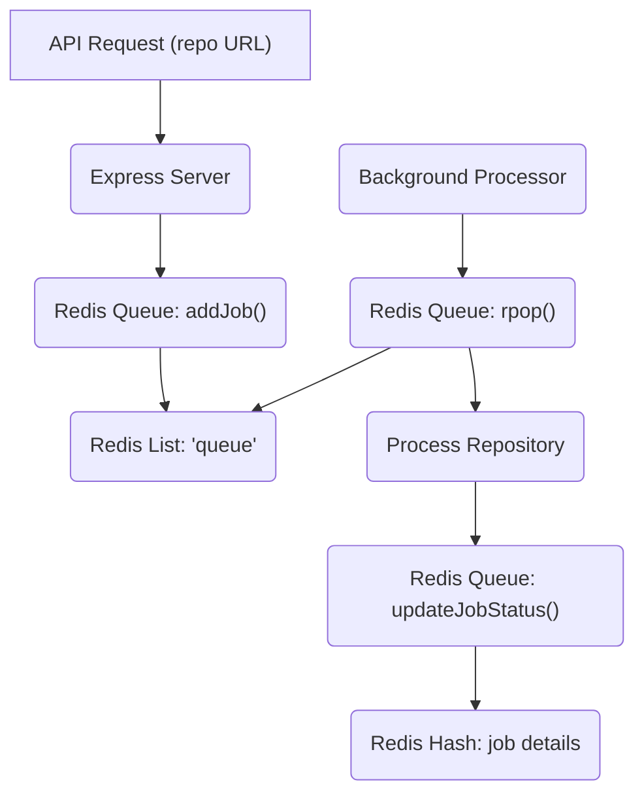
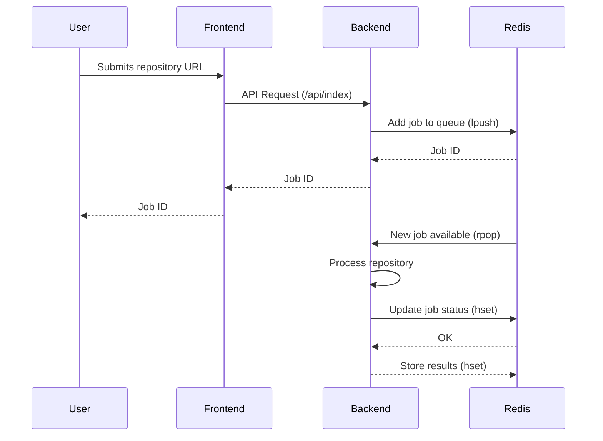

# Backend Architecture

This document describes the architecture of the server-side component of GitDex, a web application designed for documentation indexing. The backend is built using Node.js with Express, leveraging Redis for job queue management and TypeScript for enhanced code maintainability and scalability.

## Overview

The backend is responsible for handling API requests, processing repository data, and managing the queue of documentation indexing tasks. Key components include:

*   **Express Server:** Handles incoming HTTP requests and routes them to appropriate handlers.
*   **Redis Queue:** Manages the queue of repository URLs to be processed for documentation.
*   **Data Models:** Defines the structure of data objects, such as repository information.

## Key Components

### Express Server (server/index.js)

The core of the backend is an Express server that handles API requests and manages the application's routing.

```javascript title="server/index.js"
import express from "express";
import dotenv from "dotenv";
import cors from "cors";
import indexRoutes from "./routes/indexRoutes.js";
import docsRoutes from "./routes/docsRoutes.js";

dotenv.config();

const app = express();
const PORT = process.env.PORT || 3001;

// Middleware
app.use(cors({
  origin: ['https://gitdex-alpha.vercel.app', 'http://localhost:3000'],
  credentials: true
}));
app.use(express.json());

// Routes
app.use("/api", indexRoutes);
app.use("/api", docsRoutes);

// Health check
app.get("/health", (req, res) => {
  res.json({ status: "ok" });
});

// Error handling middleware
app.use((err, req, res, next) => {
  console.error(err.stack);
  res.status(500).json({ error: 'Something went wrong!' });
});

// 404 handler
app.use((req, res) => {
  res.status(404).json({ error: 'Route not found' });
});

// For Vercel, export the app
export default app;

// For local development
if (process.env.NODE_ENV !== 'production') {
  app.listen(PORT, () => {
    console.log(`Server running on port ${PORT}`);
  });
}
```

[View on GitHub](https://github.com/shinymack/gitdex/blob/main/server/index.js)

This snippet demonstrates the basic setup of the Express server, including:

*   Importing necessary modules (express, dotenv, cors).
*   Configuring middleware (CORS, JSON parsing).
*   Defining API routes.
*   Implementing error handling and 404 handlers.
*   Health check endpoint.

### Redis Queue (server/queue.js)

GitDex uses Redis to manage a queue of repository URLs that need to be processed. This allows the backend to handle indexing tasks asynchronously, improving performance and preventing request timeouts.

```javascript title="server/queue.js"
import Redis from "ioredis";

// Use environment variable for Redis URL
const redis = new Redis(process.env.REDIS_URL , {
  // Add these options for serverless environments
  retryDelayOnFailover: 100,
  maxRetriesPerRequest: 3,
  lazyConnect: true, // Important for serverless
});

console.log('Redis Connected!')

redis.on('error', (err) => {
  console.error('Redis Client Error:', err);
});

// Rest of your queue code remains the same
class SimpleQueue {
  constructor() {
    this.processing = false;
    this.removeStuckJobs(); // Remove stuck jobs on startup
    this.startProcessing();
  }

  async addJob(repoUrl) {
    const jobId = `job:${Date.now()}:${Math.random().toString(36).substr(2, 9)}`;
    await redis.hset(jobId, {
      status: "queued",
      repoUrl,
      createdAt: Date.now(),
    });
    await redis.lpush("queue", jobId);
    return jobId;
  }

  // Remove stuck jobs on startup
  async removeStuckJobs() {
    try {
      console.log("Removing stuck jobs...");
      
      const jobKeys = await redis.keys("job:*");
      
      for (const key of jobKeys) {
        const job = await redis.hgetall(key);
        
        if (job.status === "processing") {
          console.log(`Removing stuck job: ${key}`);
          // Delete the job entirely from Redis
          await redis.del(key);
        }
      }
      
      console.log("Stuck job removal completed");
    } catch (error) {
      console.error("Error removing stuck jobs:", error);
    }
  }

  async startProcessing() {
    setInterval(async () => {
      if (this.processing) return;
      this.processing = true;

      try {
        const jobId = await redis.rpop("queue");
        if (!jobId) {
          this.processing = false;
          return;
        }

        await redis.hset(jobId, { status: "processing", startedAt: Date.now() });
        
        const job = await redis.hgetall(jobId);
        const { processRepository } = await import("./controllers/indexController.js");
        
        try {
          const result = await processRepository(job.repoUrl);
          await redis.hset(jobId, {
            status: "completed",
            result: JSON.stringify(result),
            completedAt: Date.now(),
          });
        } catch (error) {
          await redis.hset(jobId, {
            status: "failed",
            error: error.message,
            completedAt: Date.now(),
          });
        }
      } catch (error) {
        console.error("Processing error:", error);
      } finally {
        this.processing = false;
      }
    }, 1000);
  }

  async getJobStatus(jobId) {
    const job = await redis.hgetall(jobId);
    if (!job) return null;
    
    return {
      id: jobId,
      status: job.status,
      repoUrl: job.repoUrl,
      result: job.result ? JSON.parse(job.result) : null,
      error: job.error || null,
      createdAt: parseInt(job.createdAt),
    };
  }

  // Find a job by owner/repo pair by inspecting stored repoUrl or path
  async findJobByRepo(owner, repo) {
    try {
      const jobKeys = await redis.keys('job:*');
      for (const key of jobKeys) {
        const job = await redis.hgetall(key);
        if (!job || !job.repoUrl) continue;
        try {
          const u = new URL(job.repoUrl);
          const parts = u.pathname.split('/').filter(Boolean);
          const jOwner = parts[0];
          const jRepo = (parts[1] || '').replace('.git', '');
          if (jOwner === owner && jRepo === repo) {
            return {
              id: key,
              status: job.status,
              repoUrl: job.repoUrl,
              result: job.result ? JSON.parse(job.result) : null,
              error: job.error || null,
              createdAt: parseInt(job.createdAt),
            };
          }
        } catch (e) {
          // ignore invalid urls
        }
      }
      return null;
    } catch (error) {
      console.error('findJobByRepo error', error);
      return null;
    }
  }
}

export default new SimpleQueue();
```

[View on GitHub](https://github.com/shinymack/gitdex/blob/main/server/queue.js)

This code defines a `SimpleQueue` class that interacts with Redis to manage the job queue. Key functionalities include:

*   **Adding Jobs:** The `addJob` method adds a new repository URL to the queue.
*   **Processing Jobs:** The `startProcessing` method continuously checks the queue for new jobs and processes them.
*	**Removing stuck Jobs:** Upon starting the queue, there is a `removeStuckJobs` method which removes any jobs which have the state `processing` from the queue, preventing infinite processing loops.
*   **Getting Job Status:** The `getJobStatus` method retrieves the status of a specific job.
*   **Finding Job by Repo:** The `findJobByRepo` method finds a job by owner/repo pair.





### Data Models (server/models/repo.js)

The `Repo` model defines the structure of repository data.

```javascript title="server/models/repo.js"
export const Repo = {
  full_name: String,
  description: String,
  url: String,
};
```

[View on GitHub](https://github.com/shinymack/gitdex/blob/main/server/models/repo.js)

This model specifies that a repository object will have the following properties:

*   `full_name`: The full name of the repository (e.g., "owner/repo").
*   `description`: A brief description of the repository.
*   `url`: The URL of the repository.

### Configuration (server/tsconfig.json)

The `tsconfig.json` file configures the TypeScript compiler.

```json title="server/tsconfig.json"
{
  "compilerOptions": {
    // Environment setup & latest features
    "lib": ["ESNext"],
    "target": "ESNext",
    "module": "Preserve",
    "moduleDetection": "force",
    "jsx": "react-jsx",
    "allowJs": true,

    // Bundler mode
    "moduleResolution": "bundler",
    "allowImportingTsExtensions": true,
    "verbatimModuleSyntax": true,
    "noEmit": true,

    // Best practices
    "strict": true,
    "skipLibCheck": true,
    "noFallthroughCasesInSwitch": true,
    "noUncheckedIndexedAccess": true,
    "noImplicitOverride": true,

    // Some stricter flags (disabled by default)
    "noUnusedLocals": false,
    "noUnusedParameters": false,
    "noPropertyAccessFromIndexSignature": false
  }
}
```

[View on GitHub](https://github.com/shinymack/gitdex/blob/main/server/tsconfig.json)

Key settings include:

*   `target`: "ESNext" specifies the target ECMAScript version.
*   `module`: "Preserve" preserves the module format.
*   `moduleResolution`: "bundler" uses the bundler-style module resolution.
*   `strict`: `true` enables strict type checking options.

## Key Integration Points

The backend architecture relies on seamless integration between its components:

1.  **API Request to Queue:** When a user submits a repository URL for indexing, the Express server receives the request and adds the URL to the Redis queue.
2.  **Queue Processing:** A background processor continuously monitors the Redis queue for new URLs. When a URL is found, the processor retrieves the repository data, indexes it, and stores the results.
3.  **Job Status Updates:** Throughout the indexing process, the background processor updates the status of the job in the Redis queue. This allows users to track the progress of their indexing requests.





## Best Practices

The following best practices are implemented in the backend architecture:

*   **Asynchronous Processing:** Using a Redis queue allows the backend to handle indexing tasks asynchronously, preventing request timeouts and improving performance.
*   **Error Handling:** Comprehensive error handling is implemented throughout the backend to ensure that errors are logged and handled gracefully.
*   **Configuration Management:** Environment variables are used to configure the backend, making it easy to deploy to different environments.
*   **Typescript:** Typescript allows for catching a number of type related errors before the application is compiled.

By following these best practices, the GitDex backend is designed to be scalable, reliable, and maintainable.
```