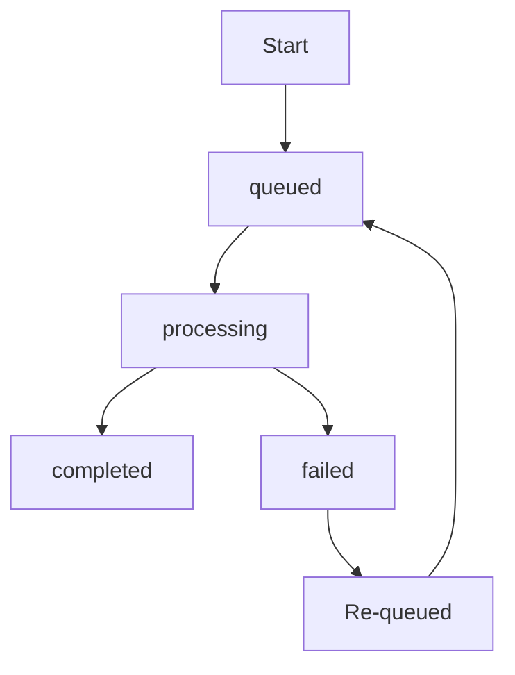
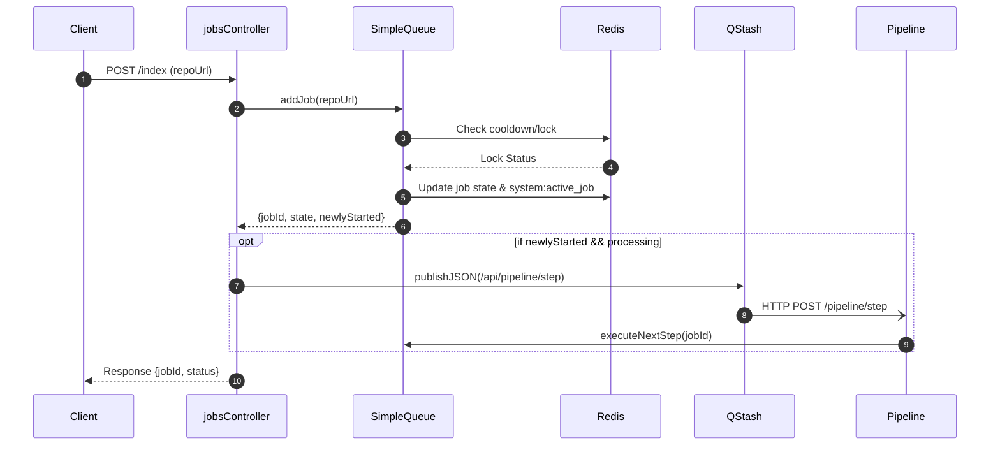

# Backend Core & Job Queue

The Backend Core manages the lifecycle of repository indexing through a serialized job queue. To prevent server overload and ensure data consistency, the system utilizes a combination of Redis for state management and QStash for asynchronous execution of pipeline steps.

## Job Lifecycle & State Machine

Indexing jobs progress through a defined set of states to track their progress and handle failures.

### Job States
The system defines four primary states for any indexing job:
- `queued`: The job is registered and waiting for the current active job to finish. Sources: [server/src/queue.ts:4]()
- `processing`: The job is currently being executed by the AI pipeline. Sources: [server/src/queue.ts:4]()
- `completed`: The repository has been successfully indexed. Sources: [server/src/queue.ts:4]()
- `failed`: An error occurred during processing, or the job timed out. Sources: [server/src/queue.ts:4]()

### State Transition Diagram

## Queue Management Logic

The `SimpleQueue` class implements a strict serialization pattern to ensure only one repository is indexed at a time across the entire system. Sources: [server/src/queue.ts:21]()

### Serialization and Execution
The system maintains a global lock and a waiting list in Redis:
1. **Active Job Lock**: The key `system:active_job` stores the ID of the job currently being processed. Sources: [server/src/queue.ts:93-94]()
2. **Waiting Queue**: A Redis list `system:queue` stores IDs of jobs waiting for their turn. Sources: [server/src/queue.ts:101]()
3. **Trigger Mechanism**: When a job completes or fails, `triggerNextJob()` pops the oldest job from the queue and promotes it to `processing`. Sources: [server/src/queue.ts:157-170]()

### Cooldowns and Locking
To prevent redundant indexing requests, the system implements two layers of protection:
- **Redis Lock Key**: A lock key (`lock:{owner}/{repo}`) with a 1-hour TTL is set upon job creation. Sources: [server/src/queue.ts:56-73]()
- **Update Timestamp**: As a fallback, the `updatedAt` field of the job data is checked against a 1-hour `COOLDOWN_MS` constant. Sources: [server/src/queue.ts:76-84]()

### Self-Healing Mechanism
To handle serverless execution timeouts or crashes, the `getJob` method implements an automatic recovery check. If a job remains in the `processing` state for more than 3 minutes without an update, it is automatically marked as `failed`, its locks are cleared, and the next job in the queue is triggered. Sources: [server/src/queue.ts:111-133]()

## Job Processing Workflow

The process involves a hand-off between the Express controller, the Redis queue, and QStash for asynchronous triggering.

### Sequence Diagram: Indexing Request

## API Reference

### Job Endpoints

| Endpoint | Method | Description | Source |
| :--- | :--- | :--- | :--- |
| `/index` | `POST` | Creates a new indexing job. Triggers QStash if job starts immediately. | [server/src/routes/jobsRoutes.ts:38]() |
| `/status/:jobId` | `GET` | Retrieves the current state of a specific job (omits heavy data payload). | [server/src/routes/jobsRoutes.ts:39]() |
| `/status` | `GET` | Checks if a repo is indexed by querying Redis cache or GitHub `meta.json`. | [server/src/routes/jobsRoutes.ts:40]() |
| `/pipeline/step` | `POST` | QStash webhook that triggers the next step in the processing pipeline. | [server/src/routes/jobsRoutes.ts:43-58]() |

### QStash Verification
The `/pipeline/step` endpoint is protected by `verifyQstashSignature` middleware, which uses the `Receiver` class to validate the `upstash-signature` header against configured signing keys. Sources: [server/src/routes/jobsRoutes.ts:13-36]()

## Data Model

Jobs are stored as Redis hashes. The following interface defines the structure of a job object. Sources: [server/src/queue.ts:8-18]()

| Field | Type | Description |
| :--- | :--- | :--- |
| `id` | `string` | Unique identifier in format `job:{owner}/{repo}`. |
| `state` | `JobState` | Current state (`queued`, `processing`, `completed`, `failed`). |
| `repoUrl` | `string` | The full GitHub URL of the target repository. |
| `owner` | `string` | GitHub organization or user owner. |
| `repo` | `string` | Repository name. |
| `createdAt` | `number` | Epoch timestamp of job creation. |
| `updatedAt` | `number` | Epoch timestamp of last state change. |
| `currentStep` | `number` | The index of the pipeline step currently being executed. |
| `error` | `string \| null` | Error message if the job state is `failed`. |
| `data` | `string \| null` | Internal processing payload (omitted in status API responses). |