# Backend Implementation

The GitDex backend is a Node.js application built with Express, designed to handle the computationally intensive tasks of repository indexing and AI-driven analysis through an asynchronous, serverless-compatible architecture.

## Server Architecture

The backend is structured as a modular Express application. The entry point, `server/index.ts`, initializes the server environment, configures Cross-Origin Resource Sharing (CORS), and loads environment variables via `dotenv`.

### Deployment Configuration
To support serverless deployment on Vercel, the project utilizes a `vercel.json` configuration file. This ensures that all incoming requests are routed to the primary entry point, treating the Express app as a single serverless function.

```json
{
  "version": 2,
  "builds": [
    {
      "src": "index.ts",
      "use": "@vercel/node"
    }
  ],
  "routes": [
    {
      "src": "/(.*)",
      "dest": "index.ts",
      "headers": {
        "Cache-Control": "no-store, must-revalidate"
      }
    }
  ]
}
```

## API Structure

The backend exposes a set of specialized endpoints primarily managed within `server/src/routes/jobsRoutes.ts`. These routes bridge the gap between the frontend UI and the underlying processing pipeline.

### Job and Chat Endpoints

| Endpoint | Controller Method | Description |
| :--- | :--- | :--- |
| `POST /jobs` | `createJob` | Initiates a new repository indexing job. |
| `GET /jobs/:id` | `getJobStatus` | Retrieves the current status of a specific job. |
| `GET /jobs/status/:name` | `getStatusByName` | Checks job status based on a repository identifier. |
| `POST /chat` | `handleChat` | Processes AI chat queries using indexed codebase context. |
| `POST /pipeline/next` | `executeNextStep` | Triggers the next phase of the processing pipeline. |
| `POST /cron/heal` | `cronHeal` | Maintenance endpoint for system recovery and state cleanup. |

## Task Management & Asynchronous Processing

Because repository indexing is a long-running process, GitDex avoids blocking the main execution thread by utilizing an external job queue and state management system.

### State and Queue Integration
The system integrates two primary Upstash services to handle persistence and scheduling:
- **Redis (`@upstash/redis`)**: Used for fast retrieval of job statuses and temporary state storage.
- **QStash (`@upstash/qstash`)**: Used as the asynchronous message broker to trigger pipeline steps and handle retries.

### Request Verification
To ensure the security of the asynchronous pipeline, the backend implements a signature verification middleware for QStash webhooks:

```typescript
const verifyQstashSignature = async (req: any, res: any, next: any) => {
  // Logic to verify that requests originate from QStash
};
```

## Data Flow Visualization

The following sequence diagram illustrates the lifecycle of a repository indexing request, from initial creation to the asynchronous execution of pipeline steps.

```mermaid
sequenceDiagram
    autonumber
    participant C as "Client"
    participant S as "Express Server"
    participant R as "Upstash Redis"
    participant Q as "Upstash QStash"

    C ->>+ S: POST /jobs (createJob)
    S ->>+ R: Store Initial Job State
    R -->>- S: State Confirmed
    S ->>+ Q: Schedule Initial Pipeline Task
    Q -->>- S: Task Queued
    S -->>- C: Return Job ID (Pending)

    Note over Q, S: Asynchronous Execution
    Q ->>+ S: Webhook (executeNextStep)
    S ->>+ S: verifyQstashSignature()
    S ->>+ R: Update Job Progress
    R -->>- S: Updated
    S -->>- Q: Acknowledge Processing
```



## Pipeline Logic

The backend separates route handling from execution logic. While `jobsRoutes.ts` handles the HTTP layer, the actual transition between indexing phases is managed by the `executeNextStep` function in `server/pipeline.js`. This separation allows the system to scale the pipeline independently of the API surface.