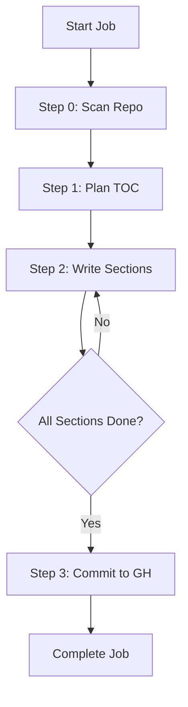

# Backend Processing Pipeline

The Backend Processing Pipeline is the core engine of GitDex, responsible for transforming a raw GitHub repository into a structured, AI-generated documentation site. The pipeline operates as a state-machine managed through an asynchronous job queue, ensuring that long-running AI generation tasks do not block the server.

## Pipeline Workflow Overview

The indexing process is divided into four distinct steps, orchestrated by the `executeNextStep` function in `server/src/pipeline.ts`. Each step is triggered asynchronously via **QStash** to handle timeouts and retries effectively.



### Detailed Step Breakdown

| Step | Function | Primary Responsibility | Key Output |
| :--- | :--- | :--- | :--- |
| **0** | `scanRepository` | Identifies and fetches raw content of relevant source files. | `data.files` array |
| **1** | `planStructure` | Uses AI to design a hierarchical documentation map. | `data.toc` (JSON array) |
| **2** | `writeSections` | Generates MDX content for each TOC entry using code context. | `data.generatedFiles` |
| **3** | `commitToGithub` | Pushes generated MDX and `meta.json` to the docs repository. | GitHub Commit |

---

## Technical Implementation

### 1. Repository Scanning (Step 0)
The pipeline filters the repository to avoid processing noise. It specifically looks for files with extensions such as `.js, .ts, .jsx, .tsx, .md, .json, .py, .rb, .go, .rs, .java, .cpp, .h, .c, .cs, .php, .css, .html, .sql, .yaml, .yml`.

**Filtering Constraints:**
- **Size Limit:** Files must be smaller than 1,000,000 bytes.
- **Exclusions:** Paths containing `node_modules`, `dist`, `build`, `.git`, `__pycache__`, `.lock`, `.min.js`, or `.bundle.js` are ignored.
- **Capacity:** The pipeline processes a maximum of the top 50 relevant files.

### 2. Structure Planning (Step 1)
GitDex passes the list of filtered file paths to the AI to generate a Table of Contents (TOC). The AI is instructed to create 4-8 top-level sections with numeric prefixes (e.g., `1.`, `2.1.`).

The output is a JSON array where each entry contains:
- `prefix`: The numeric identifier.
- `title`: The section name.
- `filename`: The target MDX filename (e.g., `1_introduction.mdx`).
- `description`: A brief overview of the section.
- `relevant_files`: A list of 2-4 file paths from the scan that provide context for this section.

### 3. Content Generation (Step 2)
This is an iterative process. For every entry in the TOC, the pipeline:
1. **Context Gathering:** Collects the content of the `relevant_files`.
2. **Token Management:** Uses `js-tiktoken` (gpt-4 encoding) to ensure the combined content does not exceed 100,000 tokens. If it does, contents are truncated.
3. **AI Generation:** Prompts the AI to generate production-ready MDX.
4. **Formatting:** Strips outer code fences and AI-generated frontmatter, then prepends a controlled frontmatter block containing `title`, `description`, and `sidebar_position`.

### 4. Persistence & Commitment (Step 3)
The final step synchronizes the generated documentation with GitHub:
- **Meta Data:** Creates a `meta.json` file at the root of the repo path containing the repository title and icon.
- **Stale File Cleanup:** The pipeline fetches the current tree of the docs repository and identifies files under `docs/{owner}/{repo}` that are no longer present in the new generation, marking them for deletion (`sha: null`).
- **Atomic Update:** Creates a new Git tree, a new commit, and updates the `main` branch reference.
- **Timestamping:** Sets a `last_indexed` key in Redis to track the last successful run.

---

## AI Integration Layer

The AI layer is implemented in `server/src/ai.ts` and utilizes the Google `gemma-4-31b-it` model via the AI SDK.

### Throttling and Reliability
To adhere to rate limits (specifically a 15 RPM limit), the system implements a custom throttling mechanism:

```typescript
// Module-level throttle to prevent hitting 15 RPM limit
let lastApiCallTimestamp = 0;
const MIN_INTERVAL_MS = 4500; // ~13 RPM
```

**Retry Logic (`generateWithRetry`):**
- **Exponential Backoff:** If a request fails, the system waits $2000 \times 2^{attempt}$ milliseconds.
- **429 Handling:** If a `429 Too Many Requests` error is encountered, the system forces a full 10-second wait.
- **Max Retries:** The system attempts the call up to 3 times before failing the pipeline step.

---

## Orchestration and State Management

### Job Locking
To prevent race conditions where multiple workers might process the same job, the pipeline uses a step-locking mechanism:

```typescript
const acquiredLock = await queue.acquireStepLock(jobId);
if (!acquiredLock) {
    console.log(`[Pipeline] Step already in progress...`);
    return;
}
```

### Asynchronous Triggering
The pipeline does not run in a single long-lived request. Instead, it uses **QStash** to trigger the next step:

```typescript
async function triggerNextStep(jobId: string, delay?: any) {
    await qstash.publishJSON({
        url: `${baseUrl}/api/pipeline/step`,
        body: { jobId },
        retries: 2,
        ...(delay ? { delay } : {})
    });
}
```
This architecture allows the system to survive server restarts and handle the high latency of AI generation without timing out the HTTP connection.