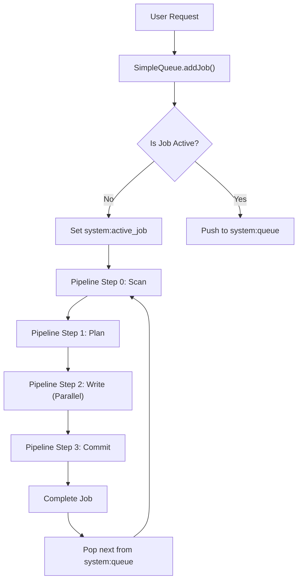
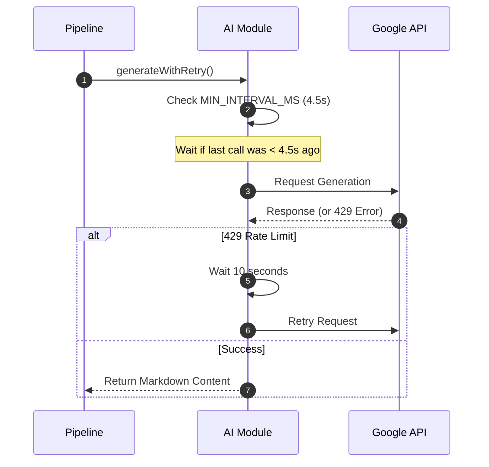

# Backend Processing Pipeline

The Backend Processing Pipeline is the core engine of GitDex, responsible for transforming a raw GitHub repository into a structured, AI-generated documentation site. The system employs a distributed, asynchronous architecture using Redis for state management and QStash for reliable step triggering.

## Pipeline Architecture Overview

The pipeline follows a serialized job queue model to ensure system stability and respect AI rate limits, while utilizing a "fan-out" pattern during the content generation phase to optimize throughput.

```mermaid
graph TD
    A["User Request"] --> B["SimpleQueue.addJob()"]
    B --> C{"Is Job Active?"}
    C -- "No" --> D["Set system:active_job"]
    C -- "Yes" --> E["Push to system:queue"]
    D --> F["Pipeline Step 0: Scan"]
    F --> G["Pipeline Step 1: Plan"]
    G --> H["Pipeline Step 2: Write (Parallel)"]
    H --> I["Pipeline Step 3: Commit"]
    I --> J["Complete Job"]
    J --> K["Pop next from system:queue"]
    K --> F
```

## Job Queuing and Lifecycle

The `SimpleQueue` class manages the lifecycle of documentation jobs. It ensures that only one repository is being processed globally at a time to prevent resource exhaustion.

### Job States
| State | Description |
| :--- | :--- |
| `queued` | Job is waiting in the `system:queue` Redis list. |
| `processing` | Job is currently being executed by the pipeline. |
| `completed` | Documentation has been successfully committed to GitHub. |
| `failed` | An error occurred; job is marked as failed with an error message. |

### Concurrency and Guardrails
- **Strict Serialization**: The system uses a Redis key `system:active_job` with the `NX` (set if not exists) flag to ensure only one job is active.
- **Cooldown Period**: A 1-hour cooldown (`COOLDOWN_MS`) is enforced per repository to prevent redundant indexing.
- **Self-Healing**: The `healStuckJobs` mechanism detects jobs that have been in the `processing` state for more than 15 minutes and marks them as `failed`.
- **Step Locking**: To prevent duplicate execution of the same pipeline step, `acquireStepLock` creates a temporary Redis lock with a 60-second TTL.

## The Four-Step Processing Pipeline

The pipeline is executed via `executeNextStep`, which uses a switch-case mechanism to progress through the following stages:

### Step 0: Repository Scanning (`scanRepository`)
The system identifies the relevant codebase to feed into the AI.
1. **Tree Retrieval**: Fetches the recursive git tree from GitHub.
2. **Filtering**: Filters files based on extensions (e.g., `.ts`, `.py`, `.go`) and excludes noise like `node_modules`, `dist`, and UI components.
3. **Round-Robin Sampling**: To avoid token limit exhaustion, the system samples up to 50 files, selecting them across different top-level directories to ensure a representative snapshot of the architecture.

### Step 1: Structure Planning (`planStructure`)
GitDex uses AI to design the documentation layout.
- **Input**: A list of sampled file paths.
- **Process**: The AI profiles the repository (e.g., monorepo, CLI, backend service) and generates a hierarchical Table of Contents (TOC).
- **Output**: A JSON array containing section titles, filenames (e.g., `1_architecture.mdx`), and the specific `relevant_files` required to write that section.

### Step 2: Content Generation (`writeSingleSection`)
This step utilizes a **fan-out** pattern for efficiency.
- **Parallelism**: The pipeline triggers the first 5 sections in parallel.
- **Context Injection**: For each section, the AI is provided with the global TOC and the actual content of the `relevant_files` identified in Step 1.
- **Token Management**: Using `js-tiktoken`, the system truncates file contents if they exceed the model's context window.
- **Completion**: As sections are completed, they are stored in a Redis hash. Once the total `completedCount` matches the TOC length, the pipeline transitions to Step 3.

### Step 3: GitHub Deployment (`commitToGithub`)
The final stage persists the generated MDX files to a dedicated documentation repository.
- **Meta Generation**: Creates a `meta.json` file containing repository metadata and the default branch.
- **Tree Synchronization**: It compares the current documentation tree with the new generated files, identifying stale files for deletion and creating new blobs for the current index.
- **Atomic Commit**: All changes are pushed in a single commit to the `main` branch of the docs repository.

## AI Integration and Rate Limiting

The pipeline interfaces with the `gemma-4-31b-it` model via the Google AI SDK. Because the API has a strict 15 Requests Per Minute (RPM) limit, the `ai.ts` module implements a custom throttling layer.

```mermaid
sequenceDiagram
    autonumber
    participant P as Pipeline
    participant AI as AI Module
    participant G as Google API

    P ->> AI: generateWithRetry()
    AI ->> AI: Check MIN_INTERVAL_MS (4.5s)
    Note over AI: Wait if last call was < 4.5s ago
    AI ->> G: Request Generation
    G -->> AI: Response (or 429 Error)
    alt 429 Rate Limit
        AI ->> AI: Wait 10 seconds
        AI ->> G: Retry Request
    else Success
        AI -->> P: Return Markdown Content
    end
```

### Throttling Logic
- **Minimum Interval**: `MIN_INTERVAL_MS` is set to 4500ms, ensuring the system stays around 13 RPM.
- **Exponential Backoff**: For non-429 errors, the system retries with a delay of $2000 \times 2^{attempt}$ milliseconds.
- **Strict 429 Handling**: If a `429 Too Many Requests` error is encountered despite the throttle, the system forces a hard 10-second wait.

## Infrastructure Components

| Component | Role | Implementation |
| :--- | :--- | :--- |
| **State Store** | Job tracking, locks, and partial content storage. | Upstash Redis |
| **Scheduler** | Asynchronous triggering of pipeline steps. | QStash |
| **VCS Interface** | Repository scanning and documentation commits. | Octokit (GitHub REST API) |
| **Tokenization** | Context window management. | js-tiktoken |