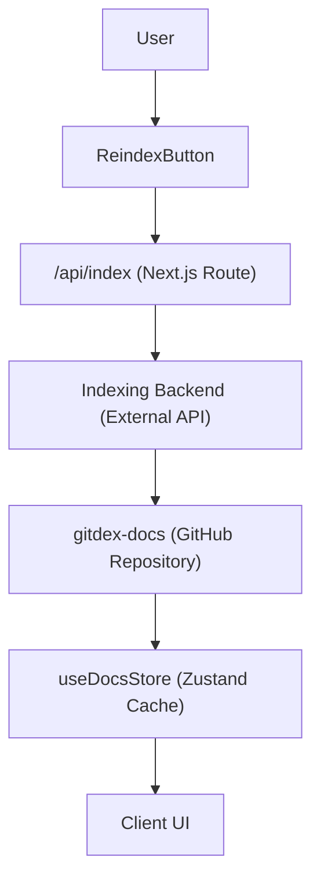

# Data Integration & Indexing

GitDex employs a decoupled indexing architecture. Rather than querying a target repository in real-time for every request, GitDex utilizes a centralized documentation store and a background processing pipeline to ensure high performance and low latency.

## Architecture Overview

The data flow moves from the user's request to trigger a re-index, through a backend pipeline, and finally into a cached state within the client application.



## Indexing Pipeline

### Triggering a Re-index
Re-indexing is initiated via the `ReindexButton` component. When a user triggers a re-index, the client sends a `POST` request to `/api/index` containing the target `repoUrl`.

The API route acting as a proxy forwards this request to the core indexing service:

```typescript
// client/src/app/api/index/route.ts
const response = await fetch(`${process.env.NEXT_PUBLIC_API_URL}/api/index`, {
  method: 'POST',
  headers: { 'Content-Type': 'application/json' },
  body: JSON.stringify({ repoUrl, force: !!force }),
});
```

### Rate Limiting & Status
To prevent abuse of the indexing pipeline, the system implements a cooldown mechanism. If the API returns a `429 Too Many Requests` status, the UI notifies the user via a toast notification and disables the queuing state.

## Documentation Store

GitDex stores processed documentation in a dedicated GitHub repository (`gitdex-docs`). This allows the system to leverage GitHub's infrastructure for storage and versioning while providing a structured way to retrieve docs.

### Retrieval Logic
The `getGithubDocs` function manages the retrieval of documentation using a two-step process:

1.  **Tree Discovery**: It uses `@octokit/rest` to fetch the recursive git tree of the `gitdex-docs` repository, filtering for files located at `docs/${owner}/${repo}`.
2.  **Content Fetching**: It fetches the raw content of each discovered file via `raw.githubusercontent.com`.

### Data Structure
The retrieved data is parsed into a `DocsStructure` object:

- **`meta`**: Parsed from `meta.json`, containing repository-specific metadata.
- **`files`**: An array of `DocFile` objects containing the relative path and raw text content of the documentation.
- **`index`**: A reference to the main entry point of the documentation.

## Caching Strategy

To minimize API overhead and improve page load speeds, GitDex implements a client-side cache using **Zustand**.

### The `useDocsStore`
The `docs-store.ts` manages a `DocsCache` where the key is the repository identifier (`owner/repo`). 

**Key Cache Specifications:**
- **TTL (Time To Live)**: 10 minutes (`10 * 60 * 1000` ms).
- **Cache Invalidation**: The store provides `clearCache` and `clearCacheFor` methods to manually purge stale data.

```typescript
// Example of the caching logic
if (cached && now - cached.timestamp < CACHE_TTL) {
  return cached.data;
}
```

When `getDocs` is called, the store first checks if a valid (non-expired) version of the documentation exists in the cache. If not, it invokes `getGithubDocs`, updates the cache with a new timestamp, and returns the fresh data.