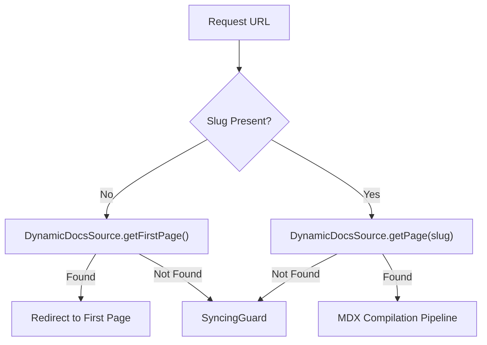
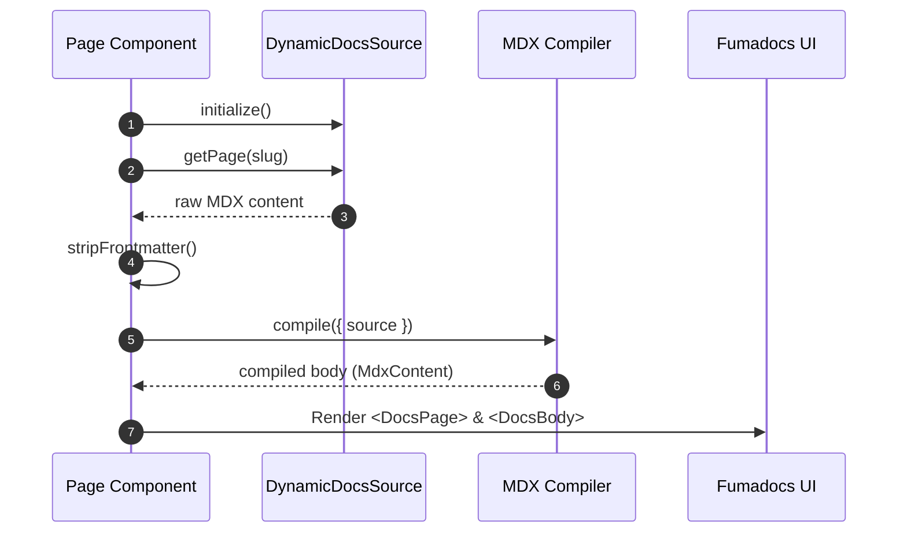

# Frontend Application Structure

GitDex utilizes the Next.js App Router to implement a highly dynamic, repository-centric documentation system. The application structure is designed to scale across any number of GitHub repositories by leveraging dynamic route segments and a hierarchical layout strategy.

## Routing Architecture

The application employs a nested routing strategy to isolate global configurations from repository-specific content.

### Route Hierarchy

The routing structure is organized as follows:

| Route Pattern | Purpose | Key Component |
| :--- | :--- | :--- |
| `/` | Global Application Shell | `RootLayout` [client/src/app/layout.tsx:15-35]() |
| `/[owner]/[repo]` | Repository Context Wrapper | `Layout` [client/src/app/[owner]/[repo]/layout.tsx:11-26]() |
| `/[owner]/[repo]/[[...slug]]` | Dynamic Documentation Page | `Page` [client/src/app/[owner]/[repo]/[[...slug]]/page.tsx:37-75]() |

### Dynamic Route Logic

The page at `client/src/app/[owner]/[repo]/[[...slug]]/page.tsx` is configured for maximum dynamism to ensure real-time updates of repository content:
- `export const dynamic = 'force-dynamic';` [client/src/app/[owner]/[repo]/[[...slug]]/page.tsx:18]()
- `export const revalidate = 0;` [client/src/app/[owner]/[repo]/[[...slug]]/page.tsx:19]()

## Layout Strategy

### Global Root Layout

The `RootLayout` serves as the entry point for the entire application, managing global state and styling. It incorporates several critical providers:

1.  **Styling & Themes**: Implements `ThemeProvider` for system-aware dark/light modes and applies global fonts (`MozillaHeadline` and `MozillaText`) [client/src/app/layout.tsx:21-26]().
2.  **Documentation Provider**: Wraps the application in `RootProvider` from `fumadocs-ui`, with search explicitly disabled [client/src/app/layout.tsx:27-31]().
3.  **Notifications**: Integrates a global `Toaster` component [client/src/app/layout.tsx:32]().

### Repository-Specific Layout

The layout located at `client/src/app/[owner]/[repo]/layout.tsx` provides a shared context for all pages within a specific repository. 

- **AI Assistant Integration**: Every repository page is automatically equipped with an `AssistantModal`, which receives the `owner` and `repo` parameters to scope AI interactions to the current project [client/src/app/[owner]/[repo]/layout.tsx:24]().
- **Loading State**: The layout handles child rendering gracefully, displaying a `Loader2` spinning animation if children are not yet available [client/src/app/[owner]/[repo]/layout.tsx:17-21]().

## Content Rendering Pipeline

The rendering of documentation pages follows a strict pipeline to transform raw repository data into interactive MDX content.

### 1. Data Retrieval
The `DynamicDocsSource` class is initialized using the `owner` and `repo` from the route parameters to fetch the corresponding page content [client/src/app/[owner]/[repo]/[[...slug]]/page.tsx:41-54]().

### 2. Content Sanitization
To prevent JSX parser crashes caused by AI-generated double or empty frontmatter, a `stripFrontmatter` function is used. It recursively removes all leading `---` blocks from the raw content [client/src/app/[owner]/[repo]/[[...slug]]/page.tsx:24-35]().

### 3. Compilation and Rendering
The sanitized content is processed through a compilation step before being passed to the UI components:

The final output is rendered using `DocsPage` and `DocsBody`, with custom components injected via `getMDXComponents({})` [client/src/app/[owner]/[repo]/[[...slug]]/page.tsx:60-72]().