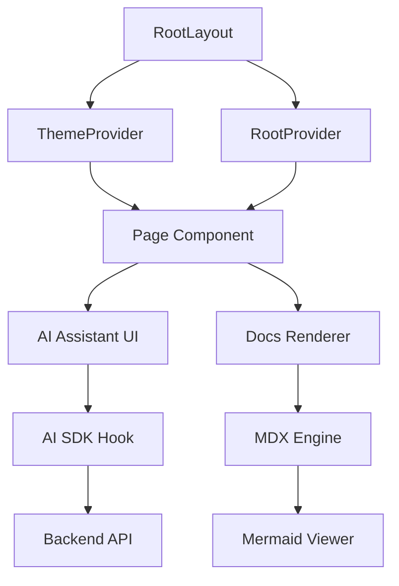

# Frontend Implementation

The GitDex frontend is a sophisticated Next.js application designed to bridge the gap between complex repository data and human-readable AI insights. Its primary role is to provide a seamless, interactive interface where users can chat with their codebase, visualize architectural patterns via Mermaid diagrams, and browse generated documentation.

The client is architected as a high-performance shell that leverages a hybrid rendering strategy: static and dynamic routing for documentation and repository browsing, combined with a highly reactive, stateful interface for the AI Assistant.

### Technical Stack Overview

The frontend utilizes a modern "AI-first" stack, prioritizing rapid streaming of LLM responses and rich data visualization.

| Layer | Technology | Purpose |
| :--- | :--- | :--- |
| **Framework** | Next.js 16 (App Router) | Routing, SSR, and layout management. |
| **AI Orchestration** | Vercel AI SDK (`ai`) | Streaming LLM responses and tool handling. |
| **Chat UI** | `@assistant-ui` | Pre-built, extensible AI chat components. |
| **Documentation** | Fumadocs | MDX-based documentation engine and UI. |
| **Visualization** | Mermaid.js & Three.js | Rendering flowcharts and 3D visualizations. |
| **Styling** | Tailwind CSS 4 & Radix UI | Atomic styling and accessible primitive components. |
| **State Management** | Zustand | Lightweight client-side state for indexing and session data. |

### Component Relationship & Data Flow

The application is structured around a centralized layout that injects necessary providers for theming, documentation context, and AI state. The interaction flow generally moves from the URL parameters (owner/repo) into the AI Assistant and the documentation renderer.



### Core UI Patterns

#### 1. The AI Assistant Interface
The AI chat experience is powered by `@assistant-ui`, which separates the chat logic from the visual presentation. This allows GitDex to implement a highly customized interaction model that supports:
- **Markdown Rendering:** Integration of `remark-gfm` and `rehype-katex` for technical documentation.
- **Dynamic Diagrams:** Integration of `mdx-mermaid` and `react-mermaid`, allowing the AI to generate architectural diagrams on the fly.
- **Interactive Visuals:** To handle large diagrams, the frontend implements a custom "Pan-Zoom" container using `svg-pan-zoom`, ensuring complex repository maps remain navigable.

#### 2. Documentation Engine (Fumadocs)
GitDex uses Fumadocs to handle the rendering of repository-specific documentation. By utilizing `fumadocs-mdx` and `mdx-remote`, the application can dynamically render content that is indexed from the repository, treating the codebase as a living document.

#### 3. Visual & Motion Design
The UI emphasizes a "modern developer tool" aesthetic. This is achieved through a combination of Tailwind CSS 4 and custom CSS animations defined in `globals.css`.

```css
/* Custom animation patterns for the GitDex experience */
.animate-aurora-slow-1 {
  /* Implementation of aurora-style background gradients */
}

.mermaid-svg-container svg:active {
  cursor: grabbing;
}
```

The use of `next-themes` provides native dark mode support, which is critical for code-centric applications.

### Application Structure

The entry point of the application, `layout.tsx`, establishes the global context. It wraps the children in a `RootProvider` (from Fumadocs) and a `ThemeProvider` to ensure a consistent look and feel across the dynamic routing paths.

```tsx
export default function RootLayout({
  children,
}: {
  children: React.ReactNode;
}) {
  return (
    <html lang="en" suppressHydrationWarning>
      <body>
        <ThemeProvider>
          <RootProvider>
            {children}
            <Toaster />
          </RootProvider>
        </ThemeProvider>
      </body>
    </html>
  );
}
```

### Client-Side Search & Processing
To maintain high performance during repository exploration, the frontend incorporates client-side search capabilities using `flexsearch` and `fuse.js`. This allows users to quickly filter through indexed documents and symbols without triggering constant network requests to the backend.