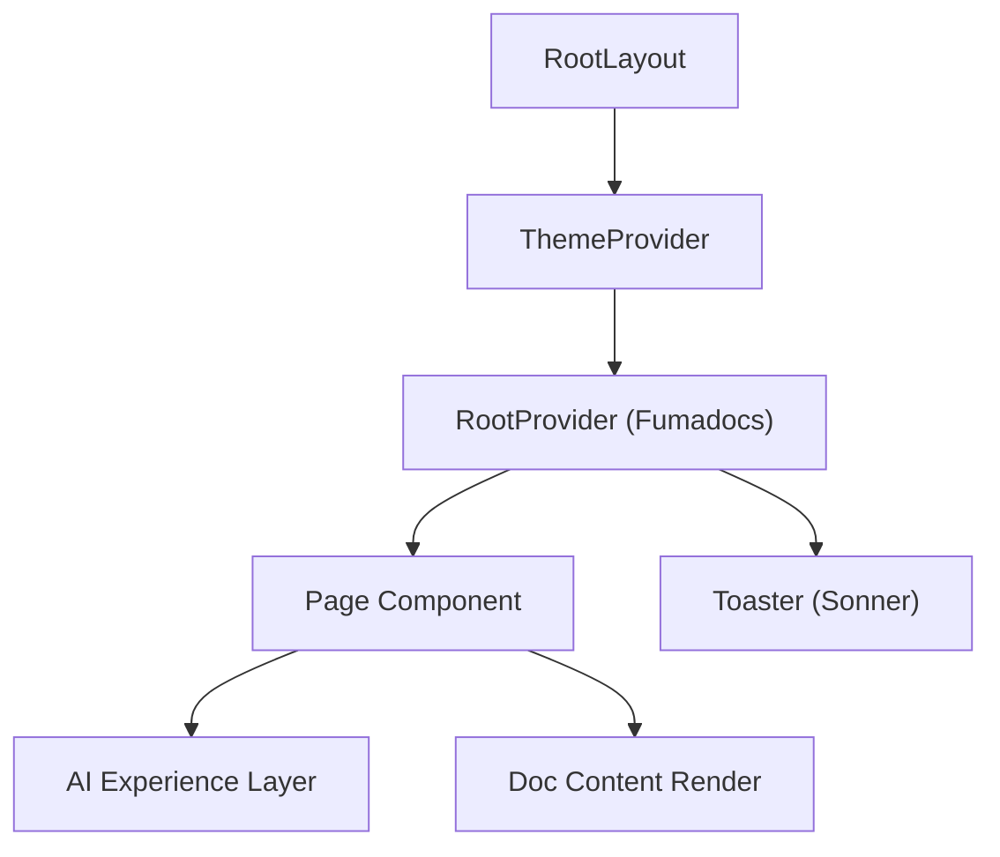

# Frontend Infrastructure

The Frontend Infrastructure of GitDex is engineered as a high-performance, type-safe single-page application (SPA) utilizing Next.js 16 with the App Router architecture. It serves as the primary orchestration layer for AI-driven repository exploration, combining a documentation engine (Fumadocs) with a complex AI interaction layer (@assistant-ui). The infrastructure is optimized for low-latency updates, GPU-accelerated visualizations, and strict theme consistency across light and dark modes.

## System Role & Architectural Position

The frontend operates as the presentation and client-side state management layer, interfacing with the Backend Core Engine via a secure proxy layer. It leverages Turbopack for optimized build times and utilizes React 19's concurrent rendering capabilities to handle heavy AI data streams without blocking the main UI thread.

### Core Technical Specifications

| Component | Technology | Version | Primary Responsibility |
| :--- | :--- | :--- | :--- |
| **Framework** | Next.js | 16.2.9 | App Routing, SSR/SSG, and Turbopack orchestration. |
| **UI Primitive** | Radix UI / Shadcn | 1.x | Accessible, unstyled component primitives. |
| **Styling** | Tailwind CSS | 4.3.1 | Utility-first CSS with JIT engine and CSS variable mapping. |
| **AI SDK** | Vercel AI SDK | 6.0.208 | Stream management, tool calling, and LLM integration. |
| **Doc Engine** | Fumadocs | 15.8.5 | MDX processing, search indexing, and documentation layouts. |
| **State Mgmt** | Zustand | 5.0.14 | Lightweight, atomic client-side state synchronization. |
| **Visualization** | Three.js / Mermaid | 0.167.1+ | 3D repository mapping and dynamic flow-chart rendering. |

## Core Execution & Data Flow Mechanics

The application boot sequence prioritizes the injection of global design tokens and the initialization of context providers to prevent Layout Shift (CLS) and Flash of Unstyled Content (FOUC).

### Provider Hierarchy and Initialization

The `RootLayout` implements a nested provider pattern to ensure that theme, documentation, and notification states are available to all child components.



### Execution Pipeline
1.  **Font Injection**: Local variable fonts (`MozillaHeadline`, `MozillaText`) are loaded via `next/font/local` and mapped to CSS variables `--font-mzh` and `--font-mzt`.
2.  **Theme Resolution**: `next-themes` intercepts the system preference or local storage setting to apply the `.dark` class to the `<html>` element before hydration.
3.  **Context Wrapping**: `RootProvider` initializes the Fumadocs search and navigation state, while the `ThemeProvider` synchronizes the CSS variable palette.
4.  **Hydration**: React 19 hydrates the DOM, applying the `suppressHydrationWarning` attribute to the `html` tag to mitigate discrepancies between server-side theme defaults and client-side preferences.

## Implementation Deep Dive

### Root Layout Orchestration
The `RootLayout` defines the global HTML shell and ensures that critical CSS (KaTeX for mathematical notation and global styles) is loaded before the component tree.

```typescript title="client/src/app/layout.tsx"
export default function RootLayout({
  children,
}: {
  children: React.ReactNode;
}) {
  return (
    <html lang="en" suppressHydrationWarning>
      <body className={` ${MozillaHeadline.variable} ${MozillaText.variable}`}>
        <ThemeProvider
          attribute="class"
          defaultTheme="system"
          enableSystem
          disableTransitionOnChange
        >
          <RootProvider
            search={{
              enabled: false 
            }}>
            {children}
            <Toaster />
          </RootProvider>
        </ThemeProvider>
      </body>
    </html>
  );
}
```
*   **`suppressHydrationWarning`**: Prevents React from throwing errors when `next-themes` modifies the class attribute of the `html` element on the client.
*   **`MozillaHeadline.variable`**: Injects a CSS variable class that allows Tailwind to reference the local font via `var(--font-mzh)`.
*   **`RootProvider`**: Configures the Fumadocs environment; the `search: { enabled: false }` flag indicates that search indexing is handled via a custom implementation rather than the default provider.

### Design Token System
GitDex employs a CSS-variable-first approach to styling, utilizing Tailwind 4's `@theme inline` directive to map system variables to utility classes.

```css title="client/src/app/globals.css"
@theme inline {
  --color-background: var(--background);
  --color-foreground: var(--foreground);
  --color-primary: var(--primary);
  --color-primary-foreground: var(--primary-foreground);
  /* ... other mappings */
  --font-sans: var(--font-sans);
  --font-mono: var(--font-mono);
  --font-serif: var(--font-serif);
}

@layer base {
  * {
    @apply border-border outline-ring/50;
  }
  body {
    @apply bg-background text-foreground;
  }
  h1, h2, h3, h4, h5, h6 {
    font-family: var(--font-mzh), sans-serif;
  }
}
```
*   **`@theme inline`**: Directly binds CSS variables to Tailwind's internal design system, enabling classes like `bg-primary` to dynamically resolve to the current theme's value.
*   **`@layer base`**: Ensures that global resets and typography (specifically using the Mozilla Headline font for headings) are applied consistently across the application.
*   **Border/Ring Logic**: All elements are defaulted to `border-border` and `outline-ring/50` for visual consistency during focus and active states.

### Font Resource Management
Variable fonts are managed as local assets to eliminate external network dependencies and optimize Largest Contentful Paint (LCP).

```typescript title="client/src/app/fonts.ts"
import localFont from 'next/font/local'

export const MozillaHeadline = localFont({
  src: '/MozillaHeadline-VariableFont_wdth,wght.ttf',
  variable: '--font-mzh',
  display: 'swap',
})

export const MozillaText = localFont({
  src: '/MozillaText-VariableFont_wght.ttf',
  variable: '--font-mzt',
  display: 'swap',
})
```
*   **`variable`**: Defines the CSS variable name that is appended to the `body` class list in `layout.tsx`.
*   **`display: 'swap'`**: Instructs the browser to use a fallback font until the variable font is fully loaded, preventing invisible text.

## Method / State Reference & Error Recovery

### Global Theme Token Map

The following tokens are used to drive the UI's appearance across different modes.

| Token | Light Mode Value | Dark Mode Value | Usage |
| :--- | :--- | :--- | :--- |
| `--background` | `#ffffff` | `#09090b` | Primary page background. |
| `--foreground` | `#09090b` | `#fafafa` | Primary text color. |
| `--primary` | `#059669` | `#10b981` | Brand accent / CTA elements. |
| `--border` | `#d4d4d8` | `#3f3f46` | Component boundaries/dividers. |
| `--ring` | `#059669` | `#10b981` | Focus indicators and active states. |
| `--muted` | `#f4f4f5` | `#18181b` | De-emphasized backgrounds. |

### Error Recovery & Invariants

*   **Hydration Mismatch**: If a theme mismatch occurs between the server (defaulting to 'system') and the client (stored in `localStorage`), `next-themes` performs a DOM mutation before the first paint. The `suppressHydrationWarning` attribute on `<html>` prevents this from triggering a React reconciliation error.
*   **CSS Variable Fallbacks**: Tailwind 4 configuration includes fallback values within the `@theme` block. If a CSS variable is undefined, the system reverts to the hardcoded HSL/HEX values defined in the `:root` or `.dark` selectors.
*   **Font Loading Failure**: The `font-family` declarations in `globals.css` include `sans-serif` fallbacks. If the `.ttf` assets fail to load, the browser defaults to the system sans-serif stack without breaking the layout.