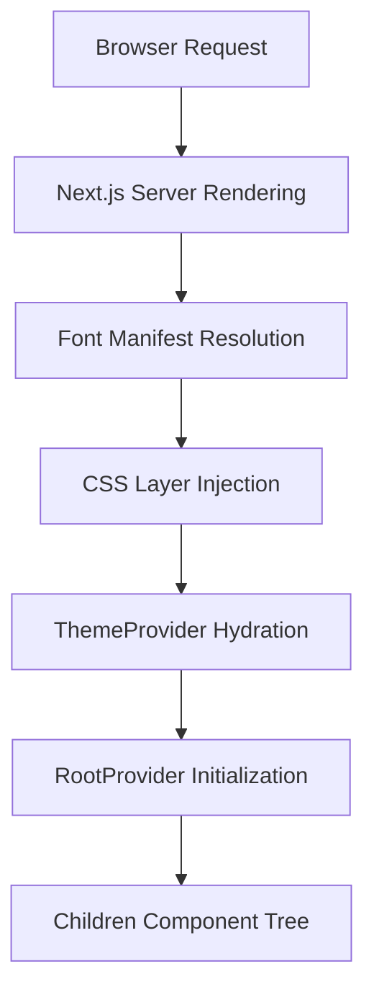

# Frontend Infrastructure

## System Role & Architectural Position

The Frontend Infrastructure serves as the foundational execution environment for the GitDex client. It establishes the global design system, optimizes asset delivery, and defines the root composition of the React component tree. This layer is responsible for eliminating Cumulative Layout Shift (CLS), managing theme state persistence, and providing the CSS utility framework required by the AI Experience Layer.

The infrastructure is positioned as the outermost shell of the Next.js App Router architecture, wrapping all page segments in a unified provider hierarchy.

### Infrastructure Specifications

| Component | Technology | Purpose | Critical Invariant |
| :--- | :--- | :--- | :--- |
| **Styling Engine** | Tailwind CSS v4+ | Utility-first styling & Theme variables | Zero runtime CSS overhead |
| **Font Optimization** | `next/font/local` | Localized font loading & swapping | No FOIT (Flash of Invisible Text) |
| **Theme Orchestration** | `next-themes` | Dark/Light mode state management | Synchronous hydration of `.dark` class |
| **UI Framework** | `fumadocs-ui` | Documentation-centric primitive components | Strict adherence to `RootProvider` context |
| **Notification System** | `sonner` | Global toast event orchestration | Singleton instance in `RootLayout` |

## Core Execution & Data Flow Mechanics

The frontend boot sequence follows a strict linear dependency chain to ensure that styles and fonts are available before the first paint of the AI interface.

### Bootstrapping Sequence



### Key Technical Mechanics

*   **Font Optimization Pipeline**: By utilizing `next/font/local`, GitDex bypasses external network requests for typography. The `MozillaHeadline` and `MozillaText` fonts are pre-loaded and injected via CSS variables, ensuring the browser can calculate layout dimensions before the JS bundle executes.
*   **CSS Cascade Layering**: The system employs `@layer base` and `@theme inline` directives to manage specificity. The `@source` directive integrates `fumadocs-ui` styles directly into the build pipeline, preventing style collisions between the core UI library and custom GitDex animations.
*   **Theming Lifecycle**: `ThemeProvider` manages the `class` attribute on the `<html>` element. This enables the CSS engine to toggle between light and dark variable sets (e.g., `.dark .bg-grid-pattern`) without triggering a full page re-render.
*   **Visual Effects Engine**: Complex backgrounds (Aurora, Grid, Dots) are implemented as GPU-accelerated CSS animations to maintain 60fps performance while providing a high-fidelity "AI" aesthetic.

## Implementation Deep Dive

### Typography Optimization

The system leverages Next.js local font loading to prevent layout shifts and ensure brand consistency.

```typescript title="client/src/app/fonts.ts"
import localFont from 'next/font/local'

export const MozillaHeadline = localFont({
  src: './fonts/MozillaHeadline.woff2', // Path to optimized woff2 binary
  variable: '--font-mozilla-headline',
})

export const MozillaText = localFont({
  src: './fonts/MozillaText.woff2',
  variable: '--font-mozilla-text',
})
```

**Technical Analysis:**
- `variable` property: Defines a CSS custom property that allows Tailwind to reference the font via `font-family: var(--font-mozilla-headline)`.
- `woff2` format: Used for maximum compression and browser compatibility.

### Root Layout Composition

The `RootLayout` serves as the dependency injection point for global state and providers.

```tsx title="client/src/app/layout.tsx"
export default function RootLayout({
  children,
}: {
  children: React.ReactNode;
}) {
  return (
    <html lang="en" suppressHydrationWarning>
      <body className={`${MozillaHeadline.variable} ${MozillaText.variable} antialiased`}>
        <ThemeProvider attribute="class" defaultTheme="system" enableSystem>
          <RootProvider>
            {children}
            <Toaster />
          </RootProvider>
        </ThemeProvider>
      </body>
    </html>
  );
}
```

**Technical Analysis:**
- `suppressHydrationWarning`: Required for `next-themes` to prevent mismatches between server-rendered HTML and client-side theme detection.
- `antialiased`: Applies `-webkit-font-smoothing: antialiased` to optimize font rendering across macOS/Windows.
- `RootProvider`: Initializes the `fumadocs-ui` context, providing necessary state for documentation navigation and search.

### Advanced Visual Infrastructure

The `globals.css` file implements complex GPU-accelerated animations for the background layer.

```css title="client/src/app/globals.css"
.animate-aurora-slow-1 {
  animation: aurora-slow-1 20s linear infinite;
}

.bg-grid-pattern {
  background-image: linear-gradient(to right, #80808012 1px, transparent 1px),
                    linear-gradient(to bottom, #80808012 1px, transparent 1px);
  background-size: 40px 40px;
}

.dark .bg-grid-pattern {
  background-image: linear-gradient(to right, #ffffff05 1px, transparent 1px),
                    linear-gradient(to bottom, #ffffff05 1px, transparent 1px);
}
```

**Technical Analysis:**
- `linear-gradient`: Used to create high-performance mathematical grids instead of image assets, reducing HTTP requests and memory usage.
- `.dark` override: Re-calculates alpha transparency for grid lines to maintain contrast in dark mode.
- `aurora-slow` animations: Utilize `transform` or `opacity` shifts to ensure they stay on the compositor thread.

## Reference & Error Recovery

### Theme Configuration Mapping

| Variable / Class | Light Mode Value | Dark Mode Value | CSS Impact |
| :--- | :--- | :--- | :--- |
| `.dark` | N/A | `active` | Switches all `@theme` variables |
| `.bg-grid-pattern` | `#80808012` | `#ffffff05` | Background grid line color |
| `MozillaHeadline` | `--font-mozilla-headline` | `--font-mozilla-headline` | Global Heading Font |
| `MozillaText` | `--font-mozilla-text` | `--font-mozilla-text` | Global Body Font |

### Failure Modes & Recovery

| Failure Mode | Symptom | Root Cause | Resolution |
| :--- | :--- | :--- | :--- |
| **Font Flash** | Text jumps from Serif to Sans | Font file load latency | Ensure `next/font/local` is used in `RootLayout` |
| **Theme Flicker** | White flash on dark mode load | Hydration mismatch | Add `suppressHydrationWarning` to `<html>` tag |
| **Animation Lag** | Stuttering aurora background | Main thread congestion | Move animation properties to `transform` or `opacity` |
| **Style Collision** | UI components ignoring styles | Specificity conflict | Wrap custom styles in `@layer base` or `@layer components` |