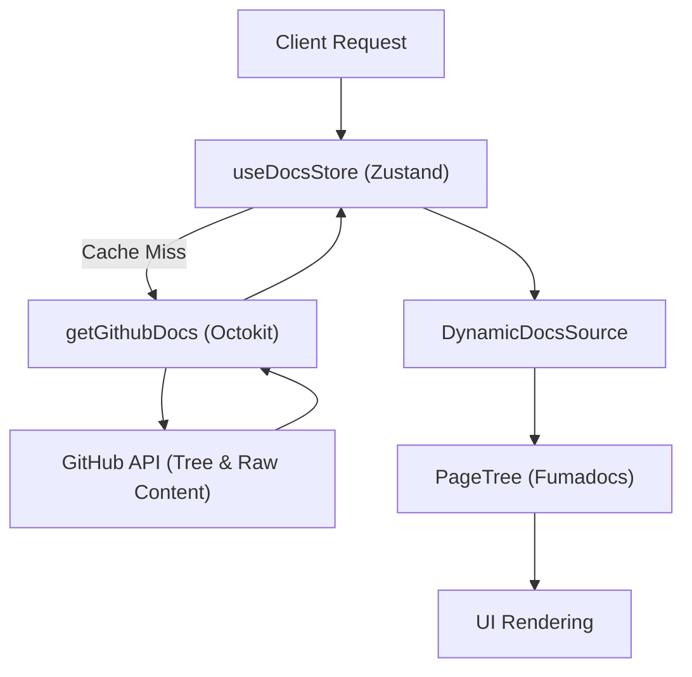

# GitHub Integration & Data Logic

GitDex implements a dynamic documentation pipeline that transforms raw GitHub repository content into a structured, navigable documentation site. Instead of static build-time generation, GitDex fetches and processes documentation on-demand.

## Data Flow Architecture

The system follows a layered approach: fetching raw data via the GitHub API, caching that data in a client-side store, and transforming it into a hierarchical tree for the UI.

## GitHub API Interaction

The core fetching logic resides in `getGithubDocs`. Unlike standard documentation tools, GitDex looks for documentation within a centralized `gitdex-docs` repository.

1.  **Tree Discovery**: It uses the `octokit.rest.git.getTree` method with `recursive: "true"` to identify all files located under the path `docs/{owner}/{repo}`.
2.  **Content Retrieval**: Once the file list is obtained, it performs concurrent `fetch` requests to `raw.githubusercontent.com` to retrieve the actual MDX content.
3.  **Metadata Extraction**: It specifically looks for a `meta.json` file within the directory to load repository-specific configuration.

## State Management & Caching

To minimize API rate limiting and improve performance, GitDex utilizes a Zustand store (`useDocsStore`) to implement a TTL (Time-To-Live) caching strategy.

-   **Cache Key**: Documents are indexed by a combined string of `{owner}/{repo}`.
-   **TTL**: The cache expires every 10 minutes (`CACHE_TTL = 10 * 60 * 1000`).
-   **Invalidation**: The store provides `clearCache` and `clearCacheFor` methods to force-refresh documentation when updates are pushed to GitHub.

## Dynamic Source Processing

The `DynamicDocsSource` class is responsible for converting raw GitHub files into a format compatible with the `fumadocs-core` page tree.

### Frontmatter Parsing
GitDex parses the top of each MDX file for a YAML-like frontmatter block. It specifically looks for:
- `title`: Overrides the default filename-based title.
- `description`: Used for SEO and page summaries.
- `sidebar_position`: A numeric value used to determine the sort order of pages.

### Hierarchical Tree Generation
The system implements a custom logic to generate folders and nested pages based on file naming conventions:

1.  **Flat to Hierarchical**: Files are scanned for a numeric prefix (e.g., `1.0.mdx`, `1.1.mdx`).
2.  **Grouping**: Files starting with the same primary digit (the "top level prefix") are grouped under a single folder node.
3.  **Sorting**: Pages are sorted primarily by their `sidebar_position` defined in the frontmatter, defaulting to `999` if not provided.

### Title Formatting
If no title is provided in the frontmatter, GitDex automatically generates one by:
1. Removing numeric prefixes (e.g., `01_introduction` $\rightarrow$ `introduction`).
2. Splitting by underscores or hyphens.
3. Capitalizing each word.