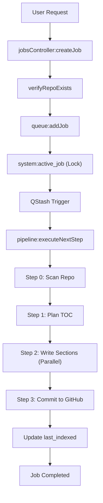

# Indexing Pipeline

The Indexing Pipeline is the core engine of GitDex, responsible for transforming a raw GitHub repository into a structured, AI-generated documentation site. This process involves a multi-stage asynchronous pipeline that handles repository scanning, architectural planning, parallel content generation, and final persistence to a documentation repository.

## Pipeline Overview

The pipeline is designed as a state machine to handle the long-running nature of AI generation and GitHub API limits. It utilizes a combination of Redis for state management, QStash for asynchronous triggers, and the GitHub REST API for source and destination data.

### Data Flow Diagram

## Job Submission and Validation

When a user submits a repository URL via the `/api/jobs/index` endpoint, the system performs several validation and concurrency checks before initiating the pipeline.

### Validation Logic
1. **URL Parsing**: The `parseOwnerRepo` utility extracts the owner and repository name from the provided GitHub URL.
2. **Existence Verification**: The `verifyRepoExists` function checks if the repository is public and accessible. To reduce API overhead, verification results are cached in Redis:
   - **Successful verification**: Cached for 3600 seconds (1 hour).
   - **404 Not Found**: Cached for 300 seconds (5 minutes).

### Concurrency and Cooldowns
To prevent abuse and redundant processing, the `SimpleQueue` implements a strict cooldown mechanism:
- **Cooldown Period**: Repositories cannot be re-indexed within 60 minutes (`COOLDOWN_MS`) unless the `force` flag is set to true.
- **Serialization**: The system ensures only one job is active globally using the `system:active_job` Redis key. If a job is already running, new requests are pushed to a `system:queue` list.

## The Execution Pipeline

The pipeline is executed in four distinct steps, managed by `executeNextStep` in `pipeline.ts`. Each step is protected by a step-level lock (`lock:step:jobId`) to prevent duplicate executions.

### Step 0: Repository Scanning
The system analyzes the repository structure to select the most relevant files for documentation.
- **Filtering**: Only files matching specific extensions (e.g., `.ts`, `.js`, `.py`, `.go`, `.rs`) are considered.
- **Exclusions**: Files in `node_modules`, `dist`, `build`, and `.git`, as well as large files (>1MB) and UI components (e.g., `/components/ui/`), are ignored.
- **Sampling**: To avoid token limit exhaustion, the pipeline employs round-robin sampling across top-level directories, selecting up to 50 representative files.

### Step 1: Structural Planning
GitDex uses AI to profile the repository (e.g., determining if it is a monorepo or a library) and generates a hierarchical Table of Contents (TOC).
- **TOC Requirements**: 5 to 12 top-level sections.
- **Mapping**: Each section is assigned a prefix, title, filename (e.g., `1_introduction.mdx`), and a list of 2-5 relevant source files.

### Step 2: Parallel Section Generation
This is a "fan-out" stage where documentation sections are written independently.
- **Processing**: The pipeline triggers the first 5 sections in parallel. Once a section is completed, it triggers the next set of 5.
- **Token Management**: `js-tiktoken` is used to encode content; if the combined content of relevant files exceeds the token limit, the text is truncated.
- **Storage**: Generated content is stored in Redis hashes using the key `section:index` until all sections are complete.

### Step 3: GitHub Persistence
The "fan-in" stage gathers all generated MDX files and commits them to the `gitdex-docs` repository.
- **Meta Generation**: A `meta.json` file is created containing the repo title, description, and default branch.
- **Tree Management**: The system identifies stale files in the destination path (`docs/{owner}/{repo}/`) and deletes them before adding the new index.
- **Finalization**: The `last_indexed` timestamp is updated in Redis.

## Asynchronous Orchestration

Because the pipeline consists of multiple AI calls and API interactions, it is orchestrated via **QStash**.

### QStash Integration
Instead of keeping a long-lived HTTP connection open, each pipeline step publishes a JSON message to the `/api/pipeline/step` endpoint.

| Trigger Point | Action | Destination |
| :--- | :--- | :--- |
| `createJob` | Initial trigger | `/api/pipeline/step` |
| `executeNextStep` | Trigger subsequent step | `/api/pipeline/step` |
| `writeSingleSection` | Trigger next batch of 5 | `/api/pipeline/step` |
| `executeNextStep` | Trigger next queued job | `/api/pipeline/step` |

### Reliability and Healing
The system implements several safeguards to prevent "stuck" jobs:
- **Step Locks**: `acquireStepLock` ensures a 60-second TTL on any active step.
- **Cron Healing**: A scheduled task calls `cronHeal`, which identifies jobs in the `processing` state that haven't been updated for 15 minutes and marks them as `failed`.
- **Re-queuing**: If a QStash trigger fails, `requeueJob` resets the job to the `queued` state and pushes it to the front of the line.

## API Reference

The following endpoints manage the indexing lifecycle:

| Endpoint | Method | Description | Key Parameters |
| :--- | :--- | :--- | :--- |
| `/api/jobs/index` | `POST` | Initiates a new indexing job | `repoUrl`, `force` |
| `/api/jobs/status/:jobId` | `GET` | Gets current state of a job | `jobId` |
| `/api/jobs/status` | `GET` | Checks if a repo is already indexed | `owner`, `repo` |
| `/api/pipeline/step` | `POST` | Internal QStash trigger for steps | `jobId`, `sectionIndex` |
| `/api/pipeline/cron-heal` | `POST` | Cleans up timed-out jobs | N/A |