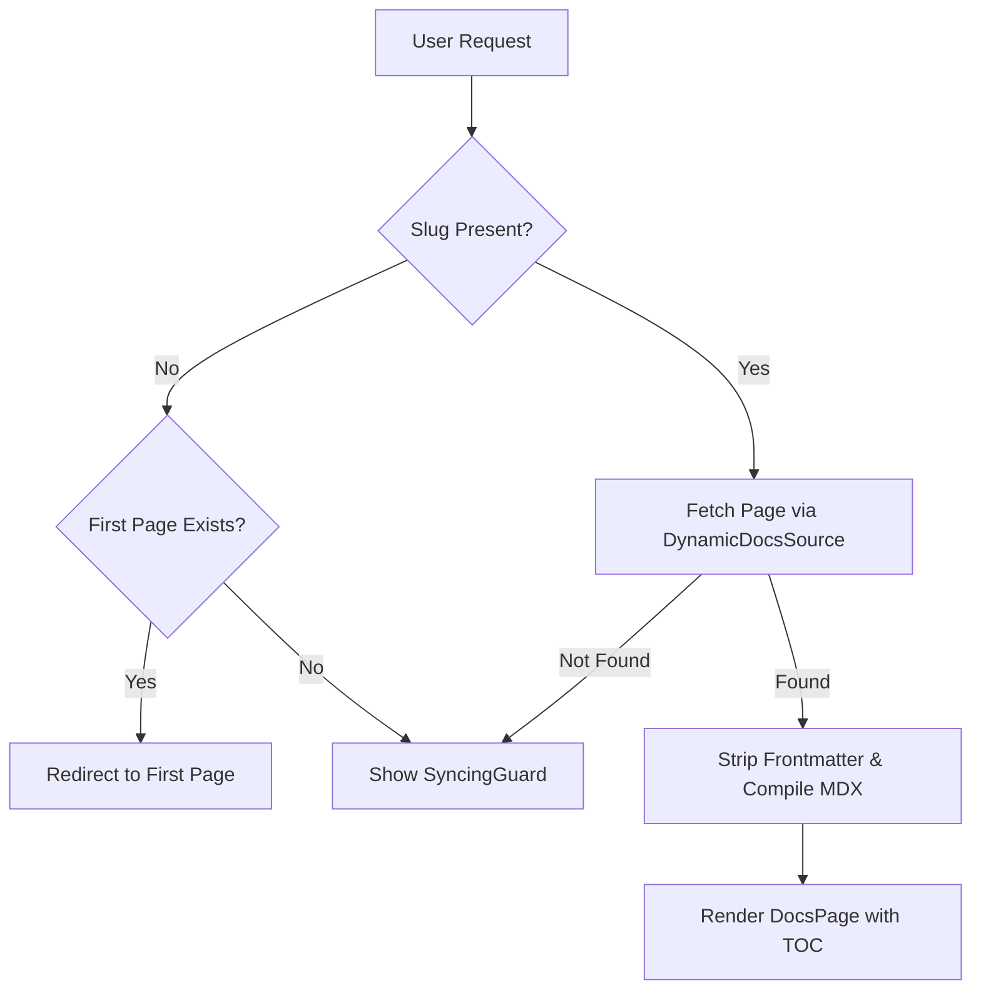

# Dynamic Routing and Pages

GitDex leverages the Next.js App Router to provide a fully dynamic documentation experience. Instead of pre-rendering static files at build time, it uses dynamic segments to resolve documentation for any GitHub repository on the fly.

## Routing Architecture

The application utilizes a deeply nested dynamic route structure to handle the hierarchy of GitHub owners, repositories, and documentation pages:

`app/[owner]/[repo]/[[...slug]]/page.tsx`

- **`[owner]`**: Captures the GitHub username or organization.
- **`[repo]`**: Captures the specific repository name.
- **`[[...slug]]`**: An optional catch-all segment that captures the path to the specific documentation page.

### Request Flow

When a user visits a documentation URL, the system follows this resolution logic:



## Page Implementation Details

### Dynamic Rendering
Because documentation is generated dynamically by AI and can change frequently, the pages are configured for server-side rendering (SSR) with no caching:

```typescript
export const dynamic = 'force-dynamic';
export const revalidate = 0;
```

### Content Processing Pipeline
The `Page` component handles the raw content transformation before it reaches the browser:

1. **Initialization**: The `DynamicDocsSource` is initialized with the `owner` and `repo` to interface with the documentation store.
2. **Frontmatter Stripping**: Since AI-generated MDX may occasionally produce redundant or malformed YAML frontmatter blocks, the `stripFrontmatter` utility recursively removes all leading `---` blocks to prevent JSX parsing errors.
3. **TOC Generation**: The `getTableOfContents` utility scans the cleaned MDX content to generate a navigation map for the sidebar.
4. **MDX Compilation**: The content is passed through a custom `compiler` to transform MDX into a renderable React component.

## The Indexing Status Page

The `/status` route is a specialized client-side page that monitors the AI generation process. It uses a polling mechanism to track the lifecycle of a repository's documentation.

### State Management
The status page tracks five distinct states to provide granular feedback to the user:

| State | Description | UI Action |
| :--- | :--- | :--- |
| `loading` | Initial status check. | Spinner |
| `not-indexed` | No documentation exists yet. | "Start Indexing" Button |
| `queued` | Job is waiting for a worker. | Hourglass / Pulse animation |
| `processing` | AI is currently generating content. | Step-based progress bar |
| `failed` | An error occurred during generation. | Error message & "Try Again" |

### Polling Logic
The page implements an exponential backoff polling strategy (starting at 2s, capping at 5s) via `useCallback` and `useEffect` to minimize server load while maintaining a responsive UI.

## Layout and Context

The `layout.tsx` file serves as the structural wrapper for all repository-specific pages. It ensures that:

1. **Consistent Styling**: Applies the global `font-sans` across the documentation site.
2. **AI Integration**: The `AssistantModal` is injected at the layout level, receiving the `owner` and `repo` parameters. This allows the AI assistant to maintain the context of the current repository regardless of which documentation page the user is browsing.