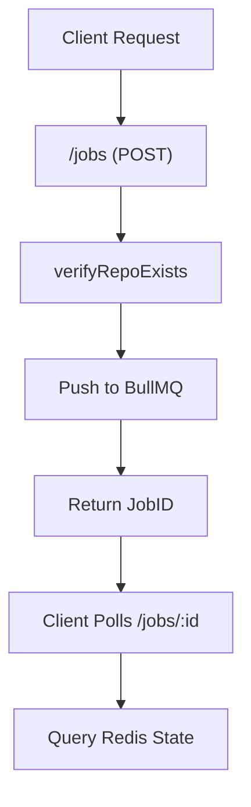
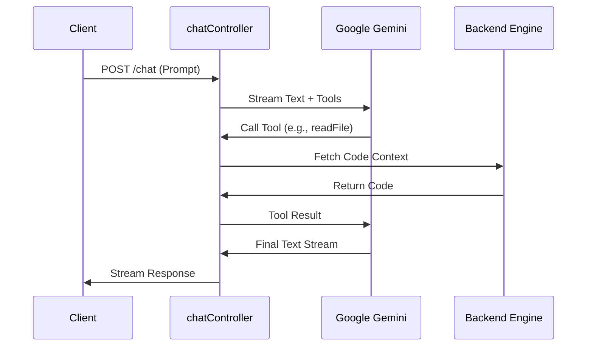

# Server API Layer

The Server API Layer acts as the primary orchestration interface for the GitDex backend. It exposes a RESTful surface that decouples the frontend's request patterns from the underlying asynchronous processing pipeline and the AI generation engine. This layer is responsible for translating HTTP requests into actionable jobs in the task queue and managing the stateful interaction between the user and the Large Language Model (LLM).

Architecturally, this layer is divided into two primary domains: **Job Management** (handling the lifecycle of repository indexing) and **Chat Orchestration** (managing the AI-driven exploration of the indexed code). By utilizing a queue-based approach for indexing, the API remains responsive, offloading heavy compute tasks (cloning, parsing, and embedding) to the Backend Core Engine.

### Core Component Summary

| Component | Responsibility | Primary Dependencies |
| :--- | :--- | :--- |
| `jobsRoutes.ts` | Route definitions, middleware integration, and endpoint mapping. | `express`, `@upstash/qstash` |
| `jobsController.ts` | Logic for job creation, status tracking, and repository validation. | `bullmq`, `@octokit/rest`, `@upstash/qstash` |
| `chatController.ts` | AI stream management, tool definition, and context resolution. | `ai`, `@ai-sdk/google`, `zod` |
| `verifyQstashSignature` | Middleware ensuring requests from Upstash (CRON/Webhooks) are authentic. | `@upstash/qstash` |

---

## Architecture, State & Data Flow

The Server API Layer manages two distinct data flows: the **Asynchronous Indexing Flow** and the **Synchronous AI Interaction Flow**.

### 1. Asynchronous Indexing Flow
When a user submits a repository for indexing, the API does not process the repository immediately. Instead, it validates the request and persists a "job" intention to a Redis-backed queue.



### 2. AI Interaction Flow
The chat interface utilizes a streaming architecture. The `handleChat` controller manages a loop where the AI can request "tools" (functions) to fetch specific code snippets or repository metadata before returning a final answer to the user.



---

## In-Depth Code Walkthrough & Implementation Details

### Job Creation and Validation
The `createJob` handler ensures that only valid, existing GitHub repositories enter the processing pipeline to prevent queue pollution and wasted compute resources.

```typescript title="server/src/controllers/jobsController.ts"
export const createJob = async (req: any, res: any) => {
  const { repoUrl } = req.body;
  const { owner, repo } = parseOwnerRepo(repoUrl);

  if (!owner || !repo) {
    return res.status(400).json({ error: "Invalid repository URL" });
  }

  const exists = await verifyRepoExists(owner, repo);
  if (!exists) {
    return res.status(404).json({ error: "Repository not found on GitHub" });
  }

  const job = await queue.add("index-repo", { owner, repo });
  res.status(202).json({ jobId: job.id });
};
```

The implementation follows a "fail-fast" pattern. First, `parseOwnerRepo` uses regex or string manipulation to extract the owner and repository name. Second, `verifyRepoExists` performs a lightweight HEAD request via `Octokit` to GitHub's API. If the repository is valid, a job is pushed to the BullMQ `index-repo` queue. The server returns a `202 Accepted` status, indicating the request is accepted for processing but not yet complete.

### AI Tool Integration and Streaming
The `handleChat` function leverages the Vercel AI SDK to create a sophisticated agentic loop. It doesn't just send a prompt; it provides the LLM with a set of tools to interact with the indexed codebase.

```typescript title="server/src/controllers/chatController.ts"
export const handleChat = async (req: Request, res: Response) => {
  const { messages, repoId } = req.body;
  
  const result = await streamText({
    model: google('gemini-1.5-pro'),
    messages: convertToModelMessages(messages),
    tools: {
      getFiles: tool({
        description: 'List files in the repository',
        parameters: z.object({ path: z.string().optional() }),
        execute: async ({ path }) => {
          // Logic to fetch file list from indexed store
        },
      }),
      // Additional tools like readFile, searchCode...
    },
  });

  result.pipeDataStreamToResponse(res);
};
```

This snippet demonstrates the `streamText` implementation. The `tools` object defines the AI's capabilities. Each tool includes a `description` (which the LLM uses to decide when to call the tool) and a `parameters` schema defined via `zod` for strict type validation. When the LLM decides to call `getFiles`, the `execute` function is triggered on the server, fetching real data from the backend store before the LLM synthesizes the final response. The `pipeDataStreamToResponse` method ensures that the user receives the response token-by-token, reducing perceived latency.

### Index Status Resolution Logic
The `getStatusByName` function implements complex logic to determine if a repository is "indexed," prioritizing active jobs over cached state.

```typescript title="server/src/controllers/jobsController.ts"
export const getStatusByName = async (req: any, res: any) => {
  const { owner, repo } = req.params;
  
  // 1. Check for active pipeline
  const activeJob = await queue.getJobs(['waiting', 'active']);
  const isProcessing = activeJob.some(j => j.data.owner === owner && j.data.repo === repo);
  
  if (isProcessing) {
    return res.json({ indexed: false, status: 'processing' });
  }

  // 2. Verify physical existence of index files
  const exists = await verifyIndexExists(owner, repo);
  if (exists) {
    return res.json({ indexed: true });
  }

  res.json({ indexed: false });
};
```

The logic here is critical for the frontend polling mechanism. If a job is currently in the `waiting` or `active` state in BullMQ, the API must report `indexed: false`. This forces the frontend to continue polling until the pipeline completes. Once no active job is found, the controller checks for the physical existence of the index. This prevents a "false negative" where a repository was indexed before the job tracking system was implemented, or a "false positive" where a job record exists but the resulting files were deleted.

---

## API / Method Reference

### Job Endpoints (`/jobs`)

| Endpoint | Method | Payload | Description |
| :--- | :--- | :--- | :--- |
| `/jobs` | `POST` | `{ repoUrl: string }` | Validates repo and queues an indexing job. Returns `jobId`. |
| `/jobs/:id` | `GET` | N/A | Returns the current status of a specific BullMQ job. |
| `/jobs/status/:owner/:repo` | `GET` | N/A | Determines if a repo is indexed or currently processing. |
| `/jobs/heal` | `POST` | N/A | Triggered via CRON to reconcile stuck jobs. |
| `/jobs/next` | `POST` | N/A | Manually triggers the next step in the processing pipeline. |

### Chat Endpoints (`/chat`)

| Endpoint | Method | Payload | Description |
| :--- | :--- | :--- | :--- |
| `/chat` | `POST` | `{ messages: Array, repoId: string }` | Streams an AI response based on the provided repository context. |

### Helper Functions

#### `parseOwnerRepo(repoUrl: string)`
- **Input**: A GitHub URL (e.g., `https://github.com/user/repo`).
- **Output**: `{ owner: string, repo: string }`.
- **Invariant**: Throws or returns null if the URL does not match the expected GitHub pattern.

#### `verifyRepoExists(owner: string, repo: string)`
- **Input**: Owner and repository strings.
- **Output**: `Promise<boolean>`.
- **Mechanism**: Uses `octokit.repos.get` to check for a 200 OK response.

---

## Error Handling, Edge Cases & Performance

### Security & Authentication
The `/jobs/heal` and `/jobs/next` endpoints are sensitive as they can trigger heavy compute cycles. To prevent abuse, the `verifyQstashSignature` middleware is implemented. This middleware validates the `upstash-signature` header using a shared secret, ensuring that only authorized requests from the Upstash Qstash scheduler can trigger these routes.

### GitHub API Rate Limiting
The `jobsController` relies on `Octokit`. To handle GitHub's strict rate limits, the implementation uses a singleton Octokit instance. If `verifyRepoExists` hits a 403 (Rate Limit Exceeded), the API returns a 503 Service Unavailable or a custom error to the client, preventing the system from queuing jobs that cannot be verified.

### Concurrency and Race Conditions
A critical edge case occurs when multiple users attempt to index the same repository simultaneously. The `getStatusByName` logic and the `createJob` flow are designed to prevent duplicate pipelines. Before adding a job to the queue, the system should ideally check for existing active jobs for that `owner/repo` pair to avoid redundant processing and embedding costs.

### Performance Optimizations
- **Streaming Responses**: By using `result.pipeDataStreamToResponse(res)`, the server avoids buffering the entire LLM response in memory, allowing for immediate time-to-first-token (TTFT).
- **Redis Caching**: Job statuses are retrieved from Redis via BullMQ, ensuring that polling requests (`/jobs/:id`) do not hit the primary database or the file system.
- **Zod Validation**: All AI tool inputs are validated via Zod schemas before execution, preventing "prompt injection" style attacks where the LLM might try to pass malicious paths to the `readFile` tool.