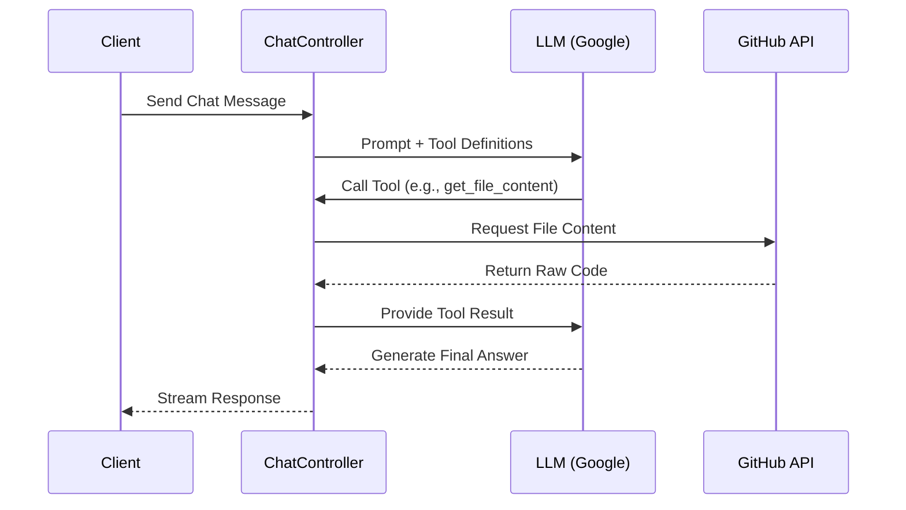

# AI & LLM Integration

The AI & LLM Integration module serves as the intelligence layer of GitDex. Its primary responsibility is to transform a static GitHub repository into an interactive, queryable knowledge base. Rather than relying on a static index, this module implements a dynamic "tool-use" (function calling) pattern, allowing the LLM to fetch real-time code and structure from GitHub to provide accurate, context-aware insights.

### Architectural Role

This module sits within the backend server, acting as the orchestrator between the client-side chat interface, the Google Generative AI models, and the GitHub API via Octokit. It ensures that the LLM is not merely hallucinating based on training data but is actively analyzing the specific state of the target repository.

#### Core Dependencies

| Dependency | Purpose |
| :--- | :--- |
| `@ai-sdk/google` | Integration with Google's Gemini models. |
| `ai` (Vercel AI SDK) | Stream management, tool orchestration, and prompt handling. |
| `@octokit/rest` | Direct interface with GitHub's REST API for data retrieval. |
| `zod` | Schema validation for LLM tool arguments. |

---

### Intelligence Workflow & Data Flow

The system employs a sophisticated loop where the LLM can request external data before finalizing its response. When a user asks a question about a repository, the server doesn't just send the prompt; it provides the LLM with a "toolbox" of capabilities to explore the codebase.



This "Agentic" approach allows GitDex to handle complex queries like *"How is authentication implemented in this project?"* by first listing files, then reading specific implementation files, and finally synthesizing the answer.

---

### Implementation Deep Dive

#### 1. Resilient Text Generation
To handle the inherent volatility of LLM APIs (rate limits, transient network errors), the system implements a wrapper around the generation logic.

```typescript
export async function generateWithRetry({
  systemPrompt,
  prompt,
  maxRetries = 3
}: GenerateOptions): Promise<string> {
  // Implementation logic for retrying generateText calls
}
```

The `generateWithRetry` function in `server/src/ai.ts` provides a safety net, ensuring that temporary API glitches do not result in failed requests for the end user.

#### 2. The Tool-Calling Mechanism
The core of the repository analysis lies in the `tools` definition within `chatController.ts`. Each tool is defined with a Zod schema, which tells the LLM exactly what arguments are required to execute the function.

```typescript
const tools = {
  get_file_content: tool({
    description: 'Get the content of a specific file in the repository',
    parameters: z.object({
      path: z.string().describe('The path to the file within the repository'),
    }),
    execute: async ({ path }) => {
      const { data } = await octokit.repos.getContent({ owner, repo, path });
      // logic to decode and return content
    },
  }),
  // ... other tools like search_code and list_files
};
```

By defining tools like `get_repo_structure`, `list_files`, `get_file_content`, and `search_code`, the server empowers the LLM to perform a "depth-first search" of the codebase.

#### 3. Streaming the Conversation
To ensure a responsive UI, the `handleChat` controller utilizes `streamText`. This allows the backend to push tokens to the frontend as they are generated, rather than waiting for the full response.

```typescript
const result = await streamText({
  model: google('gemini-1.5-pro'),
  system: systemPrompt,
  messages: convertToModelMessages(messages),
  tools,
});

result.pipeDataStreamToResponse(res);
```

The use of `convertToModelMessages` ensures that the conversation history is correctly formatted for the Google AI SDK, maintaining the context of previous questions and answers.

### Context Resolution
The module dynamically determines which repository to analyze by parsing the `referer` header or the request parameters. This ensures that the `Octokit` client is always targeting the correct `owner` and `repo` context for the specific chat session, preventing cross-repository data leakage.