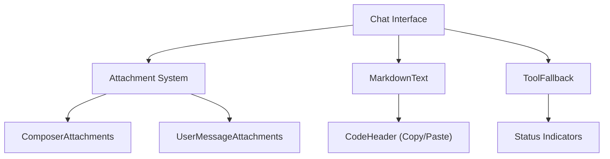

# Assistant UI Components

The GitDex chat interface is built using a modular component architecture leveraging `@assistant-ui/react`. This approach separates the business logic of the AI assistant from the visual representation, allowing for highly customized UI elements that maintain consistent state management.

## Attachment System

The attachment system provides a unified way to handle file uploads and image previews both in the message history and the input composer.

### Key Components

- **`AttachmentUI`**: The base wrapper for individual attachments. It handles type detection (Image, Document, File) and provides tooltip labels.
- **`AttachmentPreviewDialog`**: A dialog-based viewer that allows users to click an image attachment to see it in full screen.
- **`UserMessageAttachments`**: Specifically designed to render attachments within a sent message, aligned to the end of the message bubble.
- **`ComposerAttachments`**: A horizontal scrolling area in the input field that shows files staged for upload.
- **`ComposerAddAttachment`**: The trigger component used to initiate the file upload process.

### Implementation Details

The system uses a custom hook `useAttachmentSrc` to resolve file sources. It handles both local `File` objects (via `URL.createObjectURL`) and remote URLs provided by the assistant API, ensuring seamless previews regardless of the file's origin.

## Markdown Rendering

GitDex uses a customized Markdown engine to ensure that AI responses are legible, accessible, and functional.

### Features

- **GFM Support**: Integrated `remark-gfm` for support of GitHub Flavored Markdown (tables, checklists, strikethroughs).
- **Custom Typography**: Every HTML element (`h1` through `h6`, `p`, `blockquote`, `table`) is styled using Tailwind CSS to match the GitDex design system.
- **Enhanced Code Blocks**:
  - **`CodeHeader`**: Every code block includes a header displaying the language and a "Copy" button.
  - **Clipboard Integration**: A `useCopyToClipboard` hook manages the copy state, providing visual feedback (switching from a copy icon to a checkmark) for 3 seconds after a successful operation.

## Tool Execution UI

The `ToolFallback` component is used to visualize "Tool Calls"—instances where the AI agent invokes a function (e.g., `listFiles` or `readFile`) to gather information from the codebase.

### State Management

The component dynamically updates its UI based on the tool's execution status:

| Status | Visual Indicator | Behavior |
| :--- | :--- | :--- |
| **Running** | Spinning `Loader2Icon` | Displays "Running tool: [name]" |
| **Cancelled** | `XCircleIcon` + Strikethrough | Displays the reason for cancellation |
| **Success** | Green `CheckIcon` | Allows expanding to see arguments and result |

### Tool Content Breakdown

When a tool execution is complete and expanded, the UI reveals:
1. **Arguments**: The exact JSON or text parameters passed to the tool.
2. **Result**: The return value from the tool, formatted as a string or prettified JSON.