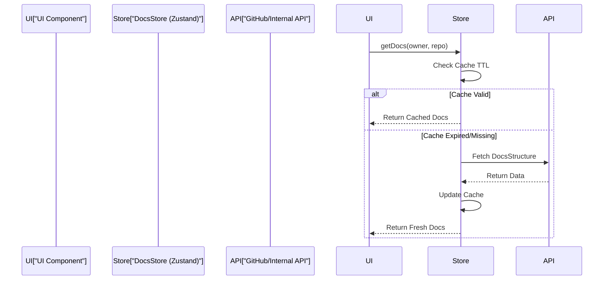

# Client State & Data Fetching

This module manages the synchronization between the GitDex frontend, the GitHub API, and the indexing server. It implements a client-side caching layer using Zustand to minimize redundant network requests and provides API routes to proxy repository search and indexing triggers.

## State Management Architecture

The client uses a centralized store to manage the structure of documentation for various repositories. To optimize performance and avoid hitting GitHub API rate limits, a Time-To-Live (TTL) caching strategy is implemented.

### Documentation Store

The `docs-store.ts` file defines the state and actions for managing documentation structures.

```typescript title="client/src/lib/docs-store.ts"
interface DocsCache {
  [key: string]: {
    data: DocsStructure;
    timestamp: number;
  };
}

interface DocsStore {
  cache: DocsCache;
  getDocs: (owner: string, repo: string) => Promise<DocsStructure>;
  clearCache: () => void;
  clearCacheFor: (owner: string, repo: string) => void;
}
```

| Field | Type | Description |
| :--- | :--- | :--- |
| `cache` | `DocsCache` | A map where keys are `owner/repo` and values contain the doc structure and a timestamp. |
| `getDocs` | `Function` | Retrieves documentation, checking the cache before fetching from the provider. |
| `clearCache` | `Function` | Wipes the entire local documentation cache. |
| `clearCacheFor` | `Function` | Removes the cache for a specific repository. |

### Caching Logic

The store implements a 10-minute cache window (`CACHE_TTL = 10 * 60 * 1000`). When `getDocs` is called, the store checks if the entry exists and if the current timestamp minus the cached timestamp is less than the TTL.

## Data Flow

The following diagram illustrates the request flow when a user accesses a repository's documentation.



## API Integration

GitDex utilizes Next.js Route Handlers to interface with GitHub and the indexing engine.

### Repository Search

The search API provides a filtered list of repositories. It fetches a broader set of results from GitHub and performs a secondary lightweight filter to improve partial-name matching.

```typescript title="client/src/app/api/search/route.ts"
export async function GET(req: Request) {
  // ... Octokit initialization ...
  const { data } = await octokit.search.repos({ q: query });
  
  // Lightweight filter for partial-name matches
  return NextResponse.json(
    data.items.filter(repo => 
      repo.full_name.toLowerCase().includes(query.toLowerCase())
    )
  );
}
```

This approach ensures that the user sees the most relevant results even if the GitHub Search API's ranking doesn't prioritize the exact partial string.

### Indexing Trigger

The index API acts as a bridge between the frontend and the background indexing engine. It allows users to manually trigger the ingestion of a repository.

```typescript title="client/src/app/api/index/route.ts"
export async function POST(request: Request) {
  const { owner, repo } = await request.json();
  
  // Logic to trigger the indexing pipeline for the specific repository
  // This interacts with the indexing server to start processing files
  return NextResponse.json({ success: true });
}
```

## Summary of API Endpoints

| Endpoint | Method | Purpose | Key Parameters |
| :--- | :--- | :--- | :--- |
| `/api/search` | `GET` | Discovers repositories via GitHub API. | `q` (query string) |
| `/api/index` | `POST` | Triggers the ingestion pipeline for a repo. | `owner`, `repo` |