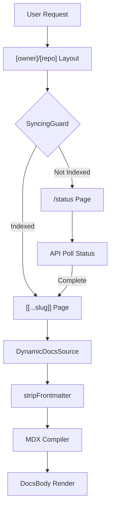

# Dynamic Repository Routing

The Dynamic Repository Routing module is the core of the GitDex frontend's ability to transform arbitrary GitHub repositories into interactive, AI-powered documentation sites. Utilizing the Next.js App Router's dynamic segment capabilities, this module implements a hierarchical routing structure—`/[owner]/[repo]/[[...slug]]`—that allows the application to resolve repository identities and specific document paths at runtime.

The primary purpose of this module is to decouple the documentation UI from a static file system. Instead of relying on pre-generated static pages, GitDex uses a `DynamicDocsSource` to fetch content from a backend index, processes it through a custom MDX compiler, and renders it within a specialized documentation layout. This architecture enables the "on-the-fly" indexing and documentation of any public repository without requiring a redeploy of the frontend.

### Core Module Components

| Component / File | Role | Primary Dependencies |
| :--- | :--- | :--- |
| `[owner]/[repo]/[[...slug]]/page.tsx` | Content resolver and MDX renderer | `fumadocs-ui`, `mdx-compiler`, `DynamicDocsSource` |
| `[owner]/[repo]/layout.tsx` | Persistent repo-level shell and AI context | `AssistantModal`, `lucide-react` |
| `[owner]/[repo]/status/page.tsx` | Indexing lifecycle orchestrator & polling UI | `next/navigation`, `lucide-react`, `@/components/ui` |
| `SyncingGuard` | Route protection middleware for unindexed repos | `next/navigation` |

---

## Architecture, State & Data Flow

The routing logic operates as a conditional pipeline. When a user navigates to a repository URL, the system must determine if the repository has been indexed and if the specific slug requested exists within that index.

### Request Processing Flow

1.  **Parameter Extraction**: Next.js extracts `owner`, `repo`, and the optional `slug` array from the URL.
2.  **Layout Initialization**: The `layout.tsx` wraps the request, initializing the `AssistantModal` which provides the global AI chat interface linked to the specific `owner/repo` context.
3.  **Guard Validation**: The `SyncingGuard` checks the current indexing status of the repository. If the repository is not yet indexed or is currently in a "syncing" state, the user is redirected to the `/status` page.
4.  **Content Fetching**: `DynamicDocsSource` fetches the raw MDX content associated with the `slug` from the backend API.
5.  **Content Sanitization**: The raw content is passed through `stripFrontmatter` to remove redundant YAML blocks generated by AI models.
6.  **MDX Compilation**: The sanitized string is compiled via `mdx-compiler` into a JSX-compatible format.
7.  **Rendering**: `DocsPage` and `DocsBody` from `fumadocs-ui` render the final documentation with the associated Table of Contents (TOC).

### Routing Workflow Diagram



---

## In-Depth Code Walkthrough & Implementation Details

### Content Sanitization and MDX Rendering

The `[[...slug]]/page.tsx` file handles the transformation of raw backend strings into rendered React components. A critical challenge in AI-generated documentation is the tendency of LLMs to include multiple or malformed frontmatter blocks (the `---` YAML sections), which crash the MDX parser.

```typescript title="client/src/app/[owner]/[repo]/[[...slug]]/page.tsx"
function stripFrontmatter(content: string): string {
  let stripped = content;
  while (stripped.startsWith('---')) {
    const endOfFrontmatter = stripped.indexOf('---', 3);
    if (endOfFrontmatter === -1) break;
    stripped = stripped.slice(endOfFrontmatter + 3).trimStart();
  }
  return stripped;
}
```

The `stripFrontmatter` function implements a `while` loop that aggressively removes all leading YAML blocks. It searches for the first occurrence of `---` starting at index 3 (to skip the current block) and slices the string forward. This ensures that even if the AI generates double frontmatter or empty blocks, the JSX parser only receives the actual MDX body. This prevents runtime crashes during the `compiler` phase.

### Indexing Lifecycle and Polling Logic

The `/status` page acts as a state machine that tracks the transition of a repository from "Unindexed" $\rightarrow$ "Indexing" $\rightarrow$ "Ready".

```typescript title="client/src/app/[owner]/[repo]/status/page.tsx"
const initPoll = async () => {
  const res = await fetch(`/api/proxy/status?owner=${owner}&repo=${repo}`);
  const data = await res.json();
  
  if (data.status === 'completed') {
    setStatus('completed');
    return true; // Stop polling
  } else if (data.status === 'failed') {
    setStatus('error');
    return true; // Stop polling
  }
  
  setStatus('syncing');
  return false; // Continue polling
};

useEffect(() => {
  const poll = setInterval(async () => {
    const shouldStop = await initPoll();
    if (shouldStop) clearInterval(poll);
  }, 3000);
  return () => clearInterval(poll);
}, [owner, repo]);
```

The polling mechanism uses a `setInterval` wrapped in a `useEffect`. Every 3 seconds, `initPoll` queries the proxy API. The function returns a boolean `shouldStop` based on the terminal states of the job (`completed` or `failed`). If the state is `syncing`, the interval continues, updating the `Progress` component and the `Loader2` spinner in the UI to provide visual feedback to the user.

### Dynamic Source Integration

GitDex integrates `fumadocs` by overriding the standard static source with a `DynamicDocsSource`.

```typescript title="client/src/app/[owner]/[repo]/[[...slug]]/page.tsx"
export default async function Page({ params }: PageProps) {
  const { owner, repo, slug = [] } = await params;
  const source = new DynamicDocsSource(owner, repo);
  const page = await source.getPage(slug);

  if (!page) {
    redirect(`/${owner}/${repo}/status`);
  }

  const compiledContent = compiler(stripFrontmatter(page.content));

  return (
    <DocsPage toc={getTableOfContents(page)}>
      <SyncingGuard owner={owner} repo={repo}>
        <DocsBody content={compiledContent} />
      </SyncingGuard>
    </DocsPage>
  );
}
```

In this implementation, `DynamicDocsSource` acts as the bridge to the backend. It takes the `owner` and `repo` parameters to scope the request. If `source.getPage(slug)` returns null, the system assumes the page is missing or the repository isn't fully indexed, triggering a redirect to the status page. The `SyncingGuard` is then used as a secondary wrapper to handle race conditions where the page might exist but the overall repository status is still "syncing".

---

## API / Method Reference

### `stripFrontmatter(content: string): string`
*   **Description**: Removes all leading YAML frontmatter blocks from a string.
*   **Input**: `content` - The raw MDX string fetched from the database.
*   **Return**: A sanitized string containing only the MDX body.
*   **Invariant**: Will continue stripping as long as the string starts with `---`.

### `initPoll(): Promise<boolean>`
*   **Description**: Checks the indexing status of the current repository.
*   **Return**: `true` if polling should terminate (success/error), `false` if it should continue.
*   **Side Effects**: Updates the local `status` state (`'syncing' | 'completed' | 'error'`).

### `indexRepo(): Promise<void>`
*   **Description**: Triggers the backend indexing pipeline for a specific repository.
*   **Execution**: Sends a POST request to the proxy layer, which forwards it to the Node.js backend core engine.
*   **Trigger**: Invoked by the "Index Repository" button on the `/status` page.

### `DynamicDocsSource.getPage(slug: string[])`
*   **Description**: Resolves a slug array into a document object.
*   **Input**: `slug` - An array of path segments (e.g., `['api', 'auth']` for `/api/auth`).
*   **Return**: `Promise<{ content: string, ... } | null>`.

---

## Error Handling, Edge Cases & Performance

### MDX Parser Recovery
The most volatile part of the pipeline is the MDX compilation. Since the content is AI-generated, it is prone to syntax errors. GitDex handles this by:
1.  **Frontmatter Stripping**: Preventing YAML-related parser crashes.
2.  **Custom Compiler**: The `compiler` function (from `@/lib/mdx-compiler`) is designed to wrap the rendering in an error boundary or provide fallback text if the MDX is completely malformed.

### Polling Optimization
To prevent overwhelming the backend API with requests, the `/status` page implements a fixed 3-second polling interval. This is a trade-off between perceived responsiveness and server load. The use of `clearInterval` in the `useEffect` cleanup phase ensures that no memory leaks occur when the user navigates away from the status page.

### Route Guarding and Redirect Loops
The `SyncingGuard` and the `redirect` logic in `page.tsx` create a potential redirect loop if not handled correctly. The logic is strictly unidirectional:
`Dynamic Page` $\rightarrow$ `SyncingGuard (Failure)` $\rightarrow$ `/status Page` $\rightarrow$ `Polling (Success)` $\rightarrow$ `Dynamic Page`.
The loop is broken once the backend returns a `completed` status for the specific `owner/repo` pair.

### Path Resolution (The `[[...slug]]` Case)
By using an optional catch-all segment `[[...slug]]`, GitDex handles both the repository root (where `slug` is `undefined` or an empty array) and deeply nested documentation paths. The `DynamicDocsSource` is programmed to treat an empty slug as a request for the `index.mdx` or the root documentation page of the repository.