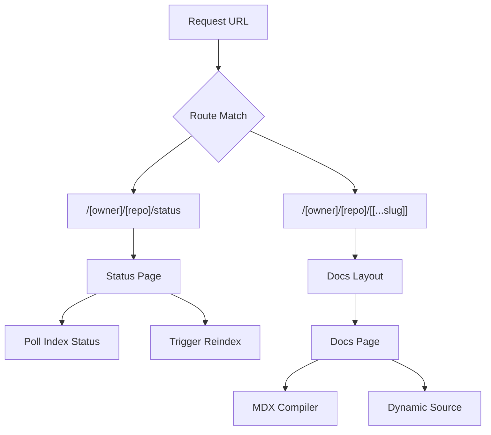

# Dynamic Routing Structure

GitDex employs a dynamic routing architecture built on Next.js App Router to provide a multi-tenant experience, allowing the application to serve documentation and status pages for any arbitrary GitHub repository based on the URL structure.

## Routing Hierarchy

The application uses a nested dynamic segment pattern to isolate repository-specific data and views. The primary routing pattern is `/[owner]/[repo]`, which captures the GitHub owner and repository name as parameters available to all child layouts and pages.

### URL Segment Breakdown

| Segment | Type | Parameter | Description |
| :--- | :--- | :--- | :--- |
| `[owner]` | Dynamic | `owner` | The GitHub username or organization name. |
| `[repo]` | Dynamic | `repo` | The specific repository name to be analyzed. |
| `[[...slug]]` | Catch-all | `slug` | An optional array of path segments used to navigate specific documentation files. |
| `/status` | Static | N/A | A dedicated route for monitoring and triggering repository indexing. |

### Routing Flow Diagram



## Implementation Details

### Repository Context Layout
The `layout.tsx` file serves as the wrapper for all repository-specific views. It extracts the `owner` and `repo` parameters to configure the `DocsLayout` and provide external links back to the source GitHub repository.

```typescript
interface LayoutProps {
  children: ReactNode;
  params: Promise<{
    owner: string;
    repo: string;
  }>;
};
```

The layout integrates the `ReindexButton` and `DynamicDocsSource`, ensuring that the documentation context is maintained regardless of which sub-page (`slug` or `status`) the user is visiting.

### Dynamic Documentation Pages
The `[[...slug]]/page.tsx` handles the rendering of AI-generated or processed documentation. It uses a catch-all segment (`[[...slug]]`) to support deeply nested documentation structures.

**Key Processing Steps:**
1. **Parameter Extraction**: Captures `owner`, `repo`, and the optional `slug` array.
2. **Content Resolution**: Utilizes `DynamicDocsSource` to fetch content based on the current route.
3. **Compilation**: Processes raw content through a custom `compiler` and `stripFrontmatter` function.
4. **Guard Integration**: Wraps the view in a `SyncingGuard` to manage the user experience during repository synchronization.

### Repository Status Route
The `/status/page.tsx` provides a specialized view for managing the backend indexing process for a specific repository. Unlike the documentation pages, this route focuses on stateful interaction.

**Core Functionalities:**
- **Status Polling**: The `initPoll` function asynchronously checks the current state of the repository index.
- **Manual Indexing**: The `indexRepo` function allows users to manually trigger a re-index of the codebase.
- **Visual Feedback**: Utilizes a `Progress` bar and `Loader2` icons to indicate the status of the backend pipeline.

## Data Flow Sequence

The following sequence illustrates how the application resolves a request for a specific documentation page.

```mermaid
sequenceDiagram
    autonumber
    participant U as User/Browser
    participant L as Layout ([owner]/[repo])
    participant P as Page ([[...slug]])
    participant DS as DynamicDocsSource
    participant C as MDX Compiler

    U ->> L: Access /owner/repo/docs/page
    activate L
    L ->> L: Resolve owner & repo params
    L ->> P: Render children
    deactivate L
    activate P
    P ->> DS: Fetch content for slug
    DS -->> P: Return raw MDX content
    P ->> C: Process content & strip frontmatter
    C -->> P: Return compiled components
    P ->> U: Display rendered DocsBody
    deactivate P