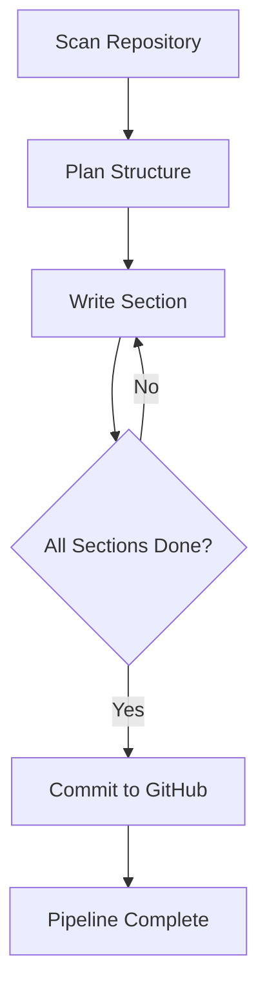
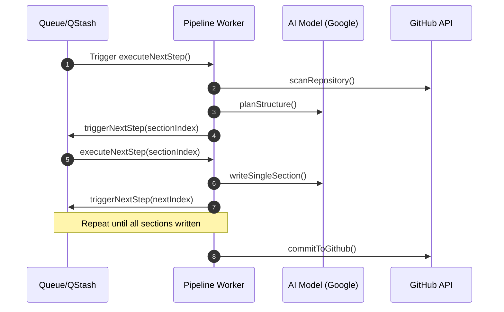

# Indexing Pipeline

The Indexing Pipeline is the core engine of GitDex, responsible for transforming a raw GitHub repository into a structured, AI-analyzed knowledge base. It orchestrates the process of codebase scanning, architectural planning, iterative content generation, and final deployment of documentation back to the source repository.

## Pipeline Workflow

The indexing process is an asynchronous, multi-stage pipeline managed by a job queue. It ensures that large repositories are processed without timing out by breaking the analysis into discrete, trackable steps.



## Pipeline Stages

### 1. Repository Scanning (`scanRepository`)
The pipeline begins by using `Octokit` to traverse the target repository. It identifies relevant source files and retrieves their contents to build a local representation of the codebase.

### 2. Structure Planning (`planStructure`)
Using the gathered file list, the pipeline invokes the AI model to generate a Table of Contents (TOC). This stage defines the "blueprint" for the documentation, determining which files are relevant to specific architectural sections.

### 3. Iterative Section Writing (`writeSingleSection`)
To avoid LLM context window limits and maintain high quality, the pipeline writes documentation one section at a time. 
- It references the `TocEntry` for the current index.
- It provides the AI with the specific `relevant_files` listed in the plan.
- It tracks progress via the `sectionsWritten` counter in the pipeline state.

### 4. GitHub Integration (`commitToGithub`)
Once all planned sections are generated, the pipeline aggregates the content and uses the GitHub API to commit the generated documentation files directly back to the repository.

## Data Models

The pipeline relies on two primary data structures to maintain state across asynchronous job executions.

### Pipeline State (`PipelineData`)
This object tracks the overall progress of a specific indexing job.

| Field | Type | Description |
| :--- | :--- | :--- |
| `files` | `Array<{path, content}>` | Raw source code extracted from the repo |
| `toc` | `TocEntry[]` | The AI-generated architectural plan |
| `generatedFiles` | `Array<{filename, content}>` | The resulting documentation fragments |
| `sectionsWritten` | `number` | Index of the last completed section |
| `defaultBranch` | `string` (optional) | The target branch for commits |

### Table of Contents Entry (`TocEntry`)
Defines the requirements for a single documentation page.

| Field | Type | Description |
| :--- | :--- | :--- |
| `prefix` | `string` | The hierarchy prefix (e.g., "1.1") |
| `title` | `string` | The heading of the section |
| `filename` | `string` | The target filename for the output |
| `description` | `string` | Summary of what the AI should analyze |
| `relevant_files` | `string[]` | List of source files needed for this section |

## AI Integration and Reliability

GitDex uses the Google AI SDK via a wrapper that implements a retry mechanism to handle transient API failures and rate limits.

```typescript
export async function generateWithRetry({
  systemPrompt,
  prompt,
  maxRetries = 3
}: GenerateOptions): Promise<string> {
  // Logic to execute generateText with exponential backoff/retries
}
```

### Orchestration Sequence
The pipeline utilizes a combination of Redis for state, a job queue for execution, and Upstash QStash for triggering subsequent steps.



## Invariants & Failure Modes

### Token Management
To prevent "context overflow" errors, the pipeline uses `js-tiktoken` to calculate the number of tokens in the source files before sending them to the AI. This ensures that prompts remain within the model's limits.

### Rate Limiting & Retries
- **AI API**: Handled by `generateWithRetry`, which attempts to recover from `5xx` or `429` errors up to 3 times.
- **GitHub API**: The use of `Octokit` provides the foundation for handling GitHub's REST API rate limits during the scanning and commit phases.

### State Consistency
The pipeline is designed to be stateless between steps. By storing `PipelineData` in the job queue/database and using `executeNextStep`, the system can recover from a worker crash by resuming from the last `sectionsWritten` index.

### Potential Edge Cases
- **Large Repositories**: If a repository contains an excessive number of files, the `scanRepository` phase may hit memory limits or API timeouts.
- **Circular Dependencies**: The `planStructure` phase relies on the AI's ability to correctly map files to sections; incorrect mappings may result in incomplete documentation for specific modules.