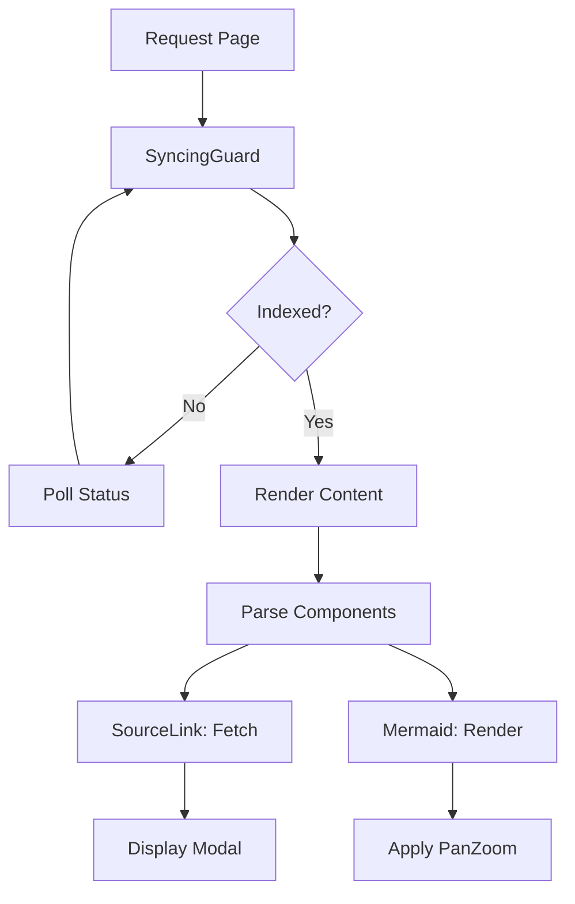

# Interactive Documentation Interface

## System Role & Architectural Position

The Interactive Documentation Interface serves as the final presentation layer of the AI Experience Layer. Its primary responsibility is to transform structured LLM outputs and repository metadata into a rich, interactive documentation experience. This interface abstracts the complexity of rendering dynamic diagrams, linking to remote source code, and managing the synchronization state between the backend indexing engine and the frontend view.

The interface operates as a set of higher-order components and utility primitives that wrap the raw documentation content, ensuring that the user experience remains consistent regardless of the underlying repository's size or complexity.

### Component Specification Matrix

| Component | Responsibility | Primary Dependency | State Management |
| :--- | :--- | :--- | :--- |
| `SyncingGuard` | Indexing state validation & polling | `useDocsStore` | Local polling state + Global store |
| `Mermaid` | Dynamic SVG diagram rendering | `mermaid`, `panzoom` | Promise-based render cache |
| `SourceLink` | Remote code retrieval & display | GitHub Raw API | Local fetch/loading state |
| `DocsSkeleton` | Perceived performance optimization | Tailwind CSS | Stateless (Pure UI) |

## Core Execution & Data Flow Mechanics

The documentation rendering pipeline follows a strict sequence to prevent "flash of unindexed content" (FOUNC) and to handle the asynchronous nature of Mermaid diagram generation.

### Documentation Lifecycle Flow



### Execution Sequence

1.  **State Verification**: `SyncingGuard` intercepts the render path. It queries the `useDocsStore` for the current indexing status of the `owner/repo` pair.
2.  **Polling Loop**: If the status is not "indexed", a `setInterval` is established to poll the backend every 3000ms. Upon a successful status change, the guard releases the content for rendering.
3.  **Component Hydration**:
    *   **Mermaid**: The `Mermaid` component implements a `cachePromise` to prevent redundant re-renders of the same chart string. It cleans the Mermaid syntax, generates an SVG, and injects it into the DOM.
    *   **SourceLink**: When triggered, `SourceLink` executes an asynchronous request to the GitHub Raw API using the provided `owner`, `repo`, `filePath`, and `lines` parameters.
4.  **Interactivity Layer**: For Mermaid diagrams, the `panzoom` library is dynamically imported and attached to the SVG element, enabling Ctrl/Cmd+Scroll zooming and click-and-drag panning.

## Implementation Deep Dive

### Dynamic Diagram Rendering Logic

The `Mermaid` component implements a robust pipeline to handle potentially malformed LLM-generated Mermaid syntax and provides high-performance zooming.

```typescript title="client/src/components/mermaid.tsx"
function cachePromise<T>(
  key: string,
  setPromise: () => Promise<T>,
): Promise<T> {
  if (!globalThis.mermaidCache) {
    globalThis.mermaidCache = new Map();
  }
  const cache = globalThis.mermaidCache as Map<string, Promise<T>>;
  if (!cache.has(key)) {
    cache.set(key, setPromise());
  }
  return cache.get(key)!;
}

async function renderMermaid(chart: string) {
  const { default: mermaid } = await import('mermaid');
  mermaid.initialize({ startOnLoad: false, theme: 'dark' });
  const { svg } = await mermaid.render('mermaid-svg-' + Math.random().toString(36).substr(2, 9), chart);
  return svg;
}
```

**Technical Mechanics:**
- **`cachePromise`**: Implements a global singleton cache using a `Map` to store promises. This ensures that if multiple components request the same diagram, only one render cycle is initiated.
- **Dynamic Import**: `mermaid` is imported dynamically to reduce the initial bundle size, as diagrams are not present on every page.
- **Syntax Sanitization**: The `fixMermaidSyntax` and `cleanContent` helpers strip surrounding markdown fences and wrap excessively long labels to prevent SVG overflow.

### Source Code Integration

`SourceLink` provides a bridge between the documentation and the actual repository source, treating the GitHub API as a remote file system.

```typescript title="client/src/components/SourceLink.tsx"
export function SourceLink({ owner, repo, defaultBranch, filePath, lines }) {
  const [content, setContent] = useState<string | null>(null);
  const [loading, setLoading] = useState(false);

  const fetchContent = async () => {
    setLoading(true);
    try {
      const response = await fetch(
        `https://raw.githubusercontent.com/${owner}/${repo}/${defaultBranch}/${filePath}`
      );
      const text = await response.text();
      // Logic to slice text based on 'lines' parameter (e.g., "10-20")
      setContent(processLines(text, lines));
    } catch (e) {
      console.error("Failed to fetch source", e);
    } finally {
      setLoading(false);
    }
  };
}
```

**Technical Mechanics:**
- **Raw Fetch**: Utilizes `raw.githubusercontent.com` to bypass the overhead of the GitHub REST API for file content retrieval.
- **Line Slicing**: The `lines` prop (formatted as `start-end`) is used to slice the retrieved string, providing a focused view of the relevant code segment.
- **Dialog Encapsulation**: The content is rendered within a `Dialog` component to maintain context without navigating away from the documentation.

## Method & State Reference

### Component Parameter Contracts

#### `Mermaid` Props
| Parameter | Type | Default | Description |
| :--- | :--- | :--- | :--- |
| `chart` | `string` | Required | The Mermaid.js syntax string to render. |
| `border` | `boolean` | `true` | Whether to wrap the SVG in a styled border. |
| `margin` | `boolean` | `true` | Adds whitespace padding around the diagram. |

#### `SourceLink` Props
| Parameter | Type | Description |
| :--- | :--- | :--- |
| `owner` | `string` | GitHub organization or username. |
| `repo` | `string` | Repository name. |
| `defaultBranch` | `string` | Branch name (e.g., `main` or `master`). |
| `filePath` | `string` | Full path to the file within the repository. |
| `lines` | `string` | Range of lines to highlight (e.g., `"12-45"`). |

### Error Recovery & Failure Modes

| Failure Scenario | Detection Mechanism | Recovery Strategy |
| :--- | :--- | :--- |
| **Invalid Mermaid Syntax** | `mermaid.render` throws exception | The component catches the error and renders the raw chart text in a code block. |
| **GitHub API Rate Limit** | HTTP 403 Response | `SourceLink` displays an "External Link" button to redirect user to GitHub UI. |
| **Indexing Race Condition** | `SyncingGuard` sees "indexed" but data is missing | `SyncingGuard` triggers a cache clear and page reload via `window.location.reload()`. |
| **PanZoom Initialization Failure** | SVG element not found in DOM | Wrapped in `useEffect` with null-check on the SVG ref; fails silently without crashing. |