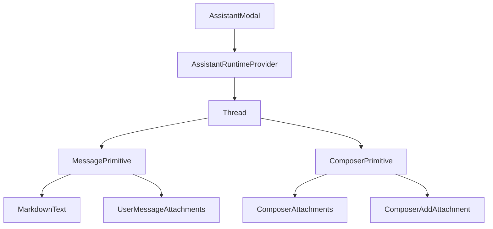
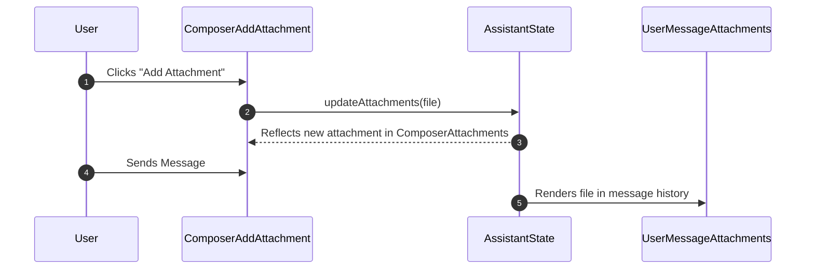

# Assistant UI Components

The Assistant UI is a modular chat interface built on top of the `@assistant-ui` framework, designed to provide an interactive AI experience for repository analysis. It leverages a primitive-based architecture to separate the logic of the chat runtime from the visual representation of messages, composers, and attachments.

## Architecture Overview

The UI is structured as a nested hierarchy where the `AssistantModal` serves as the primary container, providing the runtime context and layout constraints for the chat `Thread`.



## Assistant Modal & Layout

The `AssistantModal` acts as the entry point for the AI interface. It initializes the chat runtime and provides a resizable side-panel experience.

### Runtime Integration
The modal uses the `@assistant-ui/react-ai-sdk` to bridge the frontend with the AI backend:
- **`AssistantRuntimeProvider`**: Wraps the interface to provide the necessary state and API context.
- **`useChatRuntime`**: Hooks into the chat state to manage the conversation flow.
- **`AssistantChatTransport`**: Handles the actual communication between the client and the LLM.

### Dynamic Resizing
The modal implements a custom resizing mechanism to allow users to adjust the chat width. It tracks mouse events to calculate the new dimensions of the panel:

| Function | Purpose |
| :--- | :--- |
| `startResizing` | Initiates the resize sequence on `mousedown`. |
| `handleMouseMove` | Updates the width state based on cursor movement. |
| `handleMouseUp` | Terminates the resizing operation. |

## Chat Thread Implementation

The `Thread` component is the central orchestrator of the conversation. It utilizes several primitives from `@assistant-ui/react` to handle complex chat behaviors like branching and error states.

### Core Thread Components
- **`ThreadPrimitive`**: The base container for the message history.
- **`MessagePrimitive`**: Individual message bubbles that distinguish between user and assistant roles.
- **`ComposerPrimitive`**: The input area where users type queries and attach files.
- **`BranchPickerPrimitive`**: Allows users to navigate between different conversation paths.
- **`ActionBarPrimitive`**: Provides contextual actions (e.g., editing, deleting, or refreshing messages).

### User Experience Enhancements
The thread includes several helper components to improve usability:
- **`ThreadWelcome`**: Displays the initial greeting and introduction.
- **`ThreadSuggestions`**: Provides quick-start prompt chips to guide the user.
- **`ThreadScrollToBottom`**: Automatically ensures the latest messages are visible.

## Markdown & Content Rendering

The `MarkdownText` component provides high-fidelity rendering of AI responses, supporting technical documentation and mathematical notation.

### Rendering Pipeline
The component uses a combination of `remark` and `rehype` plugins to process markdown:

| Plugin | Purpose |
| :--- | :--- |
| `remark-gfm` | GitHub Flavored Markdown (tables, checklists, etc.) |
| `remark-math` | Parses mathematical expressions. |
| `rehype-katex` | Renders LaTeX math into HTML. |

### Specialized Rendering Features
- **Code Blocks**: Implements custom code headers with a copy-to-clipboard feature using `onCopy`.
- **Mermaid Diagrams**: Integrates a `Mermaid` component to render architectural diagrams directly from markdown code blocks.
- **Performance**: Uses `unstable_memoizeMarkdownComponents` to prevent unnecessary re-renders of complex markdown structures.

```tsx
// Simplified representation of the rendering logic
const MarkdownText = () => {
  return (
    <MarkdownTextPrimitive 
      components={memoizeMarkdownComponents({
        // Custom rendering for code, tables, etc.
      })}
    />
  );
};
```

## Attachment Handling

The assistant supports file attachments, allowing users to provide context to the AI. This is managed via a combination of specialized primitives and local state hooks.

### Attachment Lifecycle
The system manages files through a dedicated set of components that handle the transition from "pending upload" to "sent message."



### Component Breakdown

| Component | Role |
| :--- | :--- |
| `ComposerAddAttachment` | Trigger for opening the file picker. |
| `ComposerAttachments` | Displays a list of files staged for upload. |
| `UserMessageAttachments` | Renders attached files within a sent message. |
| `AttachmentPreview` | Provides a visual thumbnail or preview of the file. |
| `AttachmentPreviewDialog` | Opens a full-screen view of the attached document/image. |

### State Management
Attachments are managed using `useAssistantState` and `useAssistantApi`, ensuring that the files are synchronized between the input composer and the final message object sent to the AI. The `useFileSrc` and `useAttachmentSrc` hooks are used to generate valid URLs for file previews.