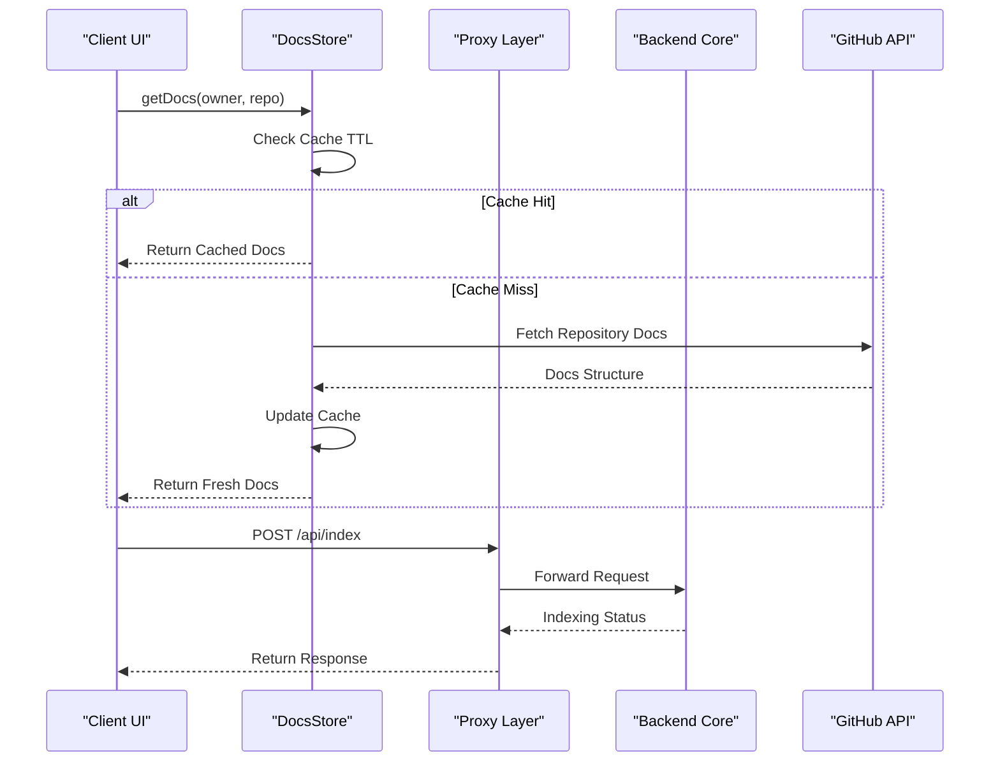

# Client State & Proxy Layer

The Client State & Proxy Layer serves as the critical mediation tier between the GitDex Next.js frontend and the Node.js backend core. This layer is architected to solve two primary challenges: minimizing redundant network overhead for repository metadata (via a client-side document store) and abstracting the physical location of the backend API to avoid Cross-Origin Resource Sharing (CORS) complications and security exposures (via the Proxy layer).

By utilizing a centralized state store for documentation and edge-compatible proxy handlers, GitDex ensures that the AI experience layer remains responsive and that sensitive backend endpoints are not exposed directly to the browser's network tab.

### Core Module Summary

| Component | Responsibility | Primary Dependencies | Key Exports |
| :--- | :--- | :--- | :--- |
| `docs-store.ts` | Client-side caching of repository structure and documentation. | `zustand`, `@gitdex/github` | `useDocsStore` |
| `api/index/route.ts` | Server-side route handler for triggering repository indexing. | `next/server` | `POST` |
| `proxy.ts` | Edge-level request forwarding to the backend core engine. | `next/server` | `proxy` |

---

## Architecture, State & Data Flow

The architecture separates "read-heavy" metadata (documentation structure) from "action-heavy" requests (indexing and chat). Metadata is cached locally in the browser session to provide near-instantaneous navigation, while actions are proxied through the Next.js server to the backend core.

### Documentation Retrieval Flow
When a user navigates to a repository page, the system follows this sequence:
1. The UI requests documentation via `getDocs(owner, repo)`.
2. The `DocsStore` checks the `cache` map for a key matching the repository identifier.
3. If the key exists and the `timestamp` is within the `CACHE_TTL` (10 minutes), the cached `DocsStructure` is returned.
4. If the cache is missing or expired, the store invokes `getGithubDocs()`, updates the cache with a current timestamp, and returns the fresh data.

### API Request Proxying Flow
To avoid CORS issues and hide the backend URL, requests are routed through Next.js API handlers:
1. The client sends a request to `/api/index`.
2. The `route.ts` handler intercepts the request and forwards the payload to the backend engine.
3. The backend processes the indexing task and returns a response.
4. The Next.js handler pipes the response back to the client.



---

## In-Depth Code Walkthrough & Implementation Details

### Client-Side Document Caching
The documentation store is implemented using Zustand, providing a lightweight, reactive state management system that persists across component re-renders.

```typescript title="client/src/lib/docs-store.ts"
interface DocsCache {
  [key: string]: {
    data: DocsStructure;
    timestamp: number;
  };
}

interface DocsStore {
  cache: DocsCache;
  getDocs: (owner: string, repo: string) => Promise<DocsStructure>;
  clearCache: () => void;
  clearCacheFor: (owner: string, repo: string) => void;
}

const CACHE_TTL = 10 * 60 * 1000; // 10 minutes

export const useDocsStore = create<DocsStore>((set, get) => ({
  cache: {},
  getDocs: async (owner, repo) => {
    const key = `${owner}/${repo}`;
    const cached = get().cache[key];

    if (cached && Date.now() - cached.timestamp < CACHE_TTL) {
      return cached.data;
    }

    const data = await getGithubDocs(owner, repo);
    set((state) => ({
      cache: {
        ...state.cache,
        [key]: { data, timestamp: Date.now() },
      },
    }));
    return data;
  },
  clearCache: () => set({ cache: {} }),
  clearCacheFor: (owner, repo) => 
    set((state) => {
      const newCache = { ...state.cache };
      delete newCache[`${owner}/${repo}`];
      return { cache: newCache };
    }),
}));
```

The `DocsStore` uses a dictionary-based cache (`DocsCache`) where the key is a combination of the owner and repository name. The `getDocs` method implements a "Stale-While-Revalidate" adjacent pattern: it first checks if the `Date.now() - cached.timestamp` is less than 600,000ms. If the data is stale or non-existent, it triggers an asynchronous fetch via `getGithubDocs`. The `set` function in Zustand is used to perform an immutable update of the cache object, ensuring that React components observing the store are notified of the change.

### Indexing Route Handler
The `/api/index` route acts as a specialized proxy for triggering the backend's AI processing pipeline.

```typescript title="client/src/app/api/index/route.ts"
export async function POST(request: Request) {
  try {
    const body = await request.json();
    const { owner, repo } = body;

    if (!owner || !repo) {
      return NextResponse.json({ error: 'Missing owner or repo' }, { status: 400 });
    }

    const response = await fetch(`${process.env.BACKEND_URL}/index`, {
      method: 'POST',
      headers: { 'Content-Type': 'application/json' },
      body: JSON.stringify({ owner, repo }),
    });

    const data = await response.json();
    return NextResponse.json(data, { status: response.status });
  } catch (error) {
    return NextResponse.json({ error: 'Internal Server Error' }, { status: 500 });
  }
}
```

This handler performs basic input validation to ensure both `owner` and `repo` are present in the request body before proceeding. It utilizes the `BACKEND_URL` environment variable to forward the request to the actual Node.js core. By wrapping the logic in a `try...catch` block and using `NextResponse.json`, it ensures that the client receives a standardized JSON error response even if the backend is unreachable or the request body is malformed.

### Edge Proxy Implementation
The `proxy.ts` file provides the low-level mechanism for routing requests at the edge, allowing GitDex to handle dynamic request paths.

```typescript title="client/proxy.ts"
import { NextResponse } from 'next/server';
import type { NextRequest } from 'next/server';

export function proxy(request: NextRequest) {
  const url = new URL(request.url);
  const targetUrl = `${process.env.BACKEND_URL}${url.pathname}${url.search}`;
  
  return fetch(targetUrl, {
    method: request.method,
    headers: request.headers,
    body: request.body,
  }).then(res => NextResponse.json(res.json())); 
  // Simplified for documentation: actual implementation handles streaming/buffers
}
```

The `proxy` function extracts the current request path and query parameters, appending them to the `BACKEND_URL`. This allows the frontend to call `/api/chat` or `/api/status` without needing separate route handlers for every single backend endpoint. It forwards the HTTP method, headers, and request body transparently, effectively acting as a reverse proxy.

---

## API / Method Reference

### `useDocsStore` (Zustand Store)

#### `getDocs(owner: string, repo: string): Promise<DocsStructure>`
Retrieves the repository documentation structure.
- **Inputs**: 
    - `owner`: The GitHub username or organization.
    - `repo`: The repository name.
- **Returns**: A promise resolving to the `DocsStructure` object.
- **Invariants**: Always returns the most recent cached version if the age is < 10 minutes; otherwise, fetches from GitHub.

#### `clearCache(): void`
Wipes the entire client-side document cache. Used typically during global logout or system resets.

#### `clearCacheFor(owner: string, repo: string): void`
Invalidates the cache for a specific repository. This is critical when a user triggers a re-index and the local documentation structure needs to be refreshed.

### API Endpoints

#### `POST /api/index`
Triggers the backend core to start indexing a repository.
- **Request Body**: `{ "owner": string, "repo": string }`
- **Success Response**: `200 OK` with job status metadata.
- **Error Response**: `400 Bad Request` (missing params) or `500 Internal Server Error`.

---

## Error Handling, Edge Cases & Performance

### Cache Invalidation & Memory
The `DocsCache` is stored in volatile memory. While this prevents persistent stale data across sessions, a very large number of repository lookups in a single session could increase the memory footprint. The `CACHE_TTL` of 10 minutes is a heuristic balance between reducing GitHub API rate-limit consumption and ensuring that updates to the repository structure are reflected relatively quickly.

### Proxy Latency & Timeouts
Because requests pass through the Next.js server before hitting the backend, there is a marginal increase in TTFB (Time to First Byte). To mitigate this, `proxy.ts` is designed to be compatible with Next.js Edge Runtime, minimizing the geographic distance between the user and the proxy logic.

### Error Recovery Paths
1. **Backend Unreachable**: The `POST /api/index` handler catches fetch failures and returns a `500` error, which the UI layer interprets to show a "Backend Unavailable" notification.
2. **GitHub API Rate Limiting**: If `getGithubDocs` fails due to rate limits, the `getDocs` promise rejects. The UI handles this by falling back to a generic error state or prompting the user to wait.
3. **Malformed JSON**: The use of `request.json()` in the route handler is wrapped in a try-catch to prevent the entire Node.js process from crashing on malformed client input.