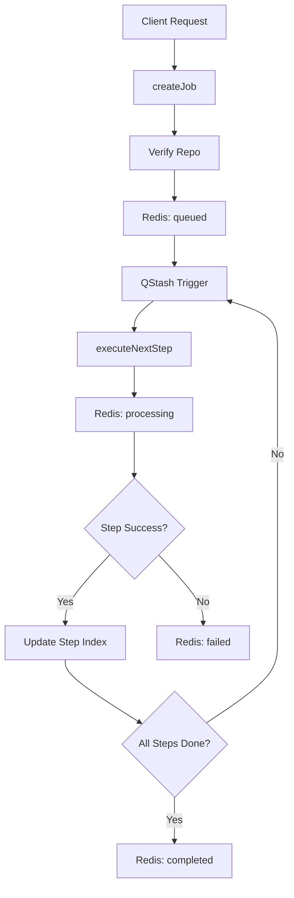

# Job Queue & Processing

Indexing a software repository is a resource-intensive, multi-step process that involves cloning, parsing, and embedding code. Because these operations exceed the timeout limits of standard HTTP requests, GitDex implements an asynchronous job queue. This module decouples the request to index a repository from the actual execution of the indexing pipeline, ensuring system stability and providing users with real-time progress tracking.

### Architectural Role

The Job Queue acts as the orchestration layer between the API controllers and the indexing pipeline. It leverages **Upstash Redis** for persistent state management and **Upstash QStash** for reliable message triggering.

| Component | Responsibility | Technology |
| :--- | :--- | :--- |
| **State Store** | Tracks job metadata, current step, and failure states. | Redis |
| **Scheduler** | Triggers asynchronous execution of pipeline steps. | QStash |
| **Lock Manager** | Prevents concurrent indexing of the same repository. | Redis (Locks) |
| **Healer** | Identifies and restarts "stuck" or timed-out jobs. | Cron/Webhooks |

### Workflow & State Transition

The system treats indexing as a state machine. A job moves through a predefined lifecycle, where each transition is recorded in Redis to allow the frontend to poll for status updates.



### Core Implementation

#### 1. Job State Definition
The system defines a strict `JobData` interface to ensure consistency across the queue and the API.

```typescript
export type JobState = 'queued' | 'processing' | 'completed' | 'failed';

export interface JobData {
    id: string;
    state: JobState;
    repoUrl: string;
    owner: string;
    repo: string;
    createdAt: number;
    updatedAt: number;
    error?: string | null;
    currentStep: number;
    data?: string | null;
}
```
This structure allows the system to track exactly where a repository is in the pipeline (`currentStep`) and whether it encountered a specific error, which is then exposed via the `getJobStatus` endpoint.

#### 2. Queue Management (`SimpleQueue`)
The `SimpleQueue` class abstracts the Redis interactions. A critical feature of this implementation is the prevention of duplicate active jobs for the same repository.

```typescript
async addJob(repoUrl: string, force = false): Promise<string> {
    const { owner, repo } = parseOwnerRepo(repoUrl);
    const jobId = this.getJobId(owner, repo);
    
    const existingJob = await this.getJob(jobId);
    if (!force && existingJob && existingJob.state !== 'failed') {
        return jobId; // Return existing job if already queued/processing
    }
    
    // Initialize new job data and save to Redis
    // ...
}
```

#### 3. Distributed Locking
To prevent race conditions where multiple workers might attempt to index the same repository simultaneously, GitDex implements a step-level locking mechanism.

```typescript
async acquireStepLock(jobId: string, sectionIndex?: number): Promise<boolean> {
    const lockKey = this.getLockKey(jobId, sectionIndex);
    const acquired = await redis.set(lockKey, "locked", { nx: true, ex: 300 });
    return acquired === "OK";
}
```
By using the `nx: true` (set-if-not-exists) option in Redis, the system ensures that only one execution context can process a specific job step at a time.

### API Integration & Routing

The `jobsRoutes.ts` file exposes the queue's functionality to the client and the QStash scheduler.

- **`POST /jobs`**: Validates the repository via Octokit and initializes the job.
- **`GET /jobs/:id`** & **`GET /jobs/:owner/:repo`**: Provides the current `JobState` and `currentStep` for UI progress bars.
- **`POST /jobs/next`**: The internal endpoint called by QStash to trigger the next step of the pipeline.
- **`POST /jobs/heal`**: A maintenance endpoint used by cron jobs to recover stuck tasks.

### Self-Healing Mechanism

In distributed environments, workers can crash or network partitions can occur, leaving jobs in a permanent `processing` state. The `cronHeal` controller triggers `healStuckJobs()`, which scans for jobs that haven't been updated within a specific threshold and resets them to `queued`.

```typescript
async healStuckJobs(): Promise<void> {
    // 1. Scan Redis for jobs in 'processing' state
    // 2. Check if updatedAt is older than the timeout threshold
    // 3. Transition state back to 'queued' and requeue the job
}
```
This ensures that the system is resilient and that no repository indexing request is lost due to transient infrastructure failures.